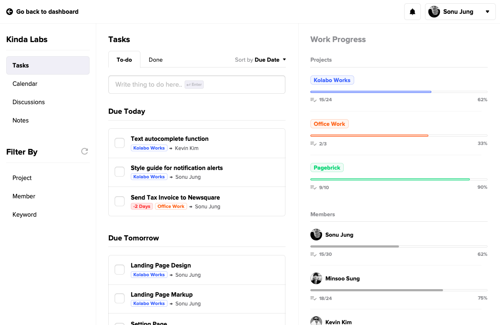
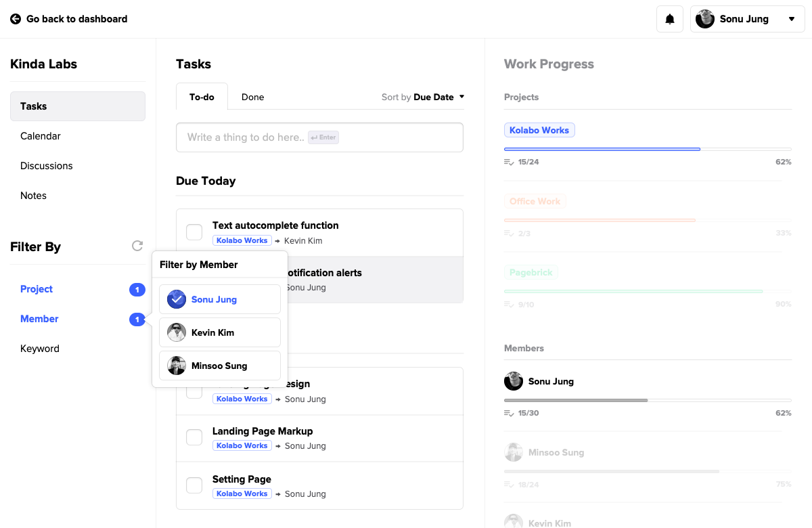
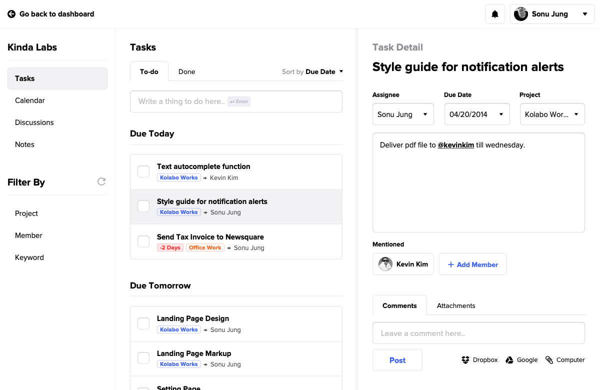
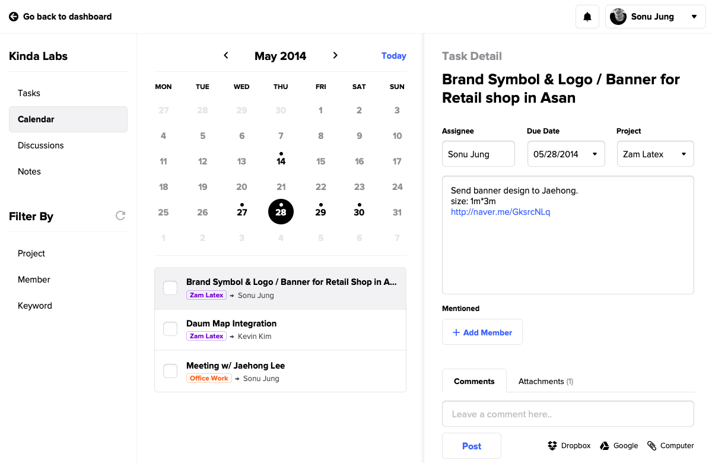
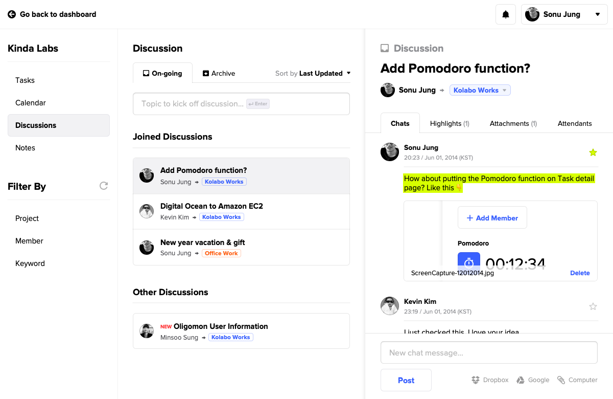
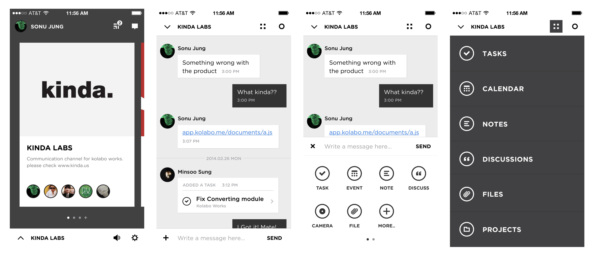

> ⚠️ 이 글은 2014년 6월 15일 작성된 프로젝트 회고글을 옮긴 것입니다.

## 콜라보웍스

카인다랩은 3명의 멤버가 원격으로 일하고 있다.
여러 클라이언트와 기민하게 소통하며 프로젝트를 진행하기엔 기존 사용하던 베이스캠프는 다소 사용자의 적극적 노력을 요구한다는 생각이 들어 아쉬워서 트렐로도 사용해봤지만 심플해서 매력적인 만큼 업무 복잡도가 조금만 높아져도 관리 비용이 더 크게 들어가는 상황이 발생했다.

페이스북 초기 멤버 중 하나인 더스틴 모스코비츠(Dustin Moskovitz)가 창업한 Asana가 우리가 기대하는 형태와 비교적 유사 했는데, 베이스캠프와 반대로 노티피케이션이 잘 제공되지만 반면 그게 없이는 커뮤니케이션이 너무 분산되어 프로젝트의 흐름을 한눈에 파악하기는 쉽지 않다는 생각이 들었다.

그래서 작년 부터 우리가 쓸 도구를 직접 만들고 있는데 이름은 콜라보웍스라고 부르기로 했다. (FYI. Ruby on Rails와 Ember.js를 활용.)

아무래도 우리가 직접적인 사용자인 만큼 아직 기능은 다소 부족해도 나름 만족스럽게 사용하고 있었는다.

콜라보웍스의 차별점은 업무 과정에서 필요에 따라 집중을 좁히거나 넓히며 커뮤니케이션과 프로젝트 흐름을 컨텍스트에 맞게 관리하기 좋다는 점이다. 특히 Discussion이란 이름의 비동기 쓰레드(Thread)를 제공하여 주제에 따라 채팅 방식의 커뮤니케이션이 가능한게 특징이다.

### 콜라보웍스 주요 기능 보기

**태스크 관리 뷰:** 모든 태스크는 한 곳에 모여 있고 필터를 활용해 원하는 프로젝트, 혹은 작업자의 태스크와 진행 상황만 모아 볼 수 있어 집중을 흐트러뜨리지 않는다.

**태스크 디테일 뷰:** 정보 구성은 베이스캠프, 트렐로 등과 크게 다르지 않지만 태스크 목록과 디테일을 한 눈에 볼 수 있는게 편하다.

**캘린더 뷰:** 간트 차트의 필요성을 특별히 느끼지는 못하였기 때문에 달력은 태스크 관리 UX에 날짜별 필터를 추가하는 정도가 우리에겐 맞았다.

**디스커션 뷰:** 가장 만족스런 기능이다. 기존에는 업무 관련 논의를 채팅으로 진행하다보니 연속으로 이어지는 여러 대화 사이에서 특정 이슈에 대한 논의 만을 다시 찾기 어려웠고 그렇다고 구글 독스를 공동 저작하는 방식도 화자 구분이 어려워 불편했다. 그래서 특정 주제에 대한 대화만을 쓰레드 형태로 모아 둘 수 있도록 하고 주요 결정을 하이라이트 하여 모아볼 수 있게 하였다.

엄청나게 다양한 기능을 제공하는 것은 아니지만 콜라보웍스는 소규모인 우리가 원격으로 일하는데 꽤 유용한 도구임에는 분명했다.

### 그런데 왜 출시하지 않았나?
작년 카인다랩의 방향성을 고민하는 과정에서 자체 서비스를 통한 독자적인 수익 모델을 갖춰야 한다는 점에 대한 공감대가 이뤄졌다. 초기 스타트업을 돕는 것도 좋지만 말 그대로 초기 스타트업을 돕는 일은 거의 봉사 활동에 가깝다보니 지속 가능한 구조를 갖추기가 어려웠다. 그래서 우리는 콜라보웍스를 출시하기로 결정했다.

사실 당시까지 콜라보웍스는 매우 단순한 CRUD앱 수준에 불과 했기 때문에 출시 범위에 대한 재정의가 필요했다.

당시 우리가 생각하는 경쟁 제품은 크게 3개가 있었다.

1. 베이스캠프
2. 아사나
3. 트렐로

위에 적었듯 세 앱은 서로 다른 업무 방식을 제안하고 있어서 팀의 일하는 스타일에 따라 선호가 달라질 수 있기에 우리에게도 기회는 있을거라 생각했다.

다만 모두 구글 독스 만큼은 아니어도 팬 베이스가 두텁고 막 떠오르는 앱인 만큼 모두가 모바일 환경에 대한 대응을 하고 있었다.

아무래도 리모트 워킹은 'Anywhere'라는 키워드가 매우 중요하니 모바일에서 손쉽게 접근할 수 있어야만 그들과 붙어 고객의 선택을 받을 수 있을 것 같았다.

**그 당시에는 꽤나 합리적인 결정이라고 생각했는데, 결국 가장 결정적인 판단 착오였고 결국 이 글을 쓰는 계기가 되었다.**

평소 함께 일하는 스타트업에게는 더 작고, 린하게 실험해야 한다고 말해왔고, 나 자신도 린스타트업에서 받은 영감이 창업을 하는 계기가 되었음에도, 막상 우리 이름을 건 제품을 세상에 내놓는다 생각하니 욕심을 부렸던걸까?

다행히 능력자 케빈이 퀸시에서 iOS앱도 살짝 다뤄봤던 덕에 구현은 가능할 것 같아보였다.

*그래서 기존 데스크탑 버전에 일부 기능을 덧붙이고, 모바일 앱을 완성하여 런칭하기로 결정했다.*

그렇다고 외주 일을 완전 접어 둘 수도 없다. 아직 진행중인 업무도 있고, 새로운 일을 받지 않으면 생활이 안되니까 말이다.

결국 그 말인 즉슨, 나는 팀의 우선순위도, 제품의 우선순위도 정하지 않고 그냥 다 하자는 결정을 내린 것이다.

결국 4개월 가량의 외부 프로젝트와 콜라보웍스 작업을 하며 팀의 번아웃 현상이 두드러지기 시작했다.
매일 새벽까지 일하면서 몇개의 프로젝트를 진행하니 당연한 일이었다.

그렇게 프로젝트를 진행하며 지쳐가던 중 나는 테크 크런치를 통해 새로운 앱 하나를 발견했다.

타이니 스펙이란 회사가  [슬랙](https://techcrunch.com/2014/02/12/slack-exits-beta/) 이라는 앱의 베타를 마치고 출시했다는 기사였는데.

평소처럼 호기심에 설치하여 써보았다.
앱의 모습은 과거 자주 사용하던 mirc와도 유사해보였는데 정작 사용해보니 그저 또 다른 채팅앱이 아니었다.

앱의 형태는 다르지만 리모트 팀을 위한 컨텍스트 기반의 커뮤니케이션 도구라는 측면에서 우리가 해결하고자 하는 핵심적인 문제들을 매우 유려하게 해결해주는 앱이라고 느꼈다.

태스크 관리가 올인원으로 탑재되지는 않았지만 트렐로를 연결하면 태스크 관리도 심리스하게 관리할 수 있고 깃헙 이슈 트래킹도 제공하여 당장 우리가 사용 했을때 매우 편리한 협업이 가능했다.

사실, 좋은 앱이다~ 하며 '우리도 잘 만들자'고 사기 진작의 계기로 활용할 수도 있는 이슈지만 안그래도 지쳐있던 팀의 사기는 저항없이 꺾여버렸다.

현재 모바일 앱 개발 진척도는 60% 정도였고 특히 모바일과 연결된 경험에서 우리가 슬랙 이상의 제품을 출시할 수 있으리란 확신이 들지 않았다.

우리는 뭔가 결정을 내려야 했다.
사실 케빈의 업무 부담이 너무 커서 더 이상 밀어 붙이기도 어려운 상황이었다.

그렇게 우리는 약 5개월 간의 콜라보웍스 프로젝트를 접고 슬랙을 사용하기로 결정했다.

### 회고
우리가 프로젝트를 접기로 결정한 지 3개월이 지났다.

앞서의 내용만 보면 사실 우리가 프로젝트를 접은 이유가 슬랙이란 앱을 보고 속된 말로 '쫄아서' 접은것 같지만. 사실 진짜 원인은 따로 있다.

슬랙이 좋은 앱이고 빠르게 성장하고 있지만. 애초에 B2B Software 시장 자체가 Winner takes all의 메카니즘으로 돌아가는 곳도 아니고 슬랙과 콜라보웍스는 오히려 상호 보완적인 제품에 가깝다.

우리가 프로젝트를 접게 된 진짜 이유는 대표이자 프로젝트 매니저인 내가 출시 범위를 충분히 린하게 정하지 못했고, 외부 프로젝트와 내부 프로젝트 사이에서 우선순위를 정하는 결단을 내리지 못했고. 이로 인해 동료들이 번아웃에 빠지게 만든 것이다.

물론 우리 모두 이 악물고 제품을 출시 할 수도 있었겠지만, 하나의 제품이 시장에서 성장 가능한 지점에 다다르기 까지의 시간이 결코 짧지 않다는 점을 고려하면 우리는 프로덕트 인큐베이터와 스타트업 중 하나의 아이덴티티를 선택해야만 한다.

결국 하나의 제품을 시장에 출시 한다는 것이 앱을 만들어 배포하는 것과 다르다는 것을 진정으로 이해하지 못한 것이 가장 큰 실수였다.

우리는 그 사이 지친 심신을 새로고침하고 새로운 프로젝트를 진행하고 있다.
페이지브릭이란 이름의 새 프로젝트는 새로 시작하는 창업자를 돕기 위해 설립된 우리의 창업 취지와도 부합하고 그들이 자신의 비즈니스 아이디어와 상품을 빠르게 팔아볼 수 있다는 점에서 우리가 제공하는 서비스를 제품화 하는 것이므로 충분히 뛰어들 가치가 있는 제품이라 생각한다.

우리는 프로덕트 인큐베이터와 스타트업이라는 아이덴티티 중 하나를 버리지 않고 둘 다여야만 할 수 있는 일을 하기로 했다.

집중을 위해 외부 프로젝트는 더 이상 받지 않기로 결정했고.
나는 스튜디오의 대표가 아닌 스타트업의 대표로써 초기 투자 유치를 해야하는 과제가 생겼다.

앞으로 가게 될 길이 어떤 모습일지는 모르지만.
우리의 미션을 달성하기 위해 내린 선택이고 두근거림을 멈출수가 없다.

---

잘 읽으셨나요? 혹시 이 글이 도움이 되셨다면 아래 버튼을 눌러 커피 한 잔 어떠세요?
여러분의 작은 후원이 창작자에게 큰 힘이 됩니다! 😁
