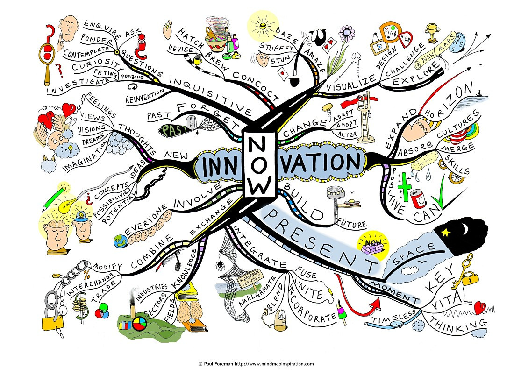

# 디자이너의 수렴적 사고를 도와주는 도구 workflowy

‘디자이너의 생산성을 높이는 도구’라는 수식어에 걸맞은 단 하나의 제품을 꼽으라면 주저 없이 택할 제품이 앞으로 설명할  [WorkFlowy](https://workflowy.com/invite/198ce1c0.lnx)라는 제품이다.

생산성 도구에 대한 개인적인 관심 덕분에 지금껏 꽤나 다양한 도구들을 발 빠르게 접해왔지만. ‘매일같이’, ‘지속적으로' 사용하는 것은 메일 클라이언트를 제외하고 WorkFlowy가 유일하다.

---

## Simple is Best를 몸소 증명한다.

‘Make List Not War’라는 슬로건을 내건(최근 Organize Your Brain으로 변경되었다.) WorkFlowy는 쉽게 말해 ‘목록 관리 도구’이다. 제공하는 기능 역시 목록을 만드는 것으로, 생김새는 아래와 같다.

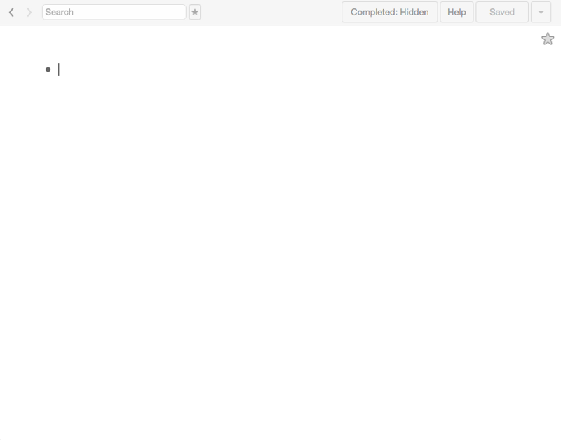

정말이지 간결하다. 마치 미디엄을 처음 접했을 때 느꼈을 생경함을 몇 곱절 더한 인상이다.

기본적으로 WorkFlowy는 문서도구이다. 파워풀한 기능과 복잡한 인터페이스를 가진 도구에 둘러싸인 이에겐 선뜻 용납되지 않을 모양새긴 하지만. 이 텅 빈 화면을 채워나가며 느끼는 묘한 뿌듯함은 형언하기 어렵다.

## 지금 당신의 머릿속은 ‘혼돈’에 가깝다.

사실 WorkFlowy는 디자이너를 위해 만들어진 도구가 아니다. 업종을 불문하고 무언가를 정리하고 관리해야 하는 사람들에게는 다름없는 유용함을 제공하며, 실제로 소개했을 때 가장 반긴 이들은 소프트웨어 엔지니어였다.

그렇지만 나는 역시 디자이너들에게 WorkFlowy 사용을 적극 권하고 싶다.

이유는 간단하다.

지금 당신의 머릿속을 표현하기에 가장 적합한 단어가 아마도 ‘혼돈'일 가능성이 높기 때문이다.

잘 알려진 디자인 구루 [존 마에다](https://twitter.com/johnmaeda) 그리고 IDEO의 창업자 [팀 브라운은](https://twitter.com/tceb62) 디자이너의 사고방식을 ‘확산적 사고(Divergent Thinking)’라는 단어로 정의했다.

이는 작은 것에서 시작해 자유롭게 다양한 분야로 발상을 넓혀가는 형태의 사고방식을 표현한 것으로, 다학제적이며 다양한 콘텍스트를 다루는 디자이너의 직업적 특성을 적절히 반영하는 단어이기도 하다.

디자이너가 되기 위해 거치는 대부분의 훈련들은 이 ‘확산적 사고'를 개발하는데 초점이 맞춰져 있다. 만약 그림으로 표현한다면 아래의 모습과 유사할 것이다.

innovation Mind Map by Paul Foreman

기본적으로 디자이너는 아이디어의 사소한 가능성에도 주목한다. 다양한 키워드를 넘나들며 꼬리에 꼬리를 무는 발상의 연결고리를 통해 기존과 전혀 다른 새로운 길을 찾아내는데 능숙하다.

때문에 디자이너의 이러한 능력은 보편적 문제 해결 과정에서 맞닥뜨리는 한계를 극복하는데 매우 유용하게 사용되며, 디자인 싱킹(Design Thinking)이라는 이름으로 널리 알려진 비즈니스 혁신 방법론은 디자이너의 확산적 사고방식을 문제 해결에 적극 활용한다.

## 엎지른 물도 마시려면 주워 담아야 한다.

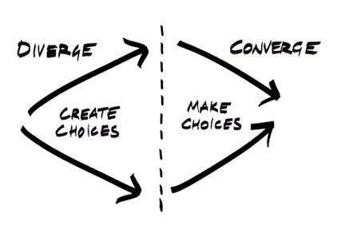

위 그림은 문제의 해결책을 찾는 과정을 간략히 도식화한 것이다.

우리가 지금껏 언급한 확산적 사고는 다양한 선택지를 만들어내는(Create Choices)데 유용하게 사용된다.

그리고 이 과정에서 실현 가능성은 최고의 고려 대상이 아니다.

하지만 하나의 가치 있는 아이디어를 찾아내기 위해선 반복적인 수렴(Converge)을 통해 수 많은 가능성을 비교 검토하고 실현 가능한 결정(Make Choices)을 도출하는 과정이 필히 동반되는데, 이 구간에서 필요한 사고의 형태를 수렴적 사고(Convergent Thinking)라 부른다.

마치 좋은 열매를 수확하기 위해 나무의 잔가지를 쳐내는 일과 유사하다. 너무 많은 가지가 뻗친 나무라면 뿌리가 열매까지 충분한 영양분을 공급하기 어려울 테니 말이다.

> *흔히 과학자, 공학자, 수학자는 여러 객관적 사실을 관찰해 하나의 원리로 추상화하는 수렴적 사고(convergent thinking)를 합니다.
>
> 그에 비해 음악가, 디자이너, 예술가는 작은 것에서 시작해 자유롭게 다양한 분야로 발상을 넓혀가는 확산적 사고(divergent thinking)를 하지요.
>
> 수렴적 사고는 좌뇌적이고 확산적 사고는 우뇌적입니다. 이 두 가지 사고방식은 서로 상반된 것처럼 보이지만 사실은 서로 공존하는 것입니다.*
>
> **존 마에다**

> 참조 : 월간 디자인 인터뷰([http://goo.gl/3g2bUi](http://mdesign.designhouse.co.kr/article/article_view/103/55166?per_page=60&sch_txt)) / STEM to STEAM ([http://goo.gl/6he5q1](http://goo.gl/6he5q1))

저명한 디자이너이자 교육자인 존 마에다의 말을 빌자면 확산적 사고는 주로 예술가와 디자이너, 수렴적 사고는 과학자, 엔지니어가 갖는 지배적 사고 구조이다.

확산적 사고는 다양한 가능성을 탐구하는데 강점을, 수렴적 사고는 하나의 정답을 도출하는데 강점을 갖는다. 이 둘은 서로 다른 메커니즘을 가지면서도 문제 해결을 위해서 떼려야 뗄 수 없는 불가분의 관계이기도 하다.

말을 조금 비틀어 보자면 디자이너는 아이디어를 펼치는 데는 능숙하지만 그것을 걸러내는 데는 익숙하지 않다는 얘기인 셈이다.

만약 당신이 디지털 프로덕트를 만드는 일에 종사한다면 지금까지 나온 얘기를 통해 디자이너 & 개발자 사이의 어려운 커뮤니케이션 문제를 떠올려 볼 수 있을 것이다. (혹시 당신이 개발자와 의사소통하는데 어려움을 겪고 있다면 그건 당연한 일이니 자책하지 말자, 그저 여태껏 습득해 온 사고방식이 다르기 때문이니까..)

하지만 결국 제품을 구현하는 과정에서, 이 두 가지 상반된 사고의 균형을 잡는 것은 제품의 성패를 좌우하는 중요한 일이기 때문에. 우리는 필연적으로 수렴적 사고법에 익숙해져야만 한다.

## 정보를 분류, 관리하자.

결국 우리가 펼쳐놓은 많은 아이디어에 질서를 부여하고 그중 가치 있는 것만 골라내는 법을 알아야 한다는 얘기다.

그리고 이를 위해 가장 먼저 해야 할 일은 내가 ‘어떤 정보를 가지고 있고’ 그 정보가 ‘어떤 의미를 지니고 있는지’ 파악하는 것이다.

잠시, 앞서 살펴본 다이아몬드꼴 도식을 확대하여 확산에서 수렴으로 이어지는 중간 과정을 살펴보자.

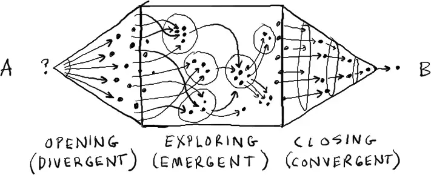
*Opening, Exploring, & Closing from Gamestorming by Dave Gray*

기존엔 보이지 않던 새로운 구간이 눈에 들어온다.

Exploring 이라 명명되는 이 구간은 지금껏 찾아낸 수많은 아이디어와 키워드를 쓰임에 맞게 분류하고 우선순위를 정하여 관리하는 과정으로 설명할 수 있다.

WorkFlowy는 이 Exploring 과정에서 정보를 보다 손쉽게 파악, 관리할 수 있도록 시각적으로 모델링(트리구조) 하는 도구이다.

그리고 잘 만들어진 정보 구조는 다음 단계의 개발과정을 보다 수월하게 만들어 주는 열쇠 역할을 한다.

---

예시 이미지를 통해 WorkFlowy 사용법을 알아보자.

[회원가입하기](https://workflowy.com/invite/198ce1c0.lnx) (웹에서 사용하기 불편하다면 Chrome 앱을 설치하길 추천한다.)

> 여러 아이템이 생각의 흐름대로(제멋대로) 나열되어 있다. WorkFlowy는 기본적으로 텍스트 에디터와 사용법이 크게 다르지 않다. 문자, 엔터 그리고 탭키를 사용하면 메모의 용도를 충실히 수행한다.

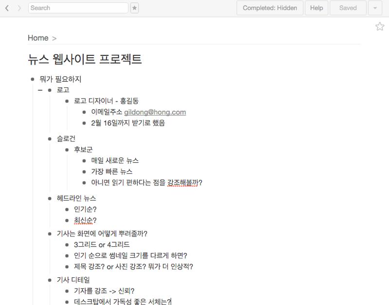

정보를  재배치하여 맥락에 따른 분류, 구조화할 수 있다. 바닥에 널브러진 책들을 책장에 차곡차곡 쌓는 것과 유사한 경험을 제공한다.

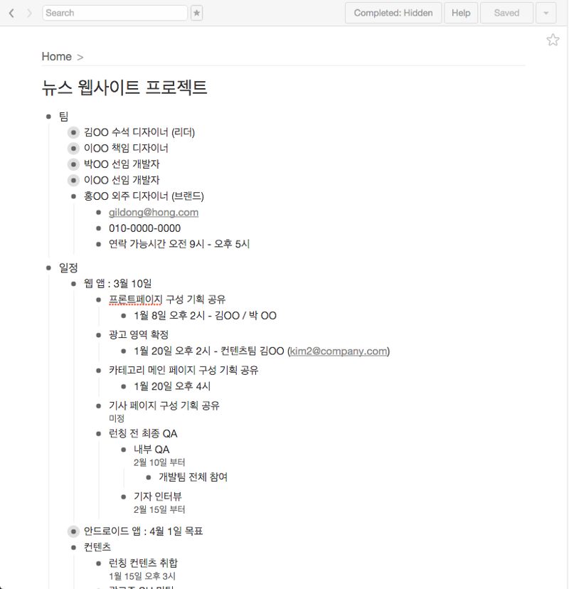

이 책장은 매우 깊다. 분류하기에 따라 아주 깊숙한 영역까지 정보의 꼬리를 이어갈 수 있으며 언제든 특정 층계(depth)로 손쉽게 이동할 수 있다.

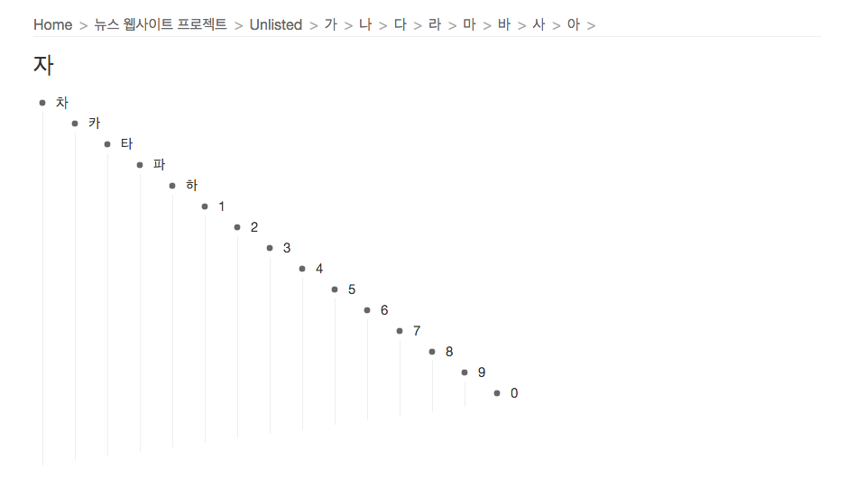

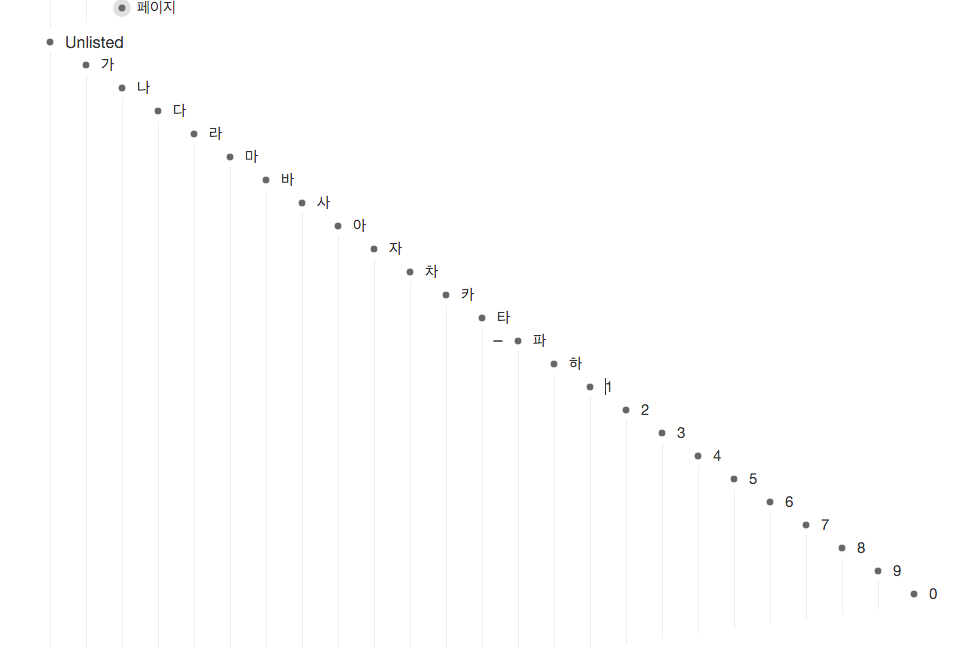

WorkFlowy를 활용하면 프로젝트의 A부터 Z까지 모든 정보를 목록의 형태로 구조화할 수 있으며 시각적으로 관리할 수 있다.

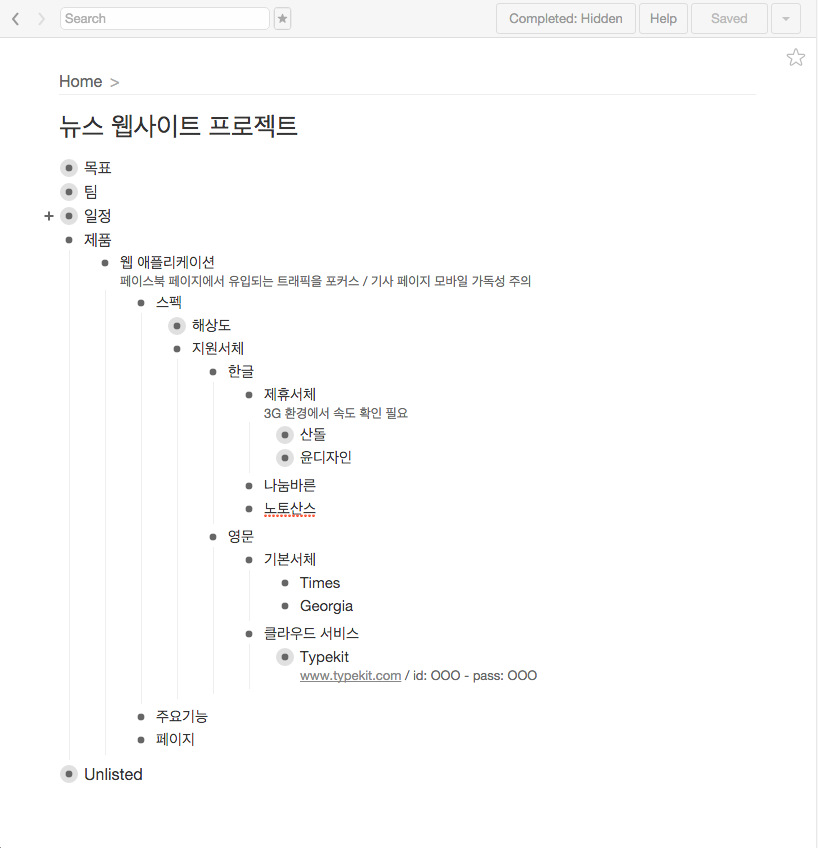

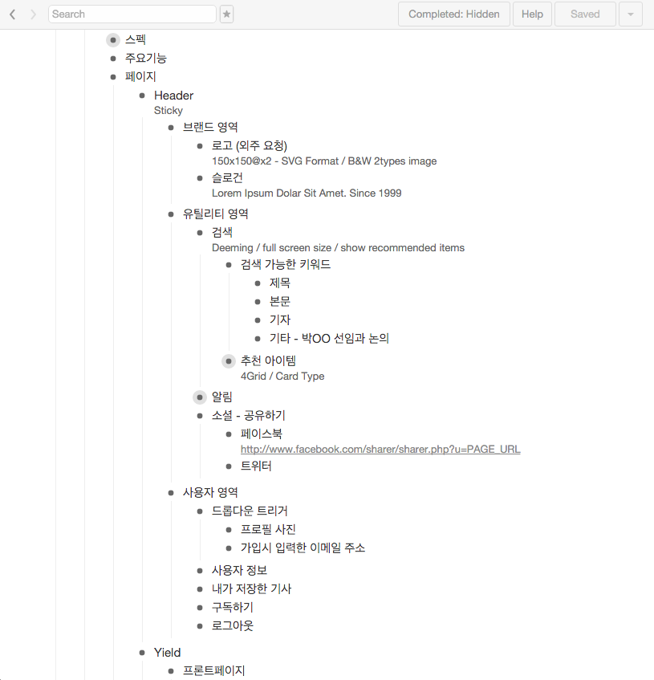

태그와 검색을 통해 필요한 정보를 언제든 꺼내올 수 있고. 공동 저작 및 공유를 통해 보다 수월한 협업을 가능케 한다.

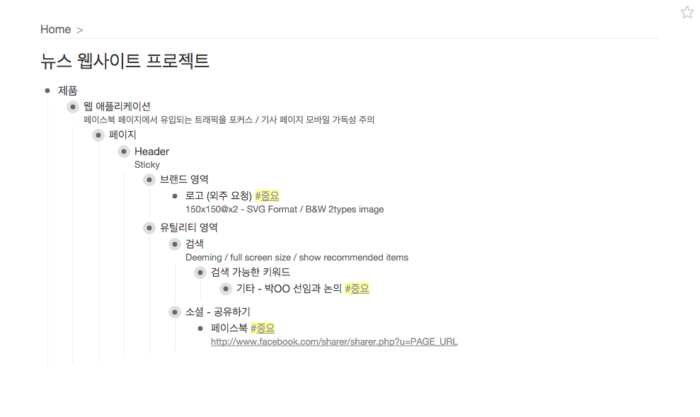

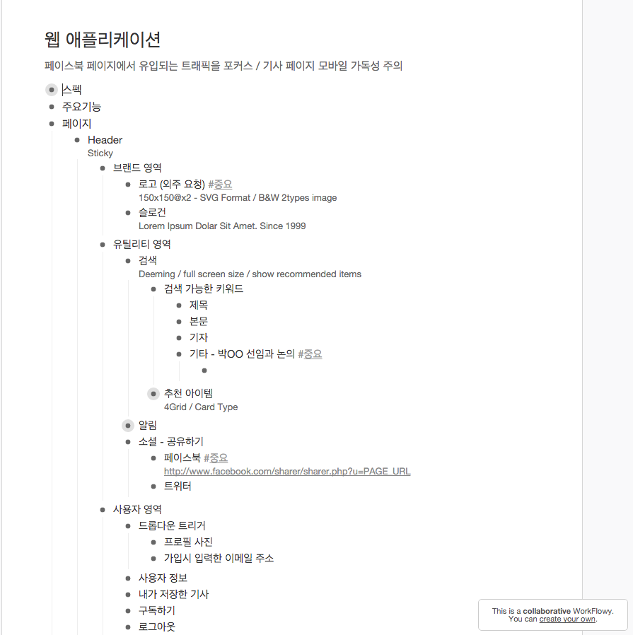

또한 태스크 관리 도구처럼 활용할 수도 있어서 전체 프로세스의 진행과정을 손쉽게 파악할 수 있다.

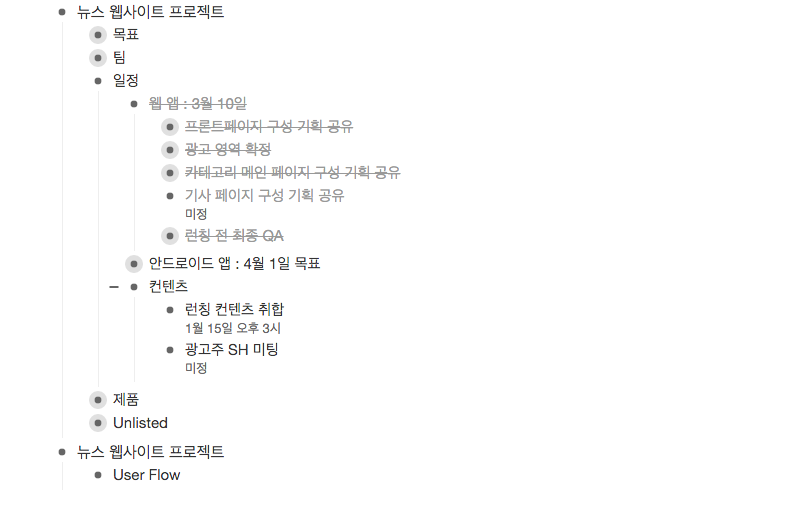

## 시작하는 디자이너에게 특히 추천하는 이유.

최근 여러 채널을 통해 프로토타이핑 방법론에 대한 뜨거운 관심을 체감하고 있다.

프로토타입은 아이디어를 제품으로 만드는 과정에서 특정 경험을 실제 제품과 유사한 형태로 구현하여 개발과정의 의사소통 및 리스크 관리를 위해 주로 사용되며, 문서로 전하기 어려운 추상적인 개념까지 담을 수 있기에 출시로 이어지는 과정을 효과적으로 단축해 준다.

개인적으로 프로토타입 활용을 적극 권장하는 편이고 최근의 변화를 무척 반기고 있지만.

가끔은 본래의 목적과 관계없이 유행처럼 소비되거나 스펙 쌓기의 일환으로 다뤄지는 경우를 접하기도 한다.

특히 학생 혹은 엔트리 레벨의 디자이너와 대화를 나누다 보면 최신 도구를 통해 프로토타이핑을 처음 접하는 경우가 되려 정보의 접점을 작게 만들 수도 있다는 생각을 하게 된다. (컴퓨터로 디자인을 접한 세대가 쉽게 놓치는 것이 있듯이..)

비교적 최근 출시된 flinto, principle, framer 등의 도구가 모바일 경험 중 특히 애니메이션(트랜지션) 구현에 초점을 맞추고 있다 보니, 이전 단계의 여러 과정을 배제한 채 효과에 목매는 경우가 있기도 하고 말이다.

그래서 만약 디자인을 시작하는 단계에 있는 디자이너라면 프로젝트의 시작 단계부터 WorkFlowy를 적극 활용하기를 권한다. (이래 봐야 Slack에서 돈 주는 거 아닌데...)

고심해서 선택한 문장과 단어를 통하여 적어도 본인의 머릿속에, 만약 가능하다면 함께 일하는 동료에게도 실재에 가까운 제품 이미지를 전할 수 있게 된다면 사용하는 도구와 관계없이 효과적인 디자인 프로세스를 만들어 가는데 도움이 되리라 생각한다.

---

잘 읽으셨나요? 혹시 이 글이 도움이 되셨다면 아래 버튼을 눌러 커피 한 잔 어떠세요?
여러분의 작은 후원이 창작자에게 큰 힘이 됩니다! 😁
