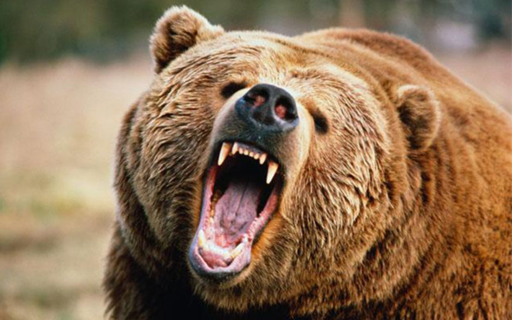
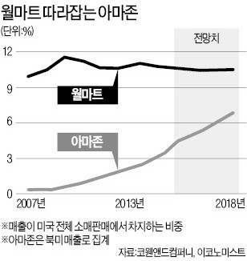

[보노보스](http://www.bonobos.com/)는 오프라인을 통해 고객의 신체 사이즈를 측정하고 온라인을 통해 구매할 수 있는 (국내의 [스트라입스](http://www.stripes.co.kr/)가 벤치마크) 온라인 기반 패션 브랜드입니다. 보노보스의 창업자이자 CEO인 Andy Dunn는 2013년 자신이 발행한 'e-commerce is a bear'라는 글을 통해 이커머스 산업의 변화와 흐름에 대한 인사이트를 공유하였습니다.

몇 년이 지났고 글에 언급된 여러 기업과 비즈니스 모델의 성패가 어느 정도 윤곽을 드러낸 지금 다시 읽어도 여전히 유효한 내공의 명문입니다.

몇 년 전 국내 스타트업 매체인 Under The Radar에서 번역하여 소개했으나 현재 사이트가 폐쇄된 관계로 다시 번역하여 공유합니다. 효과적인 의미 전달을 위해 일부 원문의 표현을 변경한 것들이 있으니 이 점 양해 부탁드립니다. 또한 잘못된 표현이나 사실은 댓글을 통해 지적해주시면 바로 반영하도록 하겠습니다.

---

지난 20년간 미국 이커머스 시장에서 의미 있는 성과를 달성한 곳은 아마존과 이베이 단 두 곳뿐입니다. [아마존](http://www.amazon.com/)은 1997년 그리고 [이베이](http://www.ebay.com/)는 1998년 상장했습니다. 이후 지난 15년간 상장한 기업 중 기업가치 100억 달러는커녕 20억 달러를 넘기는 기업 하나 없었습니다.

마크 안데르센(넷스케이프 창업자, 실리콘밸리 VC 안데르센 호로비츠의 파운딩 파트너)이 [이커머스가 전통 소매업을 잡아먹을 것](https://pando.com/2013/01/30/andreessen-predicts-the-death-of-traditional-retail-yes-absolute-death/)이라 예견했음에도 불구하고 말이죠.

## 왜 그럴까요?

현재 이커머스 시장의 문제는 기업들이 가치 있는 고객 경험과 극적인 매출 향상 그리고 높은 시장점유율을 만들지 못하는 데 있습니다.

만약 당신이 다른 이의 브랜드를 온라인을 통해 판매하려 한다면, 단순히 몇몇 기업과 경쟁하는 것이 아니라 그야말로 모든 이들과 경쟁하게 될 것입니다. 그리고 해당 유형의 시장에서 당신은 장기적인 안목을 지닌 뛰어난 리더가 이끌며, 공격적인 투자와 확장을 이어가는 대형 기업을 상상해 볼 수 있습니다. 이러한 기업은 오랜 기간 수익을 만들어내지 못할 수도 있지만 일단 벌기 시작하면 정말 미친 듯이 벌어댑니다. 또한 이 기업은 언젠가 자신들을 위협할 경쟁자들을 영리하게 인수해 버리고 자신들의 유통 경쟁력을 적극적으로 활용한 추가 서비스를 통해 고객들의 지갑을 공략합니다. 거기에 그치지 않고 점진적으로 분야를 확장해가며 수익을 증대합니다. 그리고 결국 가장 큰 규모의 세계적인 기업이 됩니다.

> 현실에 존재하는 이 회사의 이름은 아마존입니다.

앞서의 추가 서비스는 아마존 프라임이라고 불리며 아마존에 더 많은 돈을 내게 만드는 요인 중 하나입니다. 온라인 서점으로 시작한 아마존은 지난 20년간 책에서 다양한 소비재로 그리고 다시 소프트웨어 영역으로 끊임없이 확장해 왔습니다. 이들은 자신들이 지닌 핵심 서비스 자산을 더욱 강화하기 위하여 아마존 웹서비스를 포함한 다각화된 기술 비즈니스를 다수 보유하고 있습니다.

저는 주식 전문가가 아니지만 아마존이 전통적인 리테일 시장을 크게 흔들어 놓으리라는 점을 믿어 의심치 않습니다. 아마존은 월마트를 뛰어넘을 것입니다.

*[한경 기사 - 월마트.아마존 '유통업계 제왕' 놓고 승부](https://goo.gl/vivJcY)*

지난 십 년간 [자포스](http://www.zappos.com/)와 [다이퍼스](https://www.diapers.com/), 이 두 개 기업 정도만이 아마존에 '유효타를 날렸다'라고 할 만한 도전을 감행했지만 아마존과의 가격경쟁은 잔혹했고 그 여정이 너무도 멀기에 결국 아마존의 재빠른 인수제의에 응하며 한 배를 타게 되었습니다.

자포스의 창업자 Tony Hsieh와 Alfred Lin, 다이퍼스의 창업자 Marc Lore와 Vinit Bharara를 보아온 저로써 확실히 말할 수 있는 것은 그들은 선두기업과 힘을 합치는 것이 최선이라는 것을 깨달을 만큼 뛰어난 경쟁자였다는 것입니다.

여러분은 강력한 경쟁자들을 죄다 인수하고, 크라우드 소싱에 기반한 뛰어난 알고리즘을 활용해 매일 같이 당신이 할 수 있는 것보다 더욱 저렴한 가격으로 전국에 상품을 판매하는 기업과 어떤 방식으로 경쟁하시겠습니까?

사실 대부분의 사람들에게 정답은 '가격 경쟁으로 아마존과 싸울 생각은 꿈에서도 하지 마라'가 될 것 같습니다. 왜냐하면 그것은 불가능하기 때문이죠 낮은 마진율의 압박과 부족한 자원을 등에 지고 그들과 경쟁해서는 절대로 틈새시장을 벗어날 수 없을 것입니다.

물론 아마존의 경쟁자 중 하나인(였던) 이베이가 있지만 이들은 아마존과 전혀 다른 비즈니스 모델인 개인 간(P2P) 거래 방식을 경쟁력으로 삼고 있고 무엇보다 운 좋게도 페이팔을 인수하지 않았습니까? (역자 주 - 페이팔은 이베이보다 매출 규모가 2배 이상 크게 성장했고 결국 [2014년 이베이로부터 분사](http://verticalplatform.kr/archives/3805)하였다.)

즉 만약 지금 당신의 비즈니스 모델이 오픈마켓(타 브랜드의 상품을 모아서 판매하는) 형태의 이커머스라면 그저 행운을 빌겠습니다. 아마 당신은 그들에게 주목받거나, 밟히거나 혹은 운 좋게 인수될 정도의 이익을 만드는 일조차 불가능할 것입니다. 당신이 상대하는 거인 앞에서 할 수 있는 것은 오로지 제자리걸음뿐일 테니까요.

지난밤, 아침 일찍 스톡홀름으로 향하는 비행을 앞두고 잠이 오질 않았습니다. 그래서 이럴 때 종종 감상하는 '[회색곰의 공격](https://youtu.be/2EpNcptuOzQ)'(심장이 약한 분은 보지 마세요) 영상을 다시 봤습니다. 저는 회색곰의 포악성 그리고 그들의 용맹함을 사랑합니다. 그들은 상대를 한 번 물면 완전히 무력화될 때까지 끊임없이 잔혹한 공격을 가합니다. 그리고 상대의 죽음이 다가왔을 때 그제야 공격을 멈추고 상대를 잡아먹기 위한 정비를 합니다.

저는 또 다른 포식자인 아마존을 회색곰만큼 좋아하지는 않지만 분명한 것은 제가 그들을 존경한다는 점입니다. 그들의 집요함과 [경쟁에 대한 편집증적인 태도](http://biz.chosun.com/site/data/html_dir/2016/03/23/2016032300311.html), 공격 타이밍을 알아채는 날카로운 인사이트, 그리고 상대를 완전히 무력화시키는 잔혹함까지. 아마존은 경쟁자들을 시장 밖으로 완전하게 몰아냅니다.

[세금에 관한 일부 리더십 문제](http://www.hankyung.com/news/app/newsview.php?aid=2012053181291)를 제외한다면 저는 그들을 존경합니다.

Jeff Bezos(아마존 창업자)는 초창기 월스트리트로 부터의 수많은 조롱을 이겨냈습니다. 이제 그는 세계 최고의 리테일 기업으로 가는 길 위에 서있습니다. 종종 사람들이 아마존을 비난하는 것을 듣곤 하지만 고객들로부터의 비난이 거의 없다는 것을 보면 아마존은 100년 이상 롱런하는 기업이 될 수도 있을 것 같습니다.

당신의 방에 회색곰이 들어왔다면 우리는 무엇을 해야 하나요? 포기할까요?

> 말도 안 되는 소리 마세요. 여긴 미국입니다. 우리는 자본주의자고 싸움꾼입니다. 오늘의 다윗이 내일 승리를 만끽할 수도 있잖아요?

---

## 내일의 승리는 누가 차지할까요?

저는 아마존의 지배에 대응하는 네 가지 전략을 제안하고 싶습니다. 그것은 '독자적 가격 경쟁력', '차별화된 상품 선정', '유니크한 사용자 경험', '독자 상품 전략 '입니다.

### 독자적 가격 경쟁력

이 전략의 대표적인 사례가 바로 '플래시 세일'방식의 이커머스입니다. 기업은 한정된 기간의 독점적인 가격 정책을 통해 빠른 성장을 이끌어 낼 수 있습니다. 가격은 고객 유인을 위한 가장 강력한 무기 중 하나입니다. 일시적으로 엄청난 할인을 제시하는 것은 매우 효과적으로 고객 전환을 유도할 수 있는 방법입니다. [사이버 먼데이](https://ko.wikipedia.org/wiki/%EC%82%AC%EC%9D%B4%EB%B2%84_%EB%A8%BC%EB%8D%B0%EC%9D%B4)를 떠올려보세요.

2007년 보노보스의 창업자로서 뉴욕에 방문했을 때 많은 사람들이 제게 '길트 그룹'에 대해 물어봤지만 사실 잘 몰랐습니다. 이후 그들이 500명이 넘는 직원을 보유한 이커머스 2.0 시대에 가장 성공한 회사 중 하나라는 사실을 알게 되었습니다.

플래시 세일 커머스에서 가장 발 빠르게 움직이는 사람 중 한 명은 'Adam Bernhard'로 본인의 서비스인 [하우트룩](https://www.hautelook.com/)을 [노드스트롬](http://shop.nordstrom.com/)(미국의 대표적인 백화점 체인)에 성공적으로 매각하였습니다. 또한 [쓰릴리스트](https://www.thrillist.com/)는 [잭쓰레드](https://www.jackthreads.com/)를 인수했는데, 이제 막 계약을 계약을 마무리 한 Ben Lerer(쓰릴리스트 창업자: 그는 거의 최초로 콘텐츠와 커머스를 융합하는 시도를 성공적으로 안착시켰습니다.) 옆에서 그의 천재성에 감탄했던 장면이 떠오릅니다. 또 [룰랄라](http://www.ruelala.com/)의 경우 이미 두 번 이상 거래되었으며 현재는 [GSI Commerce](https://www.ebayinc.com/stories/news/gsi-commerce-becomes-ebay-enterprise/)(2013년 eBay에 매각)의 파운더이자 뛰어난 기업가 Michael Rubin이 보유하고 있습니다. 잘 알려진 스포츠 리테일 기업 [파나틱스](http://www.fanatics.com/) 역시 그의 회사입니다.

[길트](http://www.gilt.com/), [팹](http://fab.com/), [줄릴리](http://www.zulily.com/), [원킹즈레인](https://www.onekingslane.com/) 그리고 [아이딜리](http://www.ideeli.com/)와 같은 플래시 세일 커머스들의 미래를 점쳐보는 것은 매우 즐거운 일입니다. 제 개인적인 생각으론 이들 중 다수가 자체 제작 상품 혹은 M&A 등을 통해 정가 판매로 전환하게 될 것 같습니다. 그러고 그렇지 않은 회사들은 독점 상품을 늘려가거나 오프라인 진출 등의 방식을 통해 최저가 커머스 형태를 벗어나려 할 것입니다.

역자 주 - 플래시 세일의 대표주자로 꼽혔던 팹, 길트 그룹, 원킹즈레인은 당시 1조 밸류에이션을 호가하며 승승장구하듯 보였으나 유치자금 대비 경영성과 부진으로 다운 라운드를 거치며 기대보다 훨씬 저조한 금액에 매수되었습니다. 사실상 소셜커머스의 상징과도 같던 그루폰의 실패와 마찬가지로 저가 정책을 근간으로 하는 플래시 세일 모델 역시 빌리언 달러 컴퍼니 진입에 실패했다고 볼 수 있습니다. 아래는 각 기업의 매각 금액입니다.

- Fab: 2015년 PCH International에 $20M 수준의 가격에 매각

- Gilt Groupe: 2016년 Saks Fifth Avenue 등을 보유한 HBC에 $250M 에 매각

- One Kings Lane: 2016년 Bed Bath & Beyond에 $30M 수준에 매각.

- Ideeli: 2013년 그루폰에 $43M에 매각

### 차별화된 상품 선정

이 전략의 핵심은 특정 고객 집단에 포커스 된 유니크한 콘셉트를 갖는 것입니다. 뒤에 설명할 독자적인 상품 개발 전략과 유사한 내용이라 볼 수 있는데 다만 다른 점은 이 경우 써드파티 브랜드의 상품을 모아서 보여준다는 점이죠. 직접 상품을 제작할 수 없다면 그렇게 보여지게 할 수 있는데 따르는 세 가지 조건을 다음과 같습니다. 첫 째, 확실한 콘셉트를 가질 것(차별화된 스타일, 품목 등). 둘째, 다른 상점에서 손쉽게 찾을 수 없을 것. 셋째, 상품이 강력한 커뮤니티를 형성할 수 있을 것. 즉 확실한 콘셉트를 가진 써드파티 제품들을 모아서 보여주는 중독성 있는 온라인 편집샵 브랜드를 만드는 셈입니다.

이런 방식의 기업 중 제가 선호하는 두 곳은 ModCloth와 Nastygal입니다. Susan Koger와 Sophia Amoruso는 전혀 다른 성향의 사업가입니다. 하지만 그들의 단 하나 큰 공통점은 누구보다 그들의 고객을 잘 이해하는 판매 경험이 풍부한 창업자라는 점입니다. 이들은 현재 다양한 서드파티 브랜드의 제품을 판매하고 있지만 고객에게 그들 자신의 브랜드 경험을 전달하고 있습니다. 저의 예상으로 그들은 차차 독자적인 강력한 브랜드를 구축해가며 자체 상품 전략을 취할 가능성이 높아 보입니다.

역자 주 - 국내의 [스타일난다](http://stylenanda.com/)가 비교할 수 있는 대표적인 케이스라고 볼 수 있을 것 같습니다. 초반 다양한 동대문 보세 브랜드를 스타일난다만의 콘셉트와 스타일로 큐레이션 하여 고객들의 반응을 이끌어냈으며 강력한 팬덤을 형성하는 데 성공했습니다. 이후 점차 다양한 라인의 자체 브랜드(PB)를 런칭하며 현재는 1000억 원 대의 매출을 내는 브랜드로 성장했습니다.

### 유니크한 사용자 경험

이커머스는 또한 이전까지 상상할 수 없던 새로운 모델을 만들어내고 있습니다. 구독형 정기 배송 커머스인 [저스트팹](http://www.justfab.com/), [쇼대즐](http://www.shoedazzle.com/)(여성화), [벌치박스](https://www.birchbox.com/)(뷰티상품), [렌트 더 런웨이](https://www.renttherunway.com/)(드레스)나 수많은 유명인사들이 참여하는 비치민트를 보세요.

이러한 형태의 새로운 모델 역시 앞서의 내용과 유사한 부분들이 있습니다. 특정 카테고리의 상품을 유니크한 콘셉트로 큐레이션 하여 판매하거나, 자체 브랜드를 내세우고 있습니다. 빠르게 성장하고 있는 이들 기업은 모두 '고객에게 반복적인 만족을 선사하는 것'을 핵심으로 삼고 있습니다.

역자 주 - 상기 회사 중 쇼대즐은 후발주자인 저스트팹에, 비치민트는 럭키매거진에 기대보다 훨씬 낮은 가격으로 팔렸으며 최근 성공 사례로는 [달러쉐이브클럽](https://www.dollarshaveclub.com/)이 유니레버에 1조 가량의 금액에 매각된 것을 꼽을 수 있겠습니다.

### 독자 상품 전략

독자 상품 전략은 태생부터 온라인을 기반으로 한 자체적인 브랜드를 만들어내는 것입니다. 다른 곳에서는 구할 수 없는 독자적인 상품을 제공함으로써 고객을 끌어들이는 것입니다. 이 방식을 통해 당신은 마진을 스스로 정할 수 있고 더 이상 다른 웹사이트와 경쟁할 필요가 없습니다.

남성복을 판매하는 [보노보스](http://www.bonobos.com/)와 아이웨어를 판매하는 [워비파커가](https://www.warbyparker.com/) 이 전략을 취하고 있습니다. 이 전략에 대해 어느 정도 확신을 갖고 제안하는 것은 저 스스로가 지난 6년간 이 전략에 매달려왔기 때문입니다. 그렇기에 이것이 제 일생을 업적이라고 생각될 만큼 높은 성공 가능성을 갖는 전략이라고 생각합니다. 브랜드를 만드는 데는 상당히 오랜 시간과 노력이 투자되어야 한다는 것을 전제한다면 말이죠. 당신이 이 전략을 취한다면 당신은 더 이상 이커머스 기업을 만드는 것이 아니라 온라인을 주요 유통 채널로 둔 브랜드를 만드는 것입니다. 차이는 미묘하지만 매우 큽니다.

---

### 그렇다면 이런 전략과 사례들이 있음에도 왜 IPO는 없는 걸까?

아마 곧 소식이 있을 거라 생각합니다. 하지만 그렇다 하더라도 이커머스 2.0 모델이 자리를 잡는 데는 많은 시간이 필요할 것 같습니다. 이 모델은 아마존 - 자포스 - 다이퍼스 시대의 이커머스와는 다릅니다. 당신은 상품을 늘려가는 것 만으로 규모를 키울 수 없고 매 해 5배씩 성장시킬 수 없을 것입니다. 꽤나 오랜 기간 동안 말이죠. 그리고 달리 말해 당신은 회색곰을 피해 달아날 수 없습니다. 그들은 너무 빠릅니다. 그들의 링위에서는 절대 이길 수 없습니다.

역자 주 - 위 예상과 같이 유아 패션 커머스 [줄릴리](http://www.zulilly.com/) 수공예품 오픈마켓 [엣지](http://www.etsy.com/) 등이 성공적으로 IPO하였지만 현재는 주가가 큰 폭으로 하락한 상태입니다.

다음 세대의 이커머스 기업들은 가지고 가야 할 것보다 버려야 할 것을 고민해야 합니다. 무엇을 버리기 위해서 갖는데 들이는 것보다 많은 시간을 들려야 한다니 역설적이지만...

> 아마 제게 시간이 좀 더 있었다면 이 글을 더 짧게 쓸 수 있었을 겁니다.

새로운 모델의 이커머스에서는 그것이 자체적인 브랜드이건 아니건 간에 상품 기획이 매우 중요한 역할을 합니다. 규모가 승리의 핵심이던 과거와 다르게 기획이 더욱 중요해진 현시점의 모델에게 빠른 성장은 독이 될 수도 있습니다. 만약 당신이 큰 현금을 가지고 있는데 마땅히 해야 할 생산적인 일이 없는 상태라면 어떻게 하겠습니까? [스타트업의 중독](https://medium.com/what-i-learned-building/922fdc3a57c8)

이커머스의 수익구조(P&L: Profits and Loss Statement)로는 EBITDA(세전 영업이익에 감가상각비와 무형자산 상각비-현금유출이 없는 비용-를 합산하여 계산한 이익)를 얻을 수 없습니다.

총수익 그리고 순익을 높이기 위해 당신은 마진이 낮고 관리는 어렵지만 매출을 높여줄 수 있는 상품을 찾거나, 브랜드를 만들게 됩니다. 브랜드를 만든다는 것은 규모가 커질수록 높은 마진을 얻을 수 있겠지만 인건비와 마케팅비 등 많은 초기 투자가 필요합니다. 이 두 어느 쪽이든 제품 원가를 빼고 나면 총수익이 될 것 같지만 우리는 전통적인 리테일러가 아니잖습니까? 우리가 콜 프로덕트 마진이라고 부르는 것은 다양한 서비스 비용을 포함합니다. 무료배송을 하거나 혹은 무료 반송까지 해주는 경우 말이죠.

총마진에서 많은 것을 제하고 나서야 공헌 이익을 확인할 수 있습니다. 여러 가지 변동비와 판매비 및 일반 관리비(SG&A: Selling, General & Administrative Expense)는 이커머스 운영에 필수적일 수밖에 없고 일반적으로 사진 촬영, 구매 프로세스 비용, 고객 서비스 비용, 재고 관리 비용 등을 포함한 SG&A가 전체의 많은 비중을 차지합니다.

즉 우리가 예상 가능한 공헌이익은 아래와 같이 생각해 볼 수 있을 겁니다.

> 총수입 - 수익 = 순 수익 - 제품 원가(COGS: Cost of goods sold)  = 제품 마진 - 무료배송 및 반환비용 = 총 마진 - 고객 서비스 비용 - 구매 프로세스 비용 - 사진 촬영 비용 - 재고관리 비용 - 기타 관리 비용 = 약간의 공헌 이익 - 마케팅 & 홍보 비용 = 진짜 공헌이익

자 이게 진짜 공헌 이익입니다. 우리가 돈을 벌기 위해서는 이 공헌이익이 총급여 보다 높아야 할 것입니다. 그리고 여러분의 팀은 돈이 많이 듭니다. 왜냐하면 당신이 만들고 있는 브랜드에 필요한 팀은 브랜드팀, 서비스팀, 기술팀 총 세 팀으로 이뤄져 있기 때문이죠. 여러분은 단순히 상품 판매방식만 고민하면 되는 게 아니라 유통 채널까지 고민해야 한다는 점을 알아야 합니다.

> 정말 돈을 벌고 싶으세요? 그렇다면 아마존 주식을 사세요. 성공적으로 확장해 가고 있을 때조차 사람들은 수익성을 걸고넘어지며 당신을 괴롭힐 것입니다.

자포스의 매각은 이커머스 업계에서 매우 드문 성공 사례입니다. 자포스는 고객의 많은 사랑을 받았지만.. 낭설에 따르면 자포스가 아마존에 팔릴 당시의 EBITDA 마진은 총수익 10억 달러의 10분의 1인 약 1000만 달러 수준이었다고 합니다.. 순익이 6억 5천만 달러라고 가정하면 (~35% 수익률) 2% 정도의 EBITDA 마진을 남긴 셈입니다.

자포스가 매각을 결정한 것은 그럴 수밖에 없었기 때문입니다. 자포스는 상장할 수 있을 정도의 충분한 이익을 내고 있지 못했기 때문에 특별히 재정상황이 나아지지 않는 한 아마존이 아니라 하더라도 매각은 어쩔 수 없는 선택이었습니다.

제가 자포스를 열렬히 지지하며 동시에 그들을 존경하는 이유는, 고객들이 온라인을 통해 섬유/의류 제품을 구매하도록 만들었다는 것입니다. 그들은 온라인 의류/신발 판매를 위한 배송 및 반품 정책, 고객 서비스 품질 등에 대한 표준을 만들었습니다. 우리가 2007년 보노보스를 런칭하였을 때, 자포스는 우리의 가설인 온라인 기반의 브랜드 설립에 많은 영감을 주었습니다.

> 자포스가 다른 브랜드의 제품을 온라인에서 팔 수 있는데 우리 자체 브랜드를 만들어서 팔아도 되지 않겠어?

아이러니하게도 많은 회사들이 '소비자의 사랑을 받지만 상장할 수 없을 수준의 회사'를 따라 하고 있습니다. 재무적인 관점에서 바라보면 자포스는 결코 적절한 롤모델이 될 수 없습니다. 그럼에도 불구하고 많은 유통 채널을 가진 기업이나 새로 등장한 기업들이 수익성 악화로 허덕이고 있는 것은 그들이 자포스의 모델을 따르기 때문입니다. 아마존이 자포스를 인수한 것은 장기적인 관점에서 자포스의 훌륭한 고객 서비스를 흡수하기 위함이지 결코 재무적인 이유는 아니었습니다.

자포스, 그리고 그들을 쫓았던 다이퍼스는 과거 이커머스의 성공방정식을 추구하던 기업들에게 많은 반향을 일으킬만한 새로운 모델을 제시하였지만, 결국 완벽하지는 못했죠. 대신 이 두 기업은 회색 아이곰 마냥 지구 상에서 가장 무시무시한 회색곰 옆에 나란히 서있습니다..

이것이 왜 우리가 흑자 기업 되기를 '스핑크스 찾기'라고 부르는 이유입니다. 우리는 그들이 존재한다는 소문을 들었지만 현실에서 발견하기란 너무도 어렵습니다.

저는 이 문장을 좋아합니다.

> 이커머스는 상장 불가, 매수 불가, 흑자전환 불가 이 세가지만 제외하면 매우 좋다.

우리는 공식적으로 [수익을 내기 위한 마지막 투자유치라는](http://pandodaily.com/2013/03/13/nice-pants-bonobos-raises-30m-off-of-strong-growth-and-nordstrom-deal/) 표현을 사용합니다. 아이러니하게도 저희가 정말 수익을 낼 수 있는 방법은 엑싯하는 것뿐이라는 거죠.

*역자 주 - 보노보스는 현재까지 $127.65M의 투자를 유치했다.*

- Jul, 2014 $55M / Series D — Coppel Capital

- Mar, 2013 $30M / Venture — Accel Partners

- Apr, 2012 $16.4M / Venture — Nordstrom

- Dec, 2010 $18.5M / Series B — Accel Partners, Lightspeed Venture Partners

- Jan, 2010 $4M / Ange

- Jun, 2009 $3M / Angel

- Sep, 2008 $750k / Angel

---

2003년 저는 알래스카로 오지캠핑을 떠났습니다, 이곳 저곳에 곰들이 도사리고 있었죠 덕분에 더욱더 살아있다는 느낌을 실감할 수 있었습니다. 하루는 카약을 타고 20대 초반쯤 보이는 가이드와 함께 바다로 나갔습니다.

저는 그에게 회색곰을 본 적이 있는지 물었고, 그는 웃으면서 항상 본다고 말했습니다.

그가 말하길 언젠가 해변에 카약을 세워두고 소변을 보던 중 아이의 비명소리 같은 것을 들었고 이내 작은 아기곰이 튀어나왔답니다. 그 아기곰은 사람을 본 게 처음이었던지 깜짝 놀라 소리를 질렀는데 그는 그때 처음으로 죽음을 맞닥뜨린 기분을 느꼈다고 했습니다. 그는 소변을 멈추고 곧장 카약으로 뛰어갔고 역시나 어미곰이 빠르게 그를 쫓기 시작했습니다. 가까스로 카약에 올라타 겨우 빠져나와보니 어미곰은 물에 들어오지 못해 소리를 지르면 분을 삭이는 듯 보였다고 합니다.

아마 어미곰이 헤엄을 칠 줄 알았다면 저는 그를 만날 수 없었겠지요.

---