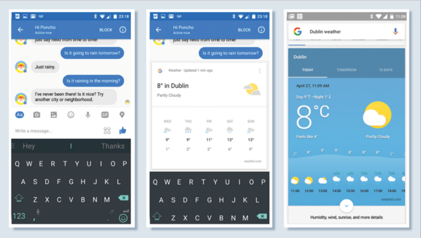
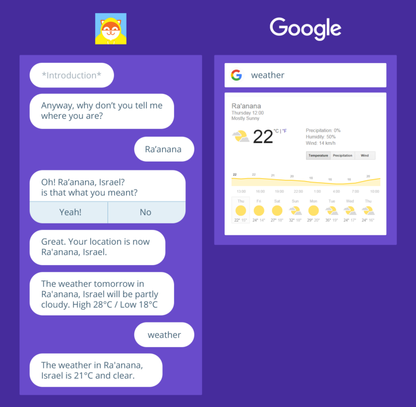
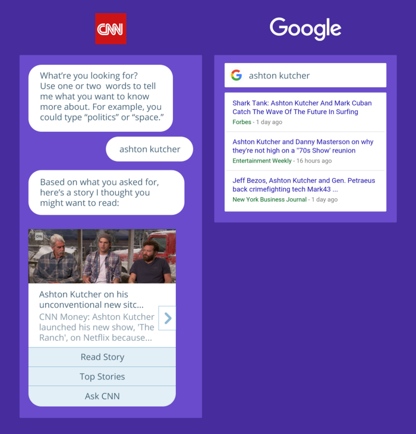
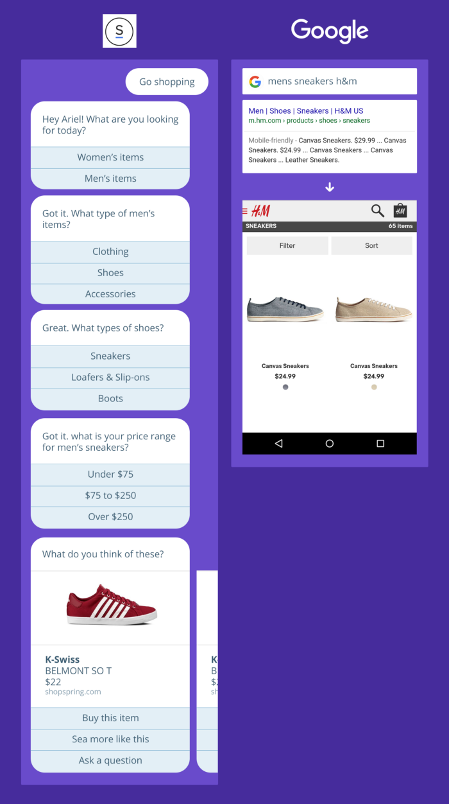

# 사람들은 챗봇의 가능성에 취해 인간의 뛰어남을 잊고있다.

최근 챗봇에 대한 관심과 열기가 후끈 달아오르고 있음을 느낄 수 있습니다. 다양한 사람들이 봇에 대해 말하고 이를 활용하는 법에 대해 얘기하고 있습니다. 물론 저 역시 채팅 플랫폼이 제공하는 대화형 인터페이스와 다양한 서비스의 결합에 기대를 갖는 사람 중 하나이지만.

가끔 과도한 관심과 무조건적인 적용 사례들을 보며 ‘지나치게 많은 것을 한 그릇에 담으려 하는 것’ 은 아닌지 의구심이 들 때도 있습니다. 실제 현재까지 등장한 여러 시도들을 체험하며 느낀 바는 [봇이 갖는 ‘가능성’이 ‘가능성’ 이상을 보여주지 못하고 있다.]로 줄여 말할 수 있을 것 같습니다.

플랫폼 제공자 입장에서는 어젠다 선점을 위해 그리고 기존 구축된 메신저 기반의 유통 채널을 수익 발생 창구로 전환할 절호의 기회라고 생각하기 때문에 앞다퉈 챗봇 도입을 유도하고 있지만. 덕분에 맥락상 적절치 않은 정보들까지 채팅 화면에 구겨 넣어지는 웃지 못할 해프닝이 발생하기도 합니다. 어찌 보면 지난 10여 년 이상 발전해 온 인터페이스 디자인의 발전을 역행하는 시도를 디자이너 스스로 그려가고 있는 셈입니다.(참고글:  [2016년 UX는 무엇을 말하는가?](https://sonujung.com/2016-the-state-of-ux) )

과거 irc 시절 챗봇을 처음 접한 뒤 약 15년이 흘렀지만 여전히 봇 생태계는 초기 단계에 머무르고 있습니다. 가장 큰 변화는 PC 채팅창이 모바일로 옮겨왔고 전보다 조금은 똑똑해졌다는 것이죠. 아마 일부 영역에서는 봇의 활용이 매우 유용하게 활용될 수 있겠지만 봇에 거는 큰 가능성이 현실화되기까지는 훨씬 더 오랜 시간이 걸릴 것이라 생각합니다. 아마도 그때쯤엔 디바이스의 형태도 지금과 확연이 다른 모습이 되어있겠죠.

물론 디지털 세상이 발전하는 속도는 눈이 돌아갈 정도입니다. 이미 피곤할 만큼 빠르게 발전하고 있으니 아마 이 글을 공유한 뒤 책상 앞에 앉아서 새로 나온 챗봇 프레임워크를 뒤적일 가능성이 높죠.

그래도 모두가 잠시 머리를 식힐 수 있도록  [인터컴의 디자인 VP 폴 애덤스가 게재한 글](https://www.intercom.com/blog/bots-versus-humans/) 을 소개해볼까 합니다. 인터컴이 어떤 서비스이고 어떤 문제를 해결하고자 하는 제품인지 알고 계시다면 그의 주장은 다소 방어적으로 읽힐 수도 있지만. 동시에 현재 다양하게 이뤄지는 챗봇 논의에 대한 한 축을 대변한다고 볼 수도 있으니. 한 번 가볍게 읽어보시고 다양한 의견 부탁드립니다.

-----

최근 몇 달 사이에 페이스북, Kik 그리고 텔레그램이 자사의 메신저를 위한 챗봇 플랫폼을 론칭했다. 그리고 많은 이들이 봇이야 말로 우리의 미래를 만들어 갈 것이라며 각자의 목소리를 내고 있다. 하지만 이러한 대부분의 사람들은 우리가 언제, 그리고 왜 봇과 대화하기를 원할지 궁금해 하기보다는 그저 페이스북과 다른 플레이어들이 가리키는 방향을 쫓아가는 듯 보이기도 한다.

봇의 등장에 사람들이 열광하는 이유는 대게 아래 두 가지 중 하나에 해당한다.

- **봇은 새로운 유통채널이다.** 
  우리는 앱의 종말 그리고 앱스토어의 종말이 매우 가까이 다가왔음을 느끼고 있다. 그리고 많은 기업들은 이미 챗봇을 활용한 유통 패러다임을 선점하기 위해 앱 대신 봇을 만들어내고 있다.

- **봇은 고객 커뮤니케이션에 발생하는 값비싼 인건비를 줄여준다.** 
  봇 생태계에서 쏟아져 나오는 수많은 아이디어들은 더 이상 채용을 필요 없게 만든다.

나는 위 두 가지 이유 모두 다 우리를 매우 일차원적이며 성급한 결론으로 이끌어가고 있다 생각한다.
첫 번째, 챗봇이 하나의 유망한 유통 채널임을 부정할 수 없지만 그것이 유일한 해법이라고는 보기 어렵다. 최근 구글의 새로운 스트리밍 앱이 이를 증명했다고 볼 수 있지 않을까.

두 번째, 만약 당신의 고객들과 실제로 대화해 본다면 모든 상품을 봇에게 구매할 것처럼 느껴지던 사람들이 사실은 사람과의 대화를 훨씬 선호한다는 것을 어렵지 않게 알아낼 수 있을 것이다. 생각해보라 그간 사람과 대화하고 싶은 간절함에 시리에게 말은 걸어본 적 없었는지.

-----

## 봇과 인간의 장점은 다르다.
봇의 잠재력을 이해하기 위해 우리는 봇이 무엇이며 다른 대안들과 구분되는 강점과 약점이 무엇인지를 알아야만 한다. 당연히 가장 먼저 떠오르는 대안은 인간이다. ‘인간의 소통 능력’은 봇에게 있어 가장 위협적인 경쟁자이다.

우선 짚고 가야 할 것은, 원래 ‘봇’은 사용자의 입력을 기반으로 단순한 동작이 가능하게 한 컴퓨터 프로그램을 통칭하는 말이다. 그리고 챗봇은 봇의 일종으로 채팅 인터페이스 내에서 동작하는 봇을 지칭한다. 하지만 최근 봇과 관련해 거론되는 것들이 메신저와의 연계에 집중되어 있다 보니(일단 페이스북 메신저만 놓고 봐도 약 10억 명이 사용하고 있다.) 근래 어딘가에서 ‘봇’이란 표현을 접했다면 그것은 ‘챗봇’을 가리킨다고 생각하자.

자, 그럼 챗봇이 차세대의 혁신 기술로 평가받는 현시점 우리는 이 기술이 지금 현재의 방식(사람과 사람의 대화)과 어떤 차별화된 가치를 제공할 것인지 비교하고 고민해 봐야 한다. 컴퓨터가 더 나은 건 무엇일까? 그리고 인간이 더 나은 점은 무엇일까?

우선 컴퓨터의 계산능력은 정말 엄청나다. 챗봇은 데이터를 분석하고, 계산하고 수 백만 가지의 옵션을 검토하여 그중 가장 최선인 해법을 단 몇 초만에 제공한다. 그 대신 챗봇은 인간의 감정을 이해할 수 없다. 사실 ‘자연어 처리 기술’이란 단어는 ‘네가 한 말이 뭔지 모르겠어 @.,@;;’라는 뜻에 가깝다. 챗봇은 우리가 글을 읽으며 느끼는 감정을 알지 못한다. 아마 컴퓨터가 인간의 감정을 이해하려면 적어도 10년은 걸리지 않을까?

반면 인간은 계산에 능숙하지 못하다. 대신 감정을 읽는 데는 무척 뛰어나다. 우리는 공감할 수 있다. 사람들을 설득해 무언갈 좋아하게, 또 사랑에 빠지게 만들 수 있다. 무엇이 그들을 상심하게 하는지 알고 또 어떻게 위로하는지 알고 있다.

우리는 그들의 이야기를 듣고 판단하며 어느 시점에 침묵이 필요한지 혹은 참견이 필요한지를 알아낼 수 있다. 마케팅이나 고객 서비스에서 공감이나 감정적 교감만큼 효과적인 수단은 없다. 전 세계를 가로지르며 끊임없이 이뤄지는 고객 커뮤니케이션에 과연 무엇이 필요할지 생각해보자.

그렇다면 대화 상대의 감정을 파악하지도 못하고, 그들의 기분을 나아지게 할 수도 없는 봇을 대체 어디에 써먹어야 할까? 심플하다 봇은 간단하고, 어렵지 않고 반복적으로 이뤄지는 질문과 수행에 적합하다. 예를 들어 다음 달 통신요금 납부일이 언제인지 알고 싶으면 봇에게 물어봐라. 얼마를 내야 하냐고? 그것도 봇에게 물어봐라.

하지만 이해할 수 없는 요금이 청구됐다? 자 이제 사람이 나설 때다.

봇에겐 분명한 한계가 있다. 하지만 봇이 제공할 수 있는 유용함을 잘만 활용한다면 모두 다 승자가 될 수 있다. 예를 들어 사소한 궁금증이 생겨 정답을 빨리 알고 싶을 때 상담원이랑 통화가 부담스러울 수 있다. 이럴 때 반복적이고 규격화된 질문은 봇이 담당하고 복잡하고 민감한 문의는 사람이 담당한다면 훨씬 효과적일 것이다. 이 효과는 고객지원에 들어가는 예산을 줄여주고 기업의 자원 분배 효용성을 높여주는 효과적인 성공전략이 될 수 있다.

-----

## 봇이 정답이 될 수 없을 때
봇은 반복적이고 단순한 로우-레벨의 문제들을 전담하는 해결사로서 고객 서비스의 미래에 중요한 위치를 차지하게 되겠지만 로우-레벨의 모든 문제를 해결할 수 있는 것도 아니다. 우리가 발견할 수 있는 봇의 나쁜 활용 사례들은 대부분 잘못된 디자인의 문제가 아니라 봇으로 해결할 수 없는 문제 혹은 봇이 필요치 않은 문제들을 해결하려 들기 때문에 생겨난다. 기존의 접근방식으로도 훌륭하게 해결할 수 있는 것들을 무조건적으로 메시징 인터페이스 안에 엉망진창으로 구겨 넣고 있다.

가장 왼쪽의 화면은 봇이 날씨에 대한 질문에 답변하는 모습이다. 세 화면중 가장 좋은 해법처럼 보이는지? 우선 보기 좋게 정리된 카드가(가운데-내가 스케치한 예시이다) 날씨를 확인하기에는 훨씬 좋은 해법처럼 보인다. 특히 이런 카드가 검색 결과에 순식간에 보이는 편이 훨씬 효과적일 것이다. 그래서 우리가 날씨를 확인할 때 폰초(가장 왼쪽 화면의 앱)보다 구글을 쓰는 것이다.

-----

## 우리는 사람과 대화하는 것을 원한다
이 모든 것이 우리를 가장 중요한 질문으로 이끈다. 정말로 우리의 고객들은 봇과 대화하기를 원하는 걸까? 앞서 말한 것처럼 역할이 분리된 형태라면 아마도 가능한 얘기일 것이다. 하지만 페이스북이 지향하는 방향대로 인간의 역할을 봇으로 대체한다? 글쎄.. 잘 모르겠다.

페이스북의 목표는 구별이 어려울 정도로 인간다운 봇을 만드는 데 있다. 하지만 거듭 강조하듯 사람은 사람과의 대화를 선호한다. 만약 현재의 온라인 비즈니스에 ‘인간다움’이 부족하고 그것이 해결해야 할 문제라고 생각한다면 사실 대부분의 원인은 ‘기존 기술을 제대로 활용하지 못하는 것’에 있으므로 봇을 사람처럼 만드는 것이 아니라 기존의 것들을 제대로 활용하는 것부터 시작해야 한다. 답장이 불가한 이메일을 발송한다거나, 고객의 질문에 숫자 표를 달아 버린다거나 지극히 형식적인 답변 양식과 컨택트 폼 같은 것들 말이다.

당신이 상점에 방문했을 때 어떤 상품에 대한 궁금증이 생긴다면 언제든 점원에게 물어볼 수 있지만 앱을 열었을 때엔 그렇지 않다. 그렇다고 사람인척 하는 봇으로 고객을 상대하게 한다면, 대화하던 중 상대방이 ‘봇’이란걸 깨달은 고객은 대체 어떤 기분을 느끼게 될까? 그게 비즈니스에 정말 도움이 될까?

봇은 우리의 대화의 훌륭한 도우미가 되어줄 수 있을 것이다. 간단한 질문에 대해 빠르게 답변하며 대화를 원활하게 이어갈 수 있도록 해줄 테지만 더더욱 감사한 것은 그들이 인간을 대체하는 순간이 꽤나 먼 미래의 일이 될 것이란 사실이다.

-----

## 추가 내용
폴 애덤스가 글에서 다뤘듯 Low-level Task라도 모든게 채팅 인터페이스와 어울리는 것은 아니라는 내용을 보충하기 위해 이스라엘의 디자이너 Ariel Verber가 공유한 글에서 채팅 인터페이스와 구글 검색 인터페이스를 비교한 사례를 일부 발췌하여 함께 소개해드리고자 합니다.

### 1. 날씨 확인하기

몰랐을 수도 있겠지만. 구글 검색창에 ‘날씨’ 라는 단어를 입력하면 오늘의 날씨는 물론 지난 일주일간의 날씨 정보를 매우 훌륭한 방식으로 제공해준다. 하지만 폰초가 제공하는 오늘의 날씨 정보만을 놓고보면 상세하고 친근한 느낌이 들 수는 하지만 그게 좀 더 쉽고 편리하다는 생각이 들지는 않는다.

### 2. 뉴스 읽기

구글은 모든 웹 정보 중 당신이 원하는 내용의 기사 그리고 연관된 기사를 찾을 수 있게 도와준다. 하지만 CNN의 새로운 챗봇은 푸시 알림을 통해 기사와 더불어 엉망진창인 브라우징 경험을 함께 전달해준다.

### 3. 의류 쇼핑하기

스프링의 챗봇을 써보자 원하는 정보를 얻기 위해 수많은 옵션의 늪을 거쳐야 하는 경험을 해야 하겠지만 구글은 정확히 당신이 원하는 결과를 보다 빠르게 제공하고 있다. 비록 스프링에서 판매하는 상품은 아니지만 — 아마 스프링은 챗봇보다 SEO를 더욱 신경써야 하지 않을까요? — 덕분에 나는 H&M의 웹사이트에서 구매하게 될 것 같다. 그리고 두 말할 것 없이 웹사이트가 메신저보다 훨씬 더 편리한 쇼핑경험을 제공하는것 같지 않은가?

---