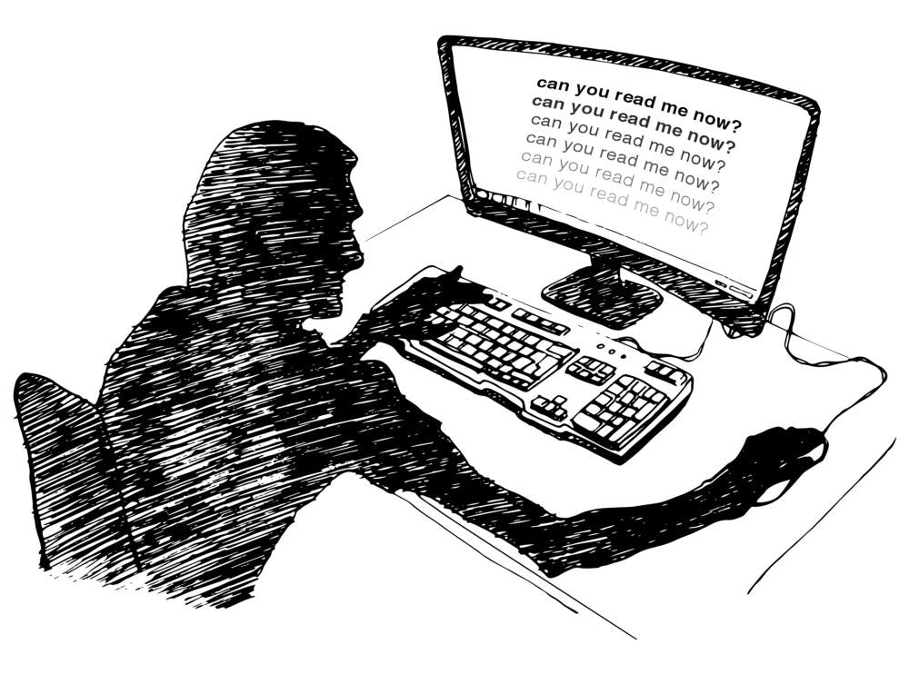
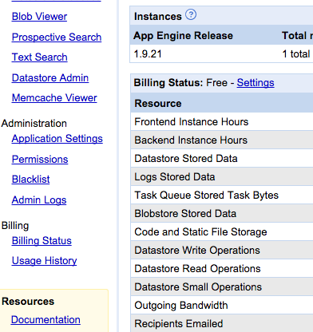
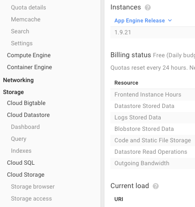
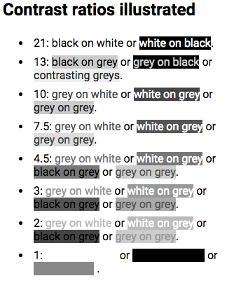
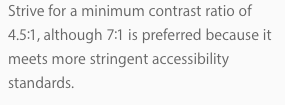
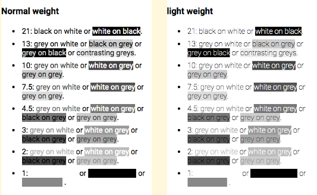

# 디자인 트렌드와 가독성에 대하여 by Kevin Marks

본 글은 [Kevin Marks](https://backchannel.com/@kevinmarks?source=post_header_lockup)가 [The Backchannel Team](https://medium.com/u/96b1b4d8e25c) 에 게재한 ‘근래 웹 환경에서의 가독성 이슈'를 다룬 [원문](https://backchannel.com/how-the-web-became-unreadable-a781ddc711b6#.osdb2q34c)을 번역한 것입니다.

디자이너 입장에서 글을 읽어 보았을 때 부분 부분 주장을 강조하기 위한 다소 억지스러운 근거들도 있지만. 전반적으로 웹 혹은 디지털 매체가 마땅히 수용해야 할 ‘범용성’이란 가치를 기준으로 보았을 때 시각적인 효과를 위해 일부 사용자의 가독성을 해치는 결과가 만들어졌다는 점을 부인하기는 어려울 것 같습니다.

시력 수준 혹은 사용하는 디스플레이의 품질 격차로 인해 정보 접근에 대한 당연한 권리를 누리지 못한다면 이는 반드시 개선되어야 할 문제임은 분명해 보입니다.

개발자 커뮤니티 못지않게 디자인 커뮤니티에서도 웹 접근성은 중요하게 다뤄야 할 어젠다이지만 아직까지는 미진하다는 점도 모두가 함께 고민해봐야 할 포인트가 아닐까요. 우선 저부터 관심 갖고 실천하려고 노력해야겠네요.

-----

휴대폰이나 노트북을 통해 뭔가 읽는 게 점점 더 어려워지고 있습니다. 화면에 얼굴을 들이밀고 잔뜩 찌푸리며 끙끙대야 할 정도인데.. 처음에는 제 시력에 문제가 있는 게 아닐까 걱정하곤 했습니다.

이러한 일들이 비일비재하여 짜증 나는 순간들도 많았지만 나를 진심으로 화나게 한 순간은 개발자인 내가 매일매일 방문하는 구글 앱 엔진의 콘솔이 새롭게 바뀌었을 때입니다. 분명히 선명하게 보이던 텍스트가 갑자기 읽기 힘든 옅은 회색으로 변경 됐거든요. 나이 탓인 줄 알았던 문제의 원인이 사실은 디자인 트렌드 때문이란 걸 알게 된 거죠.

배경과 텍스트의 대비를 줄이는 시도가 디자인 커뮤니티에 널리 퍼지며 이런 상황이 급격히 악화되고 있습니다. 애플과 구글.. 그리고 트위터 역시 책임을 피할 수 없습니다. (역자 주 — http://facebook.design 의 내비게이션을 참조하세요)

타이포그래피가 디자인이 다뤄야 할 중요한 요소로 여겨지지 않을 수도 있지만, 이는 매우 중요합니다. (역자 주 — Readability로 대체하여 이해하시면 좋겠습니다)

웹이 지금과 같이 가장 중요한 매체로 자리 잡게 된 이유 중 가장 중요한 하나는 ‘모든 사람들에게 제공된다는 점’입니다. World Wide Web 컨소시엄의 팀 버너스 리 (Tim Berners-Lee)는 이렇게 말했습니다.

> “웹의 힘은 그 보편성에 있다. 장애를 불문하고 모든 사람이 접근할 수 있어야 한다.”

그러나 지금처럼 웹의 정보들을 읽기 어렵게 만들어 버린다면 노인이나 시각 장애인 혹은 고화질의 모니터를 사용할 수 없는 사람들을 웹이라는 거대한 네트워크에서 배제하는 것과 같습니다. 특히 웹이 다루는 정보가 삶의 질을 결정짓는 상황이 되어버린 시대에서 이는 엄청난 차별 행위입니다.

우리는 시력과 관계없이 광범위하게 적용할 수 있는 텍스트 사용 표준을 마련하고 활용해야 합니다.

*구글 앱엔진의 콘솔화면 (이전) — 구식이지만 선명히 보인다.*

*구글 앱엔진의 콘솔화면 (현재) — 트렌디하고 고급스럽지만 읽기 어렵다.*

텍스트를 읽기 어렵게 만드는 큰 장애물 중 하나인 대비 문제(배경과 전경의 차이)를 해결하는 것은 그리 어렵지 않습니다. 2008년 웹 접근성 이니셔티브는 수치모델을 활용하여 가독성이 높은 웹페이지를 만들기 위한 적정 대비 값을 제시했습니다.

텍스트와 배경색이 같은 경우를 1:1로, 그리고 블랙&화이트의 명조 대비를 21:1로 표기하였습니다.

그들은 가독성을 위해 필요한 최소 대비를 4.5 : 1로 설정하고 시력 장애가 있는 독자를 위해 최소한 7 : 1의 명암 대비를 권장했습니다.

그런데 살펴보니 디자이너들은 권장사항을 지키기보다는 정말 최소한의 가독성 만을 추구하는 것처럼 보입니다.

*Contrast as modeled in 2008*

예를 들어 애플의 [타이포그래피 가이드라인](https://developer.apple.com/ios/human-interface-guidelines/visual-design/color/)은 7:1의 대비를 적용하기를 권장하지만 정작 아래 보이는 실제 페이지는 5.5 : 1의 대비로 디자인되었습니다.

*애플의 개발자 가이드를 캡춰했습니다.*

[구글의 가이드라인](https://material.google.com/style/typography.html#typography-line-height) 역시 7:1의 대비를 추천하고 있지만 의아하게도 디스플레이 서체 및 제목 유형에 대해서는 54 %의 투명도를 권장합니다. 이것은 실제로 4.6 : 1의 대비에 불과합니다. (역자주 — 아마 크기가 큰 서체의 경우 가독성의 문제가 상대적으로 적기 때문에 큰 문제는 없을 것 같아 보입니다만..)

애플과 구글 같이 영향력 있는 회사들의 타이포그래피 정책은 웹 전반에 통용됩니다. 그리고 이 두 회사가 제시하는 가이드라인은 가독성의 경계선에서 썩 모범적인 행태를 보여주고 있지는 못한 것 같습니다.

---

항상 이랬던 것은 아닙니다. 초기의 웹페이지들은 무척 읽기 좋았거든요, 1989년 [버너스 리가 제작한 웹브라우저](https://www.w3.org/History/1994/WWW/Journals/CACM/screensnap2_24c.gif)에서는 흰 배경에 검은 글자 그리고 짙은 파란색의 링크가 무척 읽기 좋은 형태로 사용되었습니다. 이 스타일은 NeXT Systems의(스티브 잡스가 설립한 소프트웨어 회사) 기본 가이드가 되었습니다. 1993년 Mosaic 브라우저가 출시되며 Black-on-Grey 구성을 선보이긴 했지만 마찬가지로 웹을 통해 널리 보급될 때까지 흰색 배경에 검은색 글자의 선명한 대비를 유지했습니다.

1996 년에 HTML 3.2가 출시되었을 때, 웹페이지에 활용할 수 있는 컬 러셋이 함께 제공되었고 우리가 선택할 수 있는 시각적 옵션을 넓혀주었습니다. 하지만 가독성 측면에선 여전히 8비트 화면이 읽기 쉽게 읽을 수 있었고 사람들은 [216색의 ‘웹 안전 색상'을](http://www.color-hex.com/216-web-safe-colors/) 지키기 위해 노력했습니다. 그러다 24비트 컬러 화면이 널리 보편화되면서 이제는 누구도 안전 색상 따위는 신경 쓰지 않습니다. 더 멋진 디자인을 위해서 파스텔 톤의 배경과 섬세한 하이라키의 텍스트 활용이 가능해졌습니다.

그러나 이때까지는 [사용자의 컴퓨터에 설치되어있는 폰트](http://www.ampsoft.net/webdesign-l/WindowsMacFonts.html)만을 웹에서 사용할 수 있었기 때문에 서체의 선택 폭이 제한적이었습니다. 그리고 이 글꼴의 대부분이 두껍고 잘 읽히는 종류였기 때문에 밝은 색상을 사용하더라도 큰 문제가 되지는 않았죠.

2009년이 되자 모든 게 바뀌었습니다. 웹폰트를 사용할 수 있게 되면서 보다 다양한 서체를 활용할 수 있게 되었고 ‘웹 안전서체'라는 용어가 무색해지게 되었습니다.

LCD 기술이 발전하고 더 높은 해상도의 디스플레이가 보급됨에 따라 가늘고 긴 서체의 활용이 유행하기 시작했고 애플이 2013년 Helvetica Neue Ultralight를 시스템 글꼴로 지정하며 이 트렌드에 불을 지폈습니다. (최근 애플은 iOS7에 굵은 서체를 다시 추가하였습니다.) 이에 많은 디자이너들은 밝은 색상, 낮은 명암에 더 얇은 글꼴을 활용하여 크기가 한껏 커진 디스플레이에 최적화된 시각 공식을 만들어냈지만 많은 사람들이 메인 디스플레이를 노트북, 휴대폰 및 태블릿 PC로 전환하고 있기 때문에 디자인 스튜디오에서 사용할 법한 이상적인 디스플레이 스펙은 점점 더 희귀해지고 있습니다.

---

디자이너들이 왜 밝은 색상의 얇은 텍스트를 사용하는지 알기 위해 한 디자이너에게 물었을 때 그는 웹디자인의 참고서 격인 [Typography Handbook](http://typographyhandbook.com/#color)을 예로 들며 설명해주었습니다. 이 책에서는 심한 대비의 컬러 사용을 경고합니다. 예를 들면 블랙(#000) 대신 다크 그레이(#333)를 사용하는 편이 눈의 피로를 줄일 수 있다는 것입니다. 이에 대해 [“The Magic of CSS”](http://adamschwartz.co/magic-of-css/chapters/4-color/)의 저자 Adam Schwartz 역시 아래와 같이 강조합니다.

> 흰색에 검은색의 선명한 대조는 시각적 인공물을 만들거나 눈의 피로를 증가시킬 수 있습니다. (반대의 경우도 마찬가지입니다. 이것은 상당히 주관적이지만 주목할만한 가치가 있습니다.)

보시는 것처럼 Schwartz는 이 결론이 주관적이라는 것을 인정하고 있습니다.

또 다른 주장은 난독증을 가진 사람들이 명암을 구분하기 어렵기 때문에 밝은 색상을 사용한다는 것입니다. 하지만 연구 결과에 따르면 [글자를 밝게 하는 것보다 배경색을 어둡게 하는 것이 난독증 환자에게 효과적이라는 데도](https://kevinmarks.github.io/textsamples.html) 말이죠.

몇몇 디자이너들은 Ian Storm Taylor의 글 ‘디자인 팁: [절대로 검은색을 쓰지 마라'를](https://ianstormtaylor.com/design-tip-never-use-black) 근거로 들기도 합니다. Taylor는 글을 통해 순수한 검은색은 색상이 아닌 개념이라고 주장하면서 아래와 같이 기술합니다.

> ‘우리는 어두운 것을 보면 이를 검은색이라고 생각한다. 하지만 현실 세계에서 순수하게 검은색을 발견하는 일은 거의 불가능하다. 아스팔트도 검은색이 아니고 사무실 의자도 검은색이 아니고 참새의 깃털도 검정이 아니고 웹페이지의 글자들도 검은색이 아니다.(그저 어두운 색일 뿐이다.)'

우선 짚고 넘어가자면 Taylor의 글은 텍스트를 밝게 쓰라는 점을 강조하기 위해 작성된 것이 아닌 듯 보입니다. 아마 글에서 말하고자 하는 요지는 디자인 시 현실 세계에서 볼 수 있는 풍부하고 미묘한 색상 변화를 고민하고 반영해야 한다는 의미에 가까울 것 같습니다. 실제 세상에는 블랙이란 존재하지 않기 때문에 #000=블랙은 비현실적인 색상이라는 셈이죠.

그리고 굳이 Taylor의 주장을 근거로 ‘#000=블랙’을 사용하지 않아야 한다는 사람들에게 토를 달자면. 사실 방의 조명과 모니터 백라이트의 누 광현상으로 인해 #000 역시 순수한 검은색이 아닌 회색 음영에 불과하다는 점을 알아줬으면 좋겠습니다. 더욱이 모바일 환경에서는 시간과 조명에 따라 밝기와 색상이 끊임없이 변하는데 말이죠.

이는 보다 근본적인 사안을 설명해줍니다. Adam Schwartz의 말을 빌자면:

> 색은 색이 아니다.. 컴퓨터가 아닌 사람의 눈도 아닌..

사용하는 디바이스를 켜서 우리가 보는 무언가는 ‘어떤 브라우저를 사용하는지, 어떤 브랜드의 휴대폰과 노트북이며 어떤 디스플레이를 사용하는지. 그리고 오늘의 날씨와 조도가 어떠하며 특히 내 눈 상태가 어떠한지’에 따라서 천차만별이다. 우리는 같은 색을 보고 있다고 여기지만 실제로 보고 있는 색을 상대적으로 인지하게 되죠.

그렇기 때문에 웹사이트 혹은 디지털 문서를 만들 때 실제 사용자를 고려하지 않고 — 만들어진 결과물이 사용자의 화면에서 밝기와 대비로 변환되는 상태를 고려하지 않고’ — 명암이 풍부한 대형 모니터로(iMac) 디자인하여 만들어진 패셔너블한 결과에 스스로 만족하고 마는 것은 디자이너로써의 책무를 포기하는 것이나 마찬가지입니다.

디자이너와 소프트웨어 개발자들은 유행을 신경 쓰지 말고 프린트 디자인의 원칙으로 돌아가기를 바랍니다. 당신이 써 내려가는 글자들을 검은색으로 유지하고, 회색을 사용하는 대신에 서체의 두께로 계층을 만드세요. 저처럼 눈이 노화된 사람뿐 아니라 오래된 디바이스를 사용하는 사람들에게도 유용할 겁니다. 이게 트렌디한 것은 아니겠지만 생각해 보세요.

> 누가 웹의 미학을 해치고 있습니까?

---

잘 읽으셨나요? 혹시 이 글이 도움이 되셨다면 아래 버튼을 눌러 커피 한 잔 어떠세요?
여러분의 작은 후원이 창작자에게 큰 힘이 됩니다! 😁
