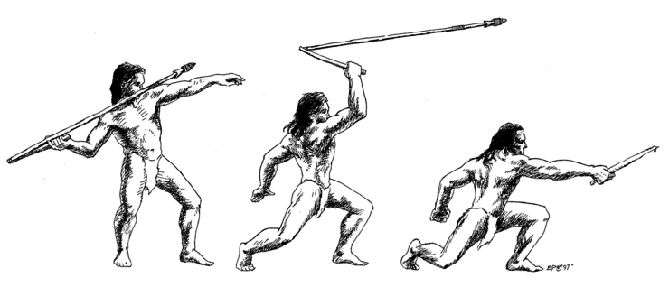
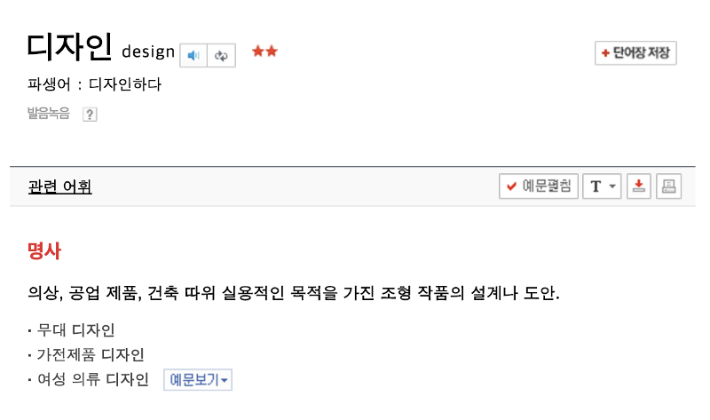

# 도구의 발전과 디자이너의 역할 변화

*Source from ‘Objectified’ by Gary Hustwit*

2013년 유명 매체인 Business Insider는 ‘부모님에게 설명하기 어려운 직업’ 10가지를 소개했습니다.

[10 Jobs That Are Impossible To Explain To Your Parents](https://www.businessinsider.com/the-most-misunderstood-jobs-2013-9?op=1)

그리고 이 중 당당히 1위를 차지한 직업은 바로 ‘유저 인터페이스 디자이너’입니다.

벌써 4년 전의 글이니 상황이 좀 나아졌을까 싶지만. 제 경우만 놓고 보더라도 지난 4년간 달라진 점은 ‘부모님께 설명하기를 포기하게 되었다는 것’ 정도인 듯합니다.

기사에서는 대표성을 위해 ‘UI 디자이너’란 잡 타이틀을 꼭 집어 랭크시켰지만 업계에서 통용되는 UX 디자이너, UX/UI 혹은 UI/UX 디자이너, 프로덕트 디자이너, 경험 디자이너 등 우리의 역할을 정의하는 다양한 호칭에 관한 논의는 업계 내에서도 끝없이 토론거리가 되어온 단골 소재입니다.

지금 구글 검색창에 What is UX Design?이라고 검색해보세요. 아마도 아래와 같이 수많은 검색 결과를 확인할 수 있을 것입니다. 아마 많은 이들이 궁금해하고 있기 때문이겠죠.

어떤 분들은 새롭게 등장하는 용어에 알레르기 반응을 보이기도 합니다. 혹은 정 반대로 단어 자체에 지나치게 매몰되거나 이를 버즈워드로 소비하는 모습도 종종 발견할 수 있습니다.

UX 디자인이라는 단어가 널리 통용된 기간은 불과 10년 내외에 불과하지만(최근에는 프로덕트 디자인이라는 명칭을 접하는 일이 잦아지고 있습니다.) 그 이전에도 디자인은 산업 발전사의 한 축에서 늘 특정한 ‘역할’을 담당해 왔습니다.

어쩌면 용어나 명칭은 큰 의미가 없을 수도 있겠죠, 타이틀 앞에 붙는 최신 유행 액세서리라고 생각할 수도 있습니다.

호칭에 신경 쓸 시간에 자기 자리에서 맡은 일을 하는 것이 정답일 수 있지만 우리는 때로 형태가 본질을 정의하는 상황이 존재하고 있음을 잘 알고 있습니다.

저 개인적으로는 ‘디자이너’라는 단어 앞에 붙어있는 여러 가지 수식어가 우리가 하는 일(業)에 대해 좀 더 명확히 정의하고자 하는 업계와 그 종사자들의 고민과 노력의 산물이라 생각합니다.

그리고 이런 생각을 하다 보니 문득 ‘디자이너, 그리고 프로덕트 디자이너’는 무엇을 하는 사람일까? 에 대한 생각을 해보게 되었습니다.

---

# 도구 그리고 인간

## **행위에 전문성을 요할 때 직업이 생겨난다.**

*Source from Illustration Art Gallery by Book Palace*

잠시 타임머신을 타고 과거로 돌아가 보겠습니다. 아마 그때에도 병에 걸리거나 다친 사람들을 치료하는 ‘행위’는 존재했겠죠? 또한 누군가가 다투면 이를 중재하는 ‘행위’가 존재했을 테고요. 그리고 이러한 행위들은 시간이 흘러 인간이 집단과 사회의 형태를 갖춰가는 과정 중에 ‘의사’, ‘판사’와 같은 직업의 형태로 발전하게 됩니다.

이런 식으로 현실의 다양한 직업들을 과거로 던져놓고 생각해보니 ‘직업’을 아래와 같이 정의할 수도 있을 것 같다는 생각이 들었습니다.

> 인간의 삶을 영위하고, 더 나은 삶을 추구하기 위한 행위에 ‘전문성’이 필요해질 때 탄생하는 것.

아마 상당히 많은 직업들이 태초부터 존재하던 인간의 원초적 ‘필요’에서 비롯되었다고 볼 수 있지 않을까요?

그렇다면 디자이너라는 직업은 인간의 어떤 행위와 연결하여 생각해 볼 수 있을까요?

## **맹수로부터 살아남기**

*Source from Museum of Vietnamese History*

아시다시피 초기 인류는 수렵과 채취를 통해 식량을 조달했습니다.

죽은 동물의 사체만으로는 생존을 이어가기 어려웠을 테니 최소 자기방어를 위해서라도 사냥은 필연적인 행위였고 어쩌다 매머드 같은 맹수라도 나타나면 주변에 보이는 나무 쪼가리 건 짱돌이건 냅다 집어 들고 달려들었겠죠? 100명이 있었다면 게 중 10명이나 살아남았을까요?

그런데 어느 날 한 친구가 새로운 걸 깨달았습니다.

> “아 저번에 뾰족한 돌(나무)로 찔렀더니 훅 가던데? 피도 막 뿜고 말이야..”

*Source from Us History Images*

그래서 동료들은 주변의 뾰족한 돌을 모으거나 돌을 쪼개어 날카롭게 만들기 시작했습니다. 그리고 다음 사냥에서 사용했더니 보다 적은 희생으로 매머드를 포획할 수 있게 된 거죠. 돌을 가공하는 것 만으로 생존율이 상승했습니다.

그러다 다른 한 친구가 말합니다.

> “얘들아 돌멩이를 나뭇가지 끝에 묶어두면 매머드 위에 올라타지 않아도 멀리서 찌를 수 있지 않겠어?”

이로써 이들은 맹수에 올라타지 않고서도 사냥을 할 수 있게 되었습니다. 당연히 생존할 확률도 훨씬 늘어났겠죠.

이렇게 인류 역사의 어느 한 지점에서 ‘필요를 발견하여 도구를 만들고 이를 개선하는’ 행위가 자리 잡게 되었습니다. 그리고 이러한 특성을 가진 인류를 이렇게 불렀습니다.

> 도구를 사용하는 사람 — ‘Homo Habilis’

현시대 디자이너라는 ‘업’의 가장 본질적인 ‘행위’는 인류가 처음으로 도구를 사용하는 순간 그 모습을 드러냈다고 볼 수 있지 않을까요?

## **생존의 문제에서 편의의 문제로 그리고..**

끝없이 떠돌아다니던 인류가 정착하고 수렵 및 채집에서 농경생활로 삶의 근간이 바뀌는 과정을 거치며 도구란 단순히 생존의 의미를 넘어서는 것이 되었습니다.

농작물 수확을 위한 농기구, 그것을 저장하기 위한 용기, 활동에 편리한 옷 등 생존과 직결되지는 않지만 인간의 삶을 더욱 풍요롭게 하는 수많은 도구가 만들어지고 삶의 많은 영역을 채워나가기 시작했습니다. 또한 그 수요가 점차 커지면서 도구를 만드는 전문적인 직업들이 생겨나기 시작했습니다.

인류가 부족 혹은 가문 등 집단을 이뤄 생활하는 과정에서 또 다른 종류의 수요가 발생했습니다. 도구의 용도, 성능과는 별개로 오롯이 서로를 구분 짓기 위해서 혹은 집단의 위세를 자랑하기 위하여 자신들의 도구에 독특한 장식을 새긴다거나 문양을 만들고 장신구를 이용하는 등 형태를 달리하여 차별화하는 일에 노력을 기울이게 된 것이 그것인데요. 이것은 마치 현재의 브랜드 그리고 브랜드 디자인이 다루는 경쟁을 위한 동질화, 차별화 행태와 사뭇 유사해 보입니다.

어쩌면 인간의 생존과 편의를 위해 도구를 만들고 개선하는 행위에서 디자인의 가장 근원적인 역할을 일면을 살필 수 있듯이 도구를 통해 서로를 차별화하고 돋보이게 하는 노력 역시 브랜드라는 개념을 포함한 디자인의 한 역할을 엿볼 수 있을 것 같습니다.

하지만 도구의 역사를 디자인 만의 전유물로 설명하기엔 도구 발전의 역사는 인류 문명 전반에 너무나도 지대한 영향을 끼쳐왔습니다. 작게는 개발자도 한 뿌리에서 뻗어 나왔으며 세상에 존재하는 수많은 직업과 발명이 도구에서 비롯하여 시작되어 인류 역사를 만들어왔고, 우리가 누리는 삶의 현재를 만들었기 때문이죠.

그렇다면 지금부터 현대적인 의미의 ‘디자인과 디자이너’가 언제쯤부터 그 모습을 드러냈는지 함께 살펴볼까요?

---

# 현대적 업(業)으로써 디자이너의 등장

## **1, 2차 산업혁명: 철기 이후의 가장 큰 패러다임 시프트**

사전에서 설명하는 디자인의 의미는 아래와 같습니다.

우리는 과거로 돌아가 도구의 탄생을 살펴보며 디자인 그리고 디자이너라는 직업과 맞닿는 ‘행위’에 대해 생각해보았습니다. 하지만 행위 만으로 하나의 직업이 성립되기에 부족한 까닭은 글 초두에 밝혔듯 ‘전문성’은 직업을 정의하는데 필수 불가결한 요소이기 때문입니다.

위 사전에서 말하는 정의에 따른다면 그 전문성이란 ‘설계하고 도안을 그리는 일’ 이 되겠네요.

가구, 건축, 무기, 의복, 생활용품 등 각각의 도구들은 오랜 기간 개선되어 발전해왔지만 아직까지는 한 사람의 손에서 시작되어 완성까지 이르는 일종의 가내 공업품으로 볼 수 있었습니다. 과정으로의 ‘설계’가 포함되어 있었지만 그 자체만으로 전문성을 요구하는 일은 아닌 셈이죠.

이러한 흐름에 큰 변화를 가져온 것은 18세기 맞이한 ‘산업혁명’의 물결이었습니다. 토머스 뉴커먼이 발명하여 제임스 와트가 개량한 ‘증기기관’의 등장은 곧 공장과 대량생산의 시대로 이어졌습니다.

면직물, 가구를 비롯한 갖가지 공산품을 만들어내는 대량생산 체제가 자리 잡으며 사회는 급변했습니다. 현대 자본주의의 태동과 세계를 반으로 가르는 이데올로기 전쟁 그리고 현 사회의 새로운 계급 체계를 야기했다는 진부한 비판은 차치하더라도 수공예의 전통과 단절된 기계가 찍어내는 값싸고 조약 한 상품들은 반기계, 수공예 생산방식으로 회기 등을 주장하는 ‘미술공예 운동’의 시발점이 되었습니다. 그러나 소량 생산만이 가능한 전통 수공예 방식으로 대중의 수요를 충족시키는 것은 불가능했습니다.

## **독일 공작 연맹 그리고 바우하우스**

*피터 베렌스: 전기 주전자, 1909 — © Die Neue Sammlung*

한편 1907년 독일에선 독일 공작 연맹이란 단체가 생겨났는데 이들은 같은 문제에 대한 해법으로 ‘수공예로의 회기’가 아닌 공업 생산품의 질적 향상을 위한 ‘기계공작의 발전’을 표방하였습니다. 미술공예 운동과 문제의식을 공유하였으나 반대의 방향의 해법을 내놓은 셈이죠.

이들은 예술과 산업 발전의 괴리를 극복하고 시대에 맞는 생산방식을 통한 ‘양질화’, ‘규격화’된 생산을 강조하였고 제품의 설계 과정에서 생산효율뿐 아니라 기능성과 미학적 완성도를 동시에 갖추길 요구하였습니다.

*발터 그로피우스가 설계한 바우하우스 건물*

이어 독일 공작 연맹의 소속 회원이던 발터 그로피우스는 바이마르 미술 아카데미와 바이마르 공예 학교를 통합한 교육기관 바우하우스의 초대 학장이 되었고. 독일 공작 연맹의 정신을 계승한 교육 방침으로 현대 디자인 교육의 기반을 마련하였습니다.

바우하우스는 기존 부르주아들의 살롱 미술로 전락한 순수 미술영역이 공예와 통합되어 빠르게 변하는 시대 상황을 반영할 수 있어야만 살아남을 수 있다는 신념 하에 미술과 공예의 이론 및 실습을 통합한 체계적인 교육을 제공하였고. 라슬로 모호이나기, 얀 치홀트, 바실리 칸딘스키, 파울 클레 등 당대의 뛰어난 디자이너와 예술가들이 모여 현대 미술과 디자인의 이론적 체계를 마련하였습니다.

바우하우스는 2차 세계대전과 나치 정권 등 혼잡한 독일 상황에 의해 폐교되었으나 바우하우스가 배출한 많은 인재들이 미국 등 세계 각국으로 퍼져나가며 바야흐로 전문적 역량을 갖춘 디자이너라는 직업의 역사가 본격적으로 시작되었다고 볼 수 있습니다.

또한 제 1.2차 세계 대전은 근대 디자인 역사를 써 내려가는데 지대한 영향을 미쳤습니다. 전쟁에 활용되는 무기야 말로 기능성과 대량생산의 효율성을 동시에 다루는만큼 디자인의 혜택을 가장 크게 볼 수 있는 생산품 중 하나였죠.

독일 공작 연맹, 바우하우스 등 근대 디자인 역사에 중요한 위치를 차치하고 있는 독일이, 마찬가지로 전쟁의 역사에도 빠질 수 없는 나라인 것은 참으로 아이러니한 일이 아닐 수 없습니다.

*2차 세계대전 당시 독일 군이 사용하여 500만명 이상을 사살한 무기 MG42*

제2차 세계대전이 종결된 후 폐허가 된 국가 재건을 위한 각 국의 산업화 경쟁이 시작되면서 디자인은 더 이상 독자적인 연구활동이나 창조적인 실험에 머무르지 않고 후기 산업 사회의 물질문화적 상징으로 여겨지기 시작했습니다.

> 전문 역량으로써의 디자인 그리고 디자이너는 조약 한 대량 공업 생산물을 개선하고자 하는데서 그 논의가 시작되었고 그것은 국가 수출 경쟁력을 높이기 위한 활동의 일환으로 산업의 형태를 갖추기 시작했다.

## **디자이너, 치열한 경쟁의 구원 투수**

*a limited-edition set of stamps commemorating some of industrial design’s pioneers*

20세기 중. 후반에 들어서며 눈부시게 빠르게 발전하는 과학 기술은 수많은 도구를 만들어냈고 이 도구들은 우리가 사는 공간의 빈 곳 들을 하나 둘 메워가기 시작했습니다.

가히 ‘소유의 세기’라고 불릴 만큼 ‘도구를 소유하는’ 행위는 삶의 질을 평가하는 중요한 잣대로 자리매김하였고 기업들은 소비자의 한정된 공간을 차지하기 위한 무한 경쟁 체제로 돌입하게 됩니다.

다만 하나의 제품이 지속적인 기술 발전을 이어가기 위해서는 큰 시간/금전적 투자가 필요하고 어떤 지점(소비자의 필요 수준)을 넘어서면 변별력을 상실하기 때문에 기업들은 경쟁력 재고를 위한 새로운 접근 방식을 찾아야 했습니다.

이런 상황에서 디자인은 기업의 간지러운 곳을 긁어주는 구원투수로 적격이었습니다. 기업들은 ‘도구의 편의성과 생산성을 높이고 무형의 가치를 통해 소비 심리를 자극할 수 있는’ 디자인의 가치에 매력을 느꼈고 곧이어 기업들의 치열한 디자인 경쟁이 시작되었습니다.

*The Cisitalia 202 designed by Pinin Farina in 1947. (www.made-in-italy.com)*

*Braun SK5 Radio and Record Player designed by Dieter Rams in 1958 (www.designxsaber.com)
*

유명한 스타 디자이너들이 등장하였고 ‘디자인 경영’, ‘디자인 매니지먼트’ 등 다양한 단어들이 등장하며 디자인은 기업 경쟁의 전면에 부각되기 시작했습니다. 바야흐로 디자인의 황금기가 찾아왔고 다양한 산업 분야에서 디자이너를 고용했으며 디자인 전문 교육기관이 연이어 생겨나기 시작했습니다.

삼성전자는 90년대 들어서 디자인을 기업의 최우선 경쟁력으로 부각하기 시작했다.

---

# 도구의 개념 확장

## **퍼스널 컴퓨터의 등장**

*The IBM 5150*

지금까지 살펴본 바에 따르면 새로운 기술은 새로운 도구를 탄생시키고 디자인은 이에 발맞춰 진화해왔음을 알 수 있습니다. 퍼스널 컴퓨터(PC)라는 새로운 도구가 탄생하기 전까지 제품 디자인이란 것은 비교적 이해하기 명료한 개념이었습니다. 누르기 편한 곳에 버튼이 달려있고, 거실이나 방 한편에 놓았을 때 보기 좋다면 좋은 디자인이라고 말할 수 있는 종류의 것이었죠.

사실 최초의 PC도 이러한 연장선상에서 별반 차이가 있었던 것 같지는 않습니다. 잘 눌리는 인풋 장치(키보드)를 만들고 이를 통해 입력된 정보를 아웃풋 장치(디스플레이)에서 잘 출력해주고 거기에 더해 책상 위에 올려두었을 때 사무실의 품격을 한껏 높여준다면 디자인의 역할은 다했다고 볼 수 있을 테니까요.

그런데 막상 PC를 만드는 과정에서 전에 없던 고민이 하나 추가됩니다. 이전까지의 도구는 내가 누르고 돌리고 앉고 눕는 살갗에 닿는 것들을 통칭하여 부르는 말이었는데. 이 컴퓨터라는 게 생기고 나니 정작 내가 누르는 것은 보조 도구이고 실제 알맹이는 화면에 출력되는 검은 화면과 글자들이라는 거죠.

## **물리적 도구 하드웨어, 디지털 도구 소프트웨어**

*Microsoft CLI based Operating System : MS-DOS*

이윽고 사람들은 고민하기 시작합니다. ‘분명 도구는 도구인데 기존의 도구와는 전혀 다른 이 녀석을 어떻게 설명해야 하지?’ 아마 이런 식의 고민이지 않았을까 싶습니다. 이 새로운 도구를 정의하기 위해서는 기존 도구의 개념을 확장시킬 필요가 있었습니다.

그렇게 등장한 단어가 바로 ‘소프트웨어’, 손으로 만질 수 있고 피부에 닿는 개념인 ‘하드웨어’와 대비하여 만들어진 이 단어로 인해 도구의 역사는 이전과는 전혀 다른 차원의 변화를 맞이하기 시작합니다. 물성을 가진 개체에 한정되어있던 도구가 디지털이라는 가상 세계 안에서 동작하는 비 물리적 개념으로 확장된 것이죠.

또한 이 ‘소프트웨어’라는 새로운 도구가 등장하므로 인해 디자인 역시 새로운 차원의 정의가 필요해지게 되었습니다.

*Grid Compass designed by Bill Moggridge in 1979*

1979년 그리드 시스템이라는 기업에게 휴대용 컴퓨터 디자인을 의뢰받은 빌 모그리지(IDEO의 공동 창업자)는 이 새로운 개념을 인터랙션 디자인*(IxD) — 인간-컴퓨터 상호작용(HCI: Human-Computer Interaction) — 라 명명하기로 했습니다.

새로운 도구를 디자인하는 과정에선 사용자와 하드웨어 그리고 소프트웨어 사이의 상호작용에 대한 충분한 이해와 고민이 필수적이라는 것이 그의 주장이었습니다.

*매킨토시의 그래픽 유저 인터페이스*

그리고 1981년 출시된 제록스 스타(Xerox Star)에서 애플의 매킨토시 그리고 마이크로소프트 윈도우로 이어지며 빠르게 보급된 그래픽 유저 인터페이스(GUI: Graphic User Interface)의 등장은 가히 획기적이었습니다. What you see is What you get(WYSIWYG)라는 개념으로 사용자에게 보다 직관적인 컴퓨팅 환경을 제공하는 GUI의 등장으로 기술자의 영역에 머무르던 인터페이스 설계 업무는 전문 디자너의 영역으로 옮겨왔습니다.

기존에 존재하지 않던 개념을 사용자들로 하여금 손쉽게 받아들이게 하기 위해선 현실세계의 컨텍스트를 반영한 적절한 메타포의 활용과 형태를 갖출 필요가 있었기 때문이죠.

이로써 ‘유저 인터페이스 디자인’의 역사가 시작되었습니다. 이전까지 크게 그래픽 디자인과 산업(제품) 디자인으로 나뉘어 시각적 상징과 물성 등을 주로 다루던 이들에게 소프트웨어 그리고 GUI의 등장은 디지털 기술에 대한 높은 이해를 요구했으며 디자인 교육은 보다 본격적인 다학제 교육의 성향을 띄게 되었다고 볼 수 있습니다.

하지만 아직까지 유저 인터페이스 디자이너는 주변에서 찾아보기 힘든 보기 드문 직종 중 하나일 뿐이었습니다. 우선 이를 필요로 하는 소프트웨어 대기업(애플, 마이크로소프트 등)의 수가 제한적이었고 대부분의 소규모 개발사의 경우 OS 프로바이더가 제공하는 가이드에 맞춰 기능을 제공하기만 하면 됐으니까 말이죠.

> 소프트웨어라는 새로운 도구의 등장으로 컴퓨터와 인간의 상호 소통 방식에 대한 고민이 시작되었으며 사용자와 소프트웨어가 만나는 표면 지점인 인터페이스 설계에 대한 니즈를 발생시켰다.

## **World Wide Web. 세상을 연결하다.**

*https://www.w3.org*

1990년 팀 버너스리에 의해 시작된 월드 와이드 웹은 실질적 의미에서 IT(Information Technology)의 시작을 알리는 혁신적인 발명이었습니다.

HTML(Hyper Text Markup Language)이란 컴퓨터 언어로 작성된 문서를 웹 브라우저라는 소프트웨어를 통해 전 세계 사람들과 공유할 수 있는 웹의 등장은 가히 폭발적인 반향을 일궈냈고 급속도로 성장하며 전 세계로 퍼져나갔습니다.

*세계 최초의 웹사이트 (http://info.cern.ch/hypertext/WWW/TheProject.html)*

최초의 웹은 온라인을 통해 공유 가능한 간결한 ‘문서’ 형태를 띠고 있었습니다. 간단한 사진과 텍스트 만으로도 충분히 위력적인 도구였으니까요. 하지만 머지않아 웹의 성장세가 심상치 않다는 것을 깨닫게 된 많은 기업들이 너나 할 것 없이 자사 웹사이트를 구축하기 시작합니다. 알다시피 기업이 관심 갖기 시작하면 무엇이든 경쟁으로 치닫습니다.

웹사이트를 매우 효과적인 홍보 수단으로 생각한 기업들은 그들의 온라인 전단물(Flyers)에 보다 많은 정보를 효율/효과적으로 담고 싶어 했고 이로 인해 새로운 직업인 웹디자이너가 세상에 등장하게 됩니다.

당시까지 웹디자이너라 하면 그래픽 디자인을 공부하여 레이아웃과 컬러 등 시각 산출물을 능숙하게 다룰 수 있으며 최신 기술인 HTML / JavaScript (후에 CSS)를 다룰 줄 아는 사람을 일컫는 말이었습니다. 시작부터 개발자와 디자이너로 각자의 영역이 명확히 구분되어 있던 시기가 아닌 만큼 웹디자이너라는 직업은 웹 기술에 대한 이해를 필수 전제로 깔고 있었다고 볼 수 있습니다.

웹이라는 새로운 매체(매개체로써 브라우저)가 갖는 여러 가지 특성에 대한 다양한 고민을 통해 웹디자인은 하나의 전문 분야이자 각광받는 신생 직종으로 주목받기 시작했습니다.

## **Web 2.0 시대의 개막과 웹 애플리케이션**

*워드프레스의 초기 버전*

웹 기술이 발전함에 따라 웹사이트는 단순 정보 전달을 위한 단방향의 문서 형태를 벗어나기 시작했습니다.

웹 2.0이라는 이름으로 구분되는 이러한 흐름의 대표적 산물인 블로그, 위키피디아, 포럼(게시판) 등의 플랫폼이 기존의 정적 웹사이트와 구분되는 가장 큰 차이점은 쌍방향 소통이 가능한 소프트웨어의 형태를 갖추었다는 점으로 사용자가 직접 참여하고 소통할 수 있다는 점에서 기존 웹의 개념에서 훨씬 진화한 형태라고 볼 수 있습니다.

그리고 이러한 변화를 통해 구글, 페이스북, 아마존 등의 수많은 웹 서비스 그리고 인터넷 벤처 회사가 탄생하게 됩니다.

웹사이트가 웹 애플리케이션의 형태로 진화 함에 따라 웹디자이너에게 요구되는 역량 또한 이에 발맞춰 변했습니다. 복잡해진 정보구조(IA)와 사용자 흐름을 정교하게 설계하고 보다 많은 참여를 유도할 수 있는 방법에 대한 고민이 필요해졌고 큰 규모에 복잡해진 개발 프로세스 내에서 소프트웨어 엔지니어들과 협업하기 위한 다양한 커뮤니케이션 스킬까지 필요하게 되었으니 한 명의 디자이너가 업무를 다루기에 역부족인 상황에 이르게 되었습니다.

이러한 환경의 변화는 자연스레 GUI디자이너(비쥬얼 디자이너), UI 디자이너, 인포메이션 아키텍트 등 다양한 명칭의 포지션의 등장으로 이어졌고 웹디자이너와 혼용되어 사용되기 시작했습니다.

> 웹의 탄생은 그 자체로도 충격적인 발명이었지만. 웹 2.0 즉 웹 애플리케이션의 탄생으로 인해 하나의 거대 산업으로 자리매김하게 되었다. 그리고 이는 자연스레 해당 분야 디자이너들에게도 이에 걸맞은 전문성을 요구하게 되었다.

## **사용자 경험 디자인의 부상**

지금까지 널리 사용되고 있는 ‘사용자 경험 디자인’이라는 단어가 전문용어로써 자리매김한 데에는 디자인 컨설팅 기업인 닐슨 앤 노먼 그룹(Nielsen Norman Group)의 설립자 도널드 노먼의 공이 지대합니다.

그가 애플의 부사장으로 재직할 당시 User Experience Architect라는 직함을 사용했는데 새로운 방식의 디지털 제품을 고안하는 과정에서 하드웨어와 소프트웨어의 인터페이스 그리고 사용자와의 상호작용을 설계해야 하는 그의 역할과 고민이 반영된 것이라고 볼 수 있습니다.

하지만 아직까지 ‘UX 디자인’은 복잡한 디지털 업계에 파편화된 여러 역할을 한데 묶고 공통 어젠다를 제시하기 위한 이론적이고 추상적인 개념에 가까웠습니다.

UX 디자인이라는 단어가 보다 실용적인 차원에서 활용되기 시작한 데에는 아이폰의 등장이 결정적인 역할을 했다고 볼 수 있을 것 같습니다.

이전까지의 소프트웨어는 정보 입력과 조작을 위해 물리적인 외부장치를 활용해야만 했지만 아이폰(멀티 터치 인터페이스)의 등장으로 인해 소프트웨어 자체가 조작 장치의 역할을 동시에 수행하며 ‘소프트웨어와 하드웨어의 완전한 결합’이라는 새로운 패러다임의 포문이 열리게 된 것입니다.

[https://www.youtube.com/watch?v=vN4U5FqrOdQ&feature=emb_title](https://www.youtube.com/watch?v=vN4U5FqrOdQ&feature=emb_title)
*스티브잡스의 2007년 아이폰 발표 영상*

스마트폰 시대가 개막하면서 서로 나뉘어 있던 하드웨어/소프트웨어 디자인의 이론과 실무적 통합, 즉 UX 디자인에 대한 본격적인 논의가 가속화되는 계기가 되었습니다.

> “물리적 세계와 디지털 세계라는 두 개의 분리된 세계가 스마트폰의 등장이라는 사건을 통해 극적으로 조우하며 디자이너는 소비자들이 이 낯선 변화를 보다 쉽게 받아들일 수 있도록 도와야만 했다. 어쩌면 ‘경험’이라는 단어가 전면에 등장하게 된 것은 이 ‘낯섦’을 해소하고자 하는 일종의 사명감이 투영된 게 아닐까?”

---

# 미래를 살아가는 사람들

## **스마트폰 생태계의 성장**

닷컴 버블 붕괴 이후 침체되어 있던 소프트웨어 산업은 스마트폰의 등장으로 제2의 호황을 맞이하게 됩니다.

수많은 애플리케이션의 등장으로 기존까지 널리 사용되던 모바일 하드웨어가 스마트폰으로 수렴되었고. 데스크톱 중심의 소프트웨어와 웹 서비스는 모바일 환경에 최적화되어야만 했습니다.

90년대 중후반 그랬던 것처럼 수많은 IT 스타트업이 생겨났고 기성 기업들은 체질 변화가 필요했던 만큼 자연스레 디자이너에 대한 수요 역시 급속도로 늘어나기 시작했습니다.

초기 스마트폰은 주머니에 넣을 수 있는 컴퓨터의 모습에 가까웠고 디자이너의 주된 역할은 소프트웨어를 좀 더 작은 화면에서 터치 인터페이스를 통해 조작할 수 있도록 설계하는 일에 집중되어 있었습니다.

그러나 데이터 통신망이 널리 보급되며 유틸리티 수준에 머물던 모바일 애플리케이션은 생활 전반을 지배하는 플랫폼으로 진화하기 시작했고. 여러 모바일 중심의 기업들이 폭발적으로 성장하게 됩니다.

이 시기를 전후로 등장한 디자인 환경의 몇 가지 큰 변화를 살펴보겠습니다.

1. **제품이 곧 기업이다.**

    페이스북은 그 자체가 제품이자 기업이며 그들의 인터페이스와 알고리즘의 변화는 광고 수익은 물론 업계 지형을 변화시킬 정도로 막강한 영향력을 갖습니다. 과거엔 하나의 기업이 다수의 제품을 보유한 형태가 일반적이던 것에 반해 온라인 비즈니스의 등장과 스마트폰 탄생이란 일련의 과정을 거치며 하나의 디지털 프로덕트를 중심으로 하는 기업 형태가 일반화되고 제품의 설계 및 작동 방식이 하나하나가 기업의 생존에 막대한 영향을 미치게 되면서 이를 만드는 (소프트웨어 엔지니어는 물론) 디자이너의 역할이 더욱 중요해졌습니다.

2. **다시 부는 스타트업 열풍**

    데스크톱 중심의 소프트웨어 생태계와 비교해 초기 진입이 수월한 모바일 생태계의 활황은 소규모 조직, 특히 제품팀(개발자/디자이너)을 중심으로 한 기업 문화와 프로세스가 정착하는데 큰 역할을 하였습니다(린스타트업, 디자인 스프린트 등). 스타트업의 성장 단계에 따른 구성원의 역할 정의에 대한 수많은 논의가 이뤄졌고 긴밀한 협업을 위한 다양한 방법론이 등장했습니다.

3. **화면 밖으로 확장된 디자이너의 역할**

    이전까지 디지털 프로덕트 디자이너는 특정 디바이스의 화면 안에서 이뤄지는 인터랙션에 대해 고민했습니다. 그러나 기술의 발전은 디자이너의 역할을 화면 밖 세상으로 확장시켰습니다. 우버나 아마존 에코를 만드는 디자이너라면 사용자가 놓인 상황적 맥락을 이해하고 다양한 경험 요소 제품에 반영하는 것이 매우 중요합니다. 과거 소프트웨어 디자인이 기능 중심, 탐색의 편의성을 중심으로 이뤄졌다면 스마트 디바이스로 인해 현실 세계로 확장된 사용자 경험의 변수는 또다시 디자이너의 역할을 크게 바꿔 놓았습니다.

## **모든 것이 연결된 시대: Smart Everything**

*아마존의 스마트 홈스피커 에코*

인프라 보급이 전 세계로 확장되고 스마트폰은 이미 너무 당연한 생활필수품으로 자리 잡게 되었습니다. 그리고 스마트폰을 중심으로 급격히 발전한 IT 생태계는 자연스레 다음 단계로 진입하였습니다.

모든 사물을 인터넷으로 연결한다는 뜻을 가진 사물인터넷(IoT)은 지난 몇 년 사이에 눈부신 속도로 발전했습니다. 오디오 냉장고 등 각종 가정용품을 비롯하여 애플 워치, 핏빗 등 웨어러블 디바이스, 아마존 에코, 구글 홈과 같이 허브 역할을 하는 인공지능 비서까지 그야말로 Smart Everything 시대라고 할 수 있습니다.

모든 기업이 인터넷으로 연결된 제품을 만들고 이젠 심지어 스마트 속옷까지 등장할 정도니까 말이죠.

앞서 아이폰에 대해 언급하며 멀티 터치 인터페이스라는 개념이 소프트웨어를 현실세계로 꺼내왔다고 했지만 이는 어디까지나 평면 위에 펼쳐진 화면에 불과했습니다. 현실과의 괴리를 극복하기 위해 사물의 텍스쳐를 흉내 내던 때가 엊그제 같은데 이제는 실제 손으로 만지고 피부로 느낄 수 있는 스마트 제품들이 빠르게 기존 제품을 대체하고 있으며 서로 연결되어 수집한 엄청난 양의 정보를 활용한 새로운 차원의 사용자 경험을 제공하고 있습니다.

또 사물인터넷이 소프트웨어라는 가상세계를 현실로 꺼내 놓으려는 노력의 일환이라면 현실을 가상세계로 옮기는 가상현실 그리고 그 중간의 경계선 역할을 하는 증강현실([참조: Mixed Reality가 온다](https://webuildproduct.com/mixed-reality-%ED%98%BC%ED%95%A9%ED%98%84%EC%8B%A4-%EA%B0%80-%EC%98%A8%EB%8B%A4-b0fa8f3f1fa7))의 상용화도 머지않았습니다. 해가 거듭될수록 마치 SF 영화에서나 볼 수 있을 법한 장면들이 현실화되고 있습니다.

## **지금, 디자이너에게 필요한 것**

*레오나르도 다빈치의 비행체 스케치*

그렇다면 프로덕트 디자이너라고 불리는 우리에게 요구되는 것은 무엇일까요?

과거 디자이너는 좀 더 명확한 역할 범위를 가지고 있었습니다. 그들은 장인정신으로 부를 법한 해당 분야 전문지식과 숙련된 기술을 갖추고 있었을 것입니다.

그러나 현재의 디자이너에게 요구되는 것들은 조금 다른 양상을 띠고 있습니다.

돌도끼가 쇠도끼로 바뀌기까지 수 천년 이상의 시간이 걸렸고 증기기관의 탄생 후 최초의 자동차가 탄생하기까지 50년 이상의 시간이 걸렸습니다. 그러나 컴퓨터-인터넷-스마트폰 그리고 사물인터넷, 인공지능, 가상현실 등등 최신 기술의 변화 주기는 하루가 다르게 짧아지고 있습니다.

기술의 발전은 더 이상 디자이너가 한 명의 장인이 되기를 기다려주지 않습니다.

하나의 제품을 만들기 위해 다뤄야 할 정보의 양은 폭발적으로 늘어났고 한 사람이 다룰 수 있는 정보의 범위는 극히 제한되어 있습니다. 게다가 일주일 뒤면 정보의 효용성이 완전히 사라질 수도 있습니다.

그렇기 때문에 디자이너에게 변화의 흐름을 빠르게 파악하고 필요한 정보만을 선택할 수 있는 능력을 갖추는 것이 매우 중요해지고 있습니다 또한 하나의 제품을 만들기 위해 필요한 전문 영역의 범위가 넓어진 만큼 이를 포괄할 수 있는 협업능력 역시 더욱 두드러지게 요구되는 핵심 역량이라 볼 수 있을 것 같습니다.

시대는 디자이너에게 스페셜리스트에서 제너럴리스트로, 다시 제너럴리스트에서 슈퍼 제너럴리스트로 변모하기를 요구하고 있습니다.

물론 변하지 않는 것도 있습니다. 결국 ‘도구를 통해 사용자의 문제를 해결한다’는 단순 명료한 목표를 달성하기 위해 끊임없이 노력하는 사람들이 과거에도 있어왔고 앞으로도 그럴 것이기 때문이죠.

다만 그들을 어떻게 부를지에 대한 고민은 계속되겠지만 말이죠.

---