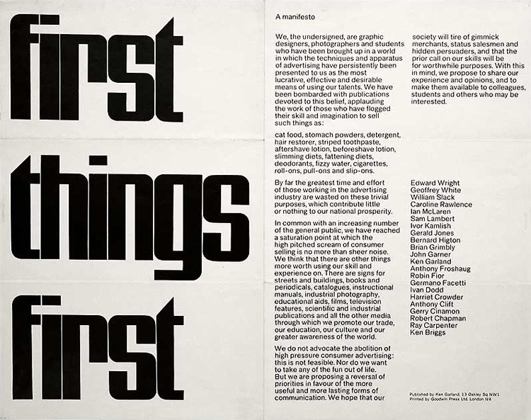
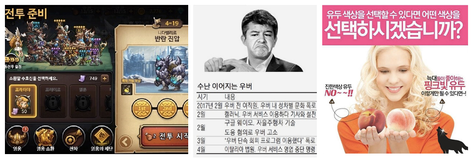

# 여자처럼?

몇 개월 전부터 진행 중인 패션 관련 프로젝트의 상품 추천 기능을 위하여 학습 데이터를 만들고 있다.
수천 개 이상의 패션 브랜드와 그들의 상품 이미지를 살피며 하나하나 키워드별로 분류하고 태깅하는 작업을 하는데, 이 과정에서 기존 패션 분야에 통용되는 여러 가지 단어를 자주 접하게 되었다.

그중 어떤 것들은 제품 내에서 사용해도 될지 많은 고민이 필요했는데 Tomboy, Mannish, Girlish와 같은 단어들이다.

**왼쪽에서부터 각각 Tomboy - Mannish - Girlish라는 키워드로 검색했을 때 노출되는 사진.**
 

위 단어들은 사회가 정의하는 '여성스러움'을 기준으로 만들어진 단어이다.
누구나 뜻하는 바를 쉽게 이해할 수 있다는 점에서 사용자 친화적인 단어라고 볼 수도 있지만 반대로 무의식적으로 고정된 성 역할을 강조하는 메시지로 사용될 수도 있다.

아래는 한국에서 '위스퍼'로 잘 알려진 'Always'라는 P&G 산하 여성 위생용품 브랜드가 진행한 'Like A Girl' 캠페인 영상이다.

%[https://www.youtube.com/watch?v=XjJQBjWYDTs&feature=emb_title]
*Always #LikeAGirl*

이 캠페인은, 우리 사회가 '여성스러운'이란 단어를 인간의 가능성을 제한하고 계층화하려는데 사용한다는 문제를 제기한다.

처음 이 영상을 처음 봤을 때, 나는 부끄러웠다.
사실 나를 포함한 대부분의 사람은 자신을 둘러싼 환경에서 많은 이들이 당연히 여기는 것들을 상식으로 생각하며 의구심을 갖지 않는다.

그래서 우리는 일상생활에서 '남자다운', '여성스러운' 등 어떤 이에겐 폭력일 수도 있는 단어를 아무런 거리낌 없이 사용해왔다.

그런데 그것을 뒤늦게 깨우쳤다 해도 이미 익숙한 것을 새롭게 정의하는 일 역시 만만한 것이 아니다. 이미 모두에게 익숙하게 사용된다는 것은 그만큼 커뮤니케이션 비용 측면에서 효과적인 수단 임을 뜻한다.

그리고 대체재를 찾는 것도 쉽지 않다. 특정 스타일이나 트렌드를 표현하는 Tomboy라는 단어를 무엇으로 대체해야 할까?

사회엔 인종, 성별, 직업 등 많은 것들에 대한 편향적 시각들이 존재한다.
그리고 이러한 시대에 부합하지 않는 사회적 통념을 바꾸기 위해서는 그들의 일상에 영향을 미칠 수 있는 여러 사람의 노력이 필요하다.

-----

# 디지털 프로덕트를 만드는 사람들

> 1964년 Ken Garland를 주축으로 한 400여명의 디자이너는 [First Things First (1964)](http://www.designishistory.com/1960/first-things-first/) 선언을 통해 사회적으로 중요한 가치를 우선해야 한다는 것을 외쳤다.

만약 당신이 IT 업계에 종사하고 있으며 특히 고객 접점이 넓은 컨슈머 제품을 만들고 있다면, 거기에 운까지 좋아서 그 제품이 인기리에 많은 사람에게 사랑받고 있다면.

당신은 많은 사람의 일상에 작지만 강력한 영향을 미칠 기회를 가지고 있다.
하루에 디지털 프로덕트를 사용하는 시간이 얼마나 될까?
모르긴 몰라도 점점 더 빠르게 늘어가고 있다는 것만큼은 분명하다.

만약 당신이 제공하는 제품 회원가입 화면 성별 입력란에 '남자'와 '여자' 외의 '성 분류 기준을' 옵션으로 제공한다면? '기타' 항목을 추가하거나 입력창 아래에 '주민등록상 성별을 선택하세요'라는 가이드 문구를 다는 것만으로도 생각보다 큰 변화를 만들 수 있다.

특히 빠르게 성장하고 있는 머신러닝 기술과 관련한 편향성 문제는 앞으로 차원이 다른 수준의 문제를 만들어낼 수 있다. 기계는 옳고 그름을 판단할 수 없는 만큼 현실에 존재하는 많은 편견을 고스란히 학습할 것이고 그가 갖는 영향력의 크기만큼 널리 퍼뜨릴 것이다. [MS가 선보인 인공지능 테이는 16시간 만에 서비스를 종료할 수밖에 없었다.](https://namu.wiki/w/%ED%85%8C%EC%9D%B4(%EC%9D%B8%EA%B3%B5%EC%A7%80%EB%8A%A5)
디지털 프로덕트를 만드는 사람들의 직업윤리가 중요해지는 까닭이다.

어려운 문제인 만큼 완벽한 정답도 존재하지 않는다.
지금, 이 순간 우리가 할 수 있는 일은, 치열하게 고민하는 것이다. 끊임없이 자신의 역할에 대해 질문하고 우리의 First Thing이 무엇인지 묻고 또 물어야 한다.

그렇지 않으면 제품, 기업은 크나큰 리스트를 맞닥뜨리게 될지도 모른다.

- 지역 감정 관련 민감한 사안을 스토리에 넣어 3년간 준비한 게임을 종료한 이터널 클래시
- 사내 여성차별, 성 추문 등으로 CEO가 물러난 우버
- 여성의 신체를 남성을 위한 도구처럼 표현하여 물의를 빚은 미미박스의 광고 이미지

> 사회는 빠르게 변하고 있다. 그것들을 따라잡기 위해서는 한시도 긴장을 놓을 수 없는 현실이다. 만약 당신이 그 빠른 변화에 기여하고 싶은 사람이라면 눈앞의 커다란 기회와 함께 따라오는 책임에 대해서도 함께 고민해야만 하지 않을까?

---