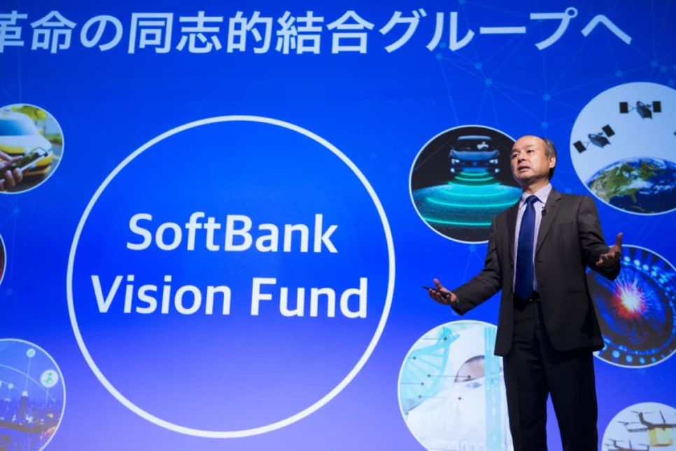

> 소프트뱅크가 2015년 1조 투자에 이어 최근 2조가량의 금액을 쿠팡에 투자했다.소프트뱅크는 왜 3조나 되는 돈을 투자했을까? 또 이게 국내 이커머스 업계에 어떤 영향을 미칠까?

소프트뱅크 주도로 운영되는 비전 펀드에서 쿠팡에 2조 원을 추가 투자하기로 결정하면서 쿠팡이 10조 규모의 데카콘(10조 이상 규모의 스타트업을 일컫는 용어) 이커머스 기업이 되었다. (블룸버그 기사 보기 [https://bloom.bg/2Bmaxzy](https://bloom.bg/2Bmaxzy))

불과 며칠 전 14일 소프트뱅크가 기존 보유하고 있던 쿠팡의 지분을 비전 펀드 소유로 전환하는 과정에서 약 30%가량 다운 밸류에이션 한 것에 대해 업계에서 한창 물어뜯던 와중에 이런 발표가 있으니 여럿 벙찌는 상황이 되어버렸다.

물론 소유주가 비전 펀드로 바뀌며 뒤따르는 주주 구성 변화를 리스크로 지적하는 것도 전혀 의미 없진 않지만 실질적으로 비전 펀드의 리더십을 소프트뱅크의 손정의 의장이 쥐고 있는 한 큰 변화는 없을 듯 보인다.

아마도 비전 펀드로의 매각은 최근 통신계열 분리 상장을 추진하며 투자사로써 본격 행보를 펼치고 있는 소프트뱅크의 포트폴리오 정리와 더불어 추가 투자를 전제로 한 밸류에이션 조정 과정이었다고 봐도 무방할 듯.오히려 추가 투자로 확실히 쿠팡을 지원사격하는 것을 보면서 소프트뱅크가 그리는 비전이란 게 무엇인지 더욱 궁금해지게 되었다.

현재 비전 펀드 및 소프트뱅크의 피투자 기업 목록을 보면 이런 상상을 해볼 수도 있다.

우선 주목해야 할 것은 이커머스로 '한국의 **쿠팡**', '일본의 **야후 옥션**', '중국의 **알리바바**', '인도네시아 **토코피디아**' 그리고 알리바바가 모기업으로 있는 '동남아시아의 **라자다**와 **레드마트**' (그리고 올 초 월마트에 매각되긴 했으나 플립카트 역시 소프트뱅크의 이커머스 포트폴리오 중 하나였다.)가 소프트뱅크의 영향력 하에 있으며 이들을 통해 소프트뱅크는 직. 간접적으로 아시아의 소비자가 어떤 상품을 구매하고 그게 어디로 이동하는지와 특정 지역의 소득, 생활 수준 등을 알 수 있게 된다.

여기에 비전 펀드의 주요 투자 대상인 인공지능, 로봇, 모빌리티 스타트업들이 열일 중인 **공장자동화, 자율 주행**이 고도화/상용화 될수록 물류 비용은 현저히 줄어들고 페이페이, 라인 페이 등 **모바일 결제**까지 합세하여 만들어내는 시너지로 온라인 구매 접근성을 폭발적으로 높일 수 있다.

현재의 이커머스가 전체 커머스에서 차지하는 비중이 10%에도 못 미친다는 점을 생각했을 때 손정의 의장은 사우디의 막대한 오일머니를 동원하여 남은 90%의 대지에 깃발을 꽂고 있는 셈이다.

특히 최근 몇 년 사이에 이커머스의 주도권이 서구권에서 아시아로 옮겨오고 있다는 점과 아시아 시장 내에서 한, 중, 일 이 세 국가가 갖는 영향력을 생각해 봤을 때 향후 소프트뱅크가 아시아 시장에서 가지게 될 파워는 그야말로 막강하지 않을까?

특히 전 세계가 메가 시티화되고 있는 추세(2050년이면 전 세계 인구의 70%가 '도시'에 살 것으로 예측하기도 한다.) 속에서 서울은 인구밀도 세계 1위 도시로 세계 최고 수준의 이커머스 보급 밀도와 인당 구매 비율을 보이고 있다.

이미 이커머스 초강국인 중국과 비교해도 훨씬 적은 비용으로 시장 검증이 가능하다는 점에서 매우 매력적인 시장이라고 볼 수 있다.

그러면 왜 쿠팡인가? 에 대한 해답은 거래 당사자들만이 알 수 있겠지만.소프트뱅크의 최초 투자시점부터 쿠팡은 지속적으로 테크 + 물류 내재화라는 키워드를 비전으로 내세우고 있었다는 점에서 이에 소프트뱅크가 공감했을 가능성과 무엇보다 (거래액 기준) 성장 속도가 어떤 경쟁사보다 빠르다는 점이 가장 잘 먹힌 요인이 아닐까 추측한다.

주로 쿠팡에 대해 비판하는 측에서는 재무 건전성을 문제 삼는데 이커머스 시장 역시 치킨게임 -> 승자 독식 공식이 잘 작동하는 시장인 만큼 자본으로 경쟁사들을 떨궈내고 끝까지 살아남는데 무엇보다 중요한 것은 '거래 규모'와 '돈'이고, 그렇다면 돈 많은 소프트뱅크가 쿠팡을 선택한 이유는 결국 성장 속도라고 봐도 무방하지 않을까.

여하튼 쿠팡이 이번 2조라는 투자 금액을 어떻게 활용할지, 그리고 그게 기존의 치열한 이커머스 경쟁구도를 어떻게 바꿀 것인지 또 한바탕 난리가 나겠구나 하는 생각이 든다.

이미 이베이, 티몬, 위메프, 신세계, 롯데 등 거대 기업들이 박 터지게 싸우고 있는 와중에 쿠팡의 독주가 시작될 것인지. 혹은 이를 계기로 한국 이커머스 전반의 밸류 상승과 자금 유치 경쟁이 시작될 것인지..그렇다 원래 남의 싸움 구경만큼 재미난 것이 없다더라.

---

잘 읽으셨나요? 혹시 이 글이 도움이 되셨다면 아래 버튼을 눌러 커피 한 잔 어떠세요?
여러분의 작은 후원이 창작자에게 큰 힘이 됩니다! 😁
