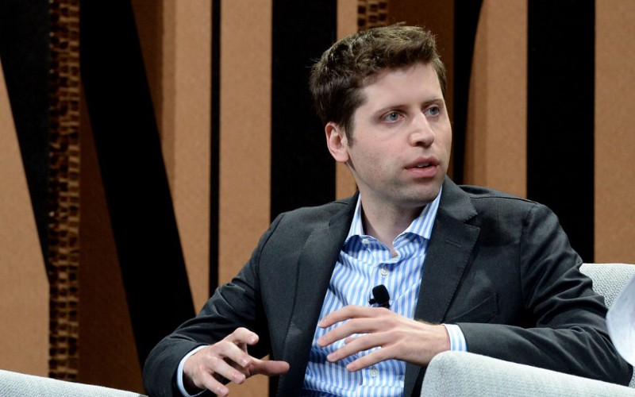

> 이 글은 Y-Combinator의 샘 알트만이 2019년 1월 25일 작성한 글을 번역한 내용이며 원문은 [http://blog.samaltman.com/how-to-be-successful](http://blog.samaltman.com/how-to-be-successful) 에서 확인할 수 있습니다.

나는 수천 명의 창업자를 관찰했고 엄청난 돈을 벌거나 매우 중요한 것을 만들어 내기 위해 필요한 것들에 대해 생각해왔습니다. 대게 사람들은 돈을 버는 것으로 시작해서 중요한 것을 만들어 내는 쪽으로 관심을 옮겨 가더군요.

여기 ‘인상적인 성공을 만들어 내기 위한 방법’에 대한 13가지를 나열해보겠습니다.

아래 내용들은 노력이나 특권을 통해 이미 어느정도 성공을 거둔 사람들이 더 큰 성공을 만들어내기 위해 활용한다면 좀 더 수월하게 적용될 수 있겠으나 대체로 모든 사람에게 공통적으로 적용되는 내용이라고 생각합니다.

---

## 1. 단리 상품이 아닌 복리 상품이 되라

복리는 마술입니다. 어디서든 지수 곡선을 만드는 것이 부를 창출하는 핵심 원리입니다.

> 지수 곡선(exponential curve): 어떤 순간의 개체군의 성장률이 그때의 개체 수에 비례해 지수 함수적으로 증가되는 성장곡선 — 네이버 지식백과

매년 기업 가치가 50%씩 증대하는 중소기업은 금세 대기업이 될 수 있습니다.

전 세계의 몇 안 되는 비즈니스 만이 진짜 네트워크 효과와 확장성을 갖고 있긴 하지만, 기술 발전으로 인해 그 수가 점점 늘어가고 있습니다. 이들을 찾아내거나 만들기 위해 노력하는 건 충분히 가치 있는 일입니다.

이 글을 읽는 당신은 아마도 자신의 부, 혹은 가치를 기하급수적으로 성장시키고 싶을 것입니다. 하지만 대부분의 커리어는 선형적 성장만을 기대할 수 있기 때문에 자신의 삶을 J 커브 모양의 성장 곡선 위에 올려놓는 것을 목표로 해야 합니다. 여기서 중요한 것은 복리 효과가 있는 커리어를 선택하는 것입니다. 2년 정도 투자해도 20년 경력자들과 비슷한 성과를 낼 수 있는 분야에서 일하기를 원치는 않을 테니 말이죠.

그렇다면 우선 당신의 학습 속도가 매우 높아야 합니다. 당신이 경력을 쌓아감에 따라, 당신이 맡은 프로젝트가 점점 더 큰 가치를 창출해 내야 합니다. 이러한 영향력을 만들어내는 수단은 자본, 기술, 브랜드, 네트워크 효과, 인력 관리 등 매우 다양합니다.

돈, 지위, 영향력, 당신이 무엇을 성공 기준으로 삼건 간에 이 수치에 0하나를 더하는 일에 집중하는 것이 좋습니다. 나는 하나의 프로젝트를 마치고 그다음 프로젝트를 정하기 위해서 충분한 시간을 들이고자 하는 편입니다. 여기에서 고려하는 것은 그다음 프로젝트가 이전까지의 모든 프로젝트를 사이드 프로젝트처럼 보이게 할 수 있는가?입니다.

대부분의 사람들은 선형적 성장의 수렁에 빠져있습니다. 당신은 작은 기회를 포착하여 이를 잠재적인 커리어 추월 차선으로 만드는데 집중하세요.

제 생각에 기업이건 개인이건 간에 비즈니스에서 가장 중요한 경쟁 우위 요소는 사회의 서로 다른 시스템이 어떤 방식으로 연결되고 결합하는지를 넓고 장기적인 관점에서 관찰하고 판단하는 능력입니다. 지금 시작된 하나의 성장 곡선이 수 년, 혹은 수 십 년이 지난 뒤 어떤 지점을 지나고 있을지가 중요합니다. 대부분의 사람들이 단기 성장에 매몰되어 있는 세상에서 시장은 장기적인 관점을 갖는 사람에게 충분한 보상을 제공할 것입니다.

성장 곡선의 힘을 믿고 인내한다면 놀랄만한 결과를 만나볼 수 있을 것입니다.

---

## 2. 과신으로 보일 만큼 확신하라

자기 확신(Self-belief)의 힘은 대단히 강력합니다. 내가 아는 가장 성공적인 사람들은 거의 망상이라고 할 만큼 자기 신뢰가 강합니다.

이것을 일찍부터 개발하십시오. 자신의 판단력이 좋으며 이를 통해 지속적인 결과를 만들어 낼 수 있다는 근거들을 확보하면 할수록 자신을 더 신뢰하게 될 것입니다.

만약 당신이 자신을 믿지 못한다면, 미래 가치에 대한 확신을 갖기 어려워집니다. 거대한 성공의 대부분이 미래를 뒤집어 생각하는 데서 시작는데도 말이죠.

나는 수년 전 엘런 머스크와 함께 SpaceX 공장을 방문했을 때를 기억합니다. 그는 로켓 제조 과정의 많은 디테일한 사항들을 설명하였으나 정작 가장 기억에 남는 것은 화성에 로켓을 보낸다는 것을 확신하고 있는 그의 표정입니다. 나는 그 표정이야말로 누군가의 신념을 눈으로 확인하게 할 수 있는 기준이라고 생각했습니다.

자신을 비롯해 팀의 사기를 관리하는 것은 가장 큰 도전 과제 중 하나입니다. 이는 자기 확신이 없이는 거의 불가능합니다. 불행하게도 당신의 야심이 크면 클수록 세상이 당신을 끊임없이 괴롭힐 테니까 말이죠.

가장 성공적인 사람들은 적어도 한 번 이상 다른 모든 사람들이 불가능하다고 말하는 미래를 실현해냈습니다. 그렇지 않았다면 그들은 훨씬 더 많은 경쟁에 직면했을 것입니다.

자기 확신은 반드시 자기 인식(Self-awareness)과 균형을 이루어야 합니다. 나는 한때 어떤 종류의 비판도 수용하지 않고 피하려 했으나. 이제는 그것이 사실이라는 가정하에 귀 기울이며, 이러한 비판까지도 모두 고려하여 나의 행동을 결정합니다. 진리 추구의 과정은 힘들고 때로는 고통스럽지만, 그렇기 때문에 자기 망상과 다른 결과를 만들어 낼 수 있습니다.

또한 이러한 균형을 갖추는 것이 당신의 손을 벗어난 일들을 걸러내는 데 도움이 되기도 합니다.

---

## 3. 독창적으로 생각하는 법을 배워라

독창적인 사고방식을 누군가에게 가르치는 게 어렵기 때문에 기업가 정신을 교육한다는 것이 어려운 것입니다. 학교에서 배울 수 없습니다. 사실 오히려 방해가 되기도 합니다. 그래서 당신은 스스로 독창적 사고방식을 확립해가기 위해 노력해야 합니다."

[제1 원칙](https://www.youtube.com/watch?v=NV3sBlRgzTI)을 기준 삼아 새로운 아이디어를 만들어내는 것은 즐거운 일입니다. 그다음 당신의 아이디어를 훨씬 더 멋지게 만들어 줄 수 있는 사람들을 찾고 그들과 함께 그 아이디어를 현실에서 쉽고 빠르게 테스트할 수 있는 방법을 찾아야 합니다.

“나는 수많은 실패를 겪겠지만 결국 단 하나의 성공에 도달할 것이다” 이것이 창업가의 방식입니다. 행운을 거머쥐기 위해서는 그만큼 많이 시도해야 한다는 것이죠.

이를 통해 배울 수 있는 가장 강력한 교훈 중 하나는 해결 방법이 없어 보이는 상황에서 당신이 무엇을 해야 하는지 파악할 수 있다는 것입니다. 이런 과정을 반복할수록 당신의 확신은 커져갈 것입니다. 그릿(Grit)은 쓰러지고 일어서는 것을 반복하는 과정 속에서 발현됩니다.

---

## 4. 세일즈에 능통해져라

스스로의 신념만으로는 충분치 않습니다. 당신이 믿는 바를 다른 이에게 설득할 수 있어야 합니다.

훌륭한 커리어를 쌓아가다 보면 대게 어느 정도의 영업력을 필요로 하게 마련입니다. 당신의 고객, 예비 사원, 언론, 투자자 등에 계획을 설득력 있게 전달하려면 매력적인 비전과 강력한 커뮤니케이션 스킬 그리고 남다른 카리스마와 실행력의 증거를 내보일 필요가 있습니다.

소통을 잘하기 위해 노력하는 것 특히 글을 통한 커뮤니케이션의 경우 충분한 투자 가치가 있습니다. 제가 드리는 최선의 조언은 먼저 자신의 생각을 명확히 하고 보편적이고 간결한 언어를 사용하라는 것입니다.

세일즈를 위한 최고의 기술은 당신이 판매하고자 하는 것에 대해 진실된 믿음을 갖는 것입니다. 자신이 진심으로 믿는 것을 팔 때엔 즐겁지만 짝퉁 약(Snake Oil)을 속여서 팔아야 한다면 기분이 어떻겠어요?

세일즈에 능숙해지는 것은 다른 기술을 향상시키는 것과 크게 다르지 않습니다. 누구든 의지를 갖고 연습하면 발전할 수 있습니다. 하지만 종종 영업하는 것에 대해 이유 모를 거리낌, 선입견을 갖고서 배우기를 꺼려 하는 경우도 많습니다.

또 다른 세일즈 팁을 하나 꼽자면, 중요한 순간에는 직접 움직이세요. 제가 처음 사업을 시작했을 때, 저는 언제나 비행기에 올라탈 준비를 하고 있었습니다. 이런 접근이 언제나 먹히는 것은 아닐지도 모르지만 지금까지 제 커리어에서 세 번의 커다란 기회를 이런 방식으로 만났습니다.

---

## 5. 기꺼이 위험을 감수하라

대부분의 사람들이 리스크를 과대평가하고 보상을 과소평가하는 경향이 있습니다. 리스크를 감수하는 것이 매우 중요한 이유는 많은 것을 실행하며 배운 것을 빠르게 적용하는 과정에서 매 순간 완벽할 수는 없기 때문입니다.

기왕이면 커리어 초반에 리스크를 지는 편이 좀 더 수월할 수 있습니다. 잃을게 많지 않은 반면 얻을 수 있는 잠재적인 보상은 훨씬 크기 때문이죠.

만약 수많은 의무에 손발이 묶인 상황에 다다랐다면 리스크 감수를 통해서 이러한 상황을 환기할 필요가 있습니다. 잠재적 손실이 작으면서도 기대 수익이 높은 지점을 찾아 크게 걸어보세요.

그리고 안락함에 익숙해지지 마세요. 우리는 종종 페이스북 혹은 구글에서 오랜 시간을 보낸 창업자들로부터 공통된 문제점을 발견하곤 합니다. 균형 잡힌 삶과 안정적인 직업, 무엇을 하건 인정받을 수 있다는 달콤한 유혹을 뿌리치기는 정말 어렵습니다. 게다가 다시 돌아가고자 하는 유혹은 더욱 강력하죠. 인간의 본성이 장기적인 성취보다는 단기적인 이익과 편안함을 추구하기 쉽도록 설계되어 있기 때문입니다.

만약 당신이 발 디딜 안식처를 마련하는 대신 생활에 드는 비용을 줄이고 엉덩이를 가볍게 한다면 영감을 따라 흥미로운 도전으로 시간을 보내는 일이 더욱 쉬워집니다. 물론 여기에는 확실한 장단점이 있겠죠.

---

## 6. 집중하라

집중은 일에 전력 승수 효과를 가져다 줍니다.

내가 지금껏 만나 온 대부분의 사람들은 무엇에 집중할 것인지 생각하는데 많은 시간을 할애하여 성과를 거뒀습니다. 지금 무엇을 해야하는지 잘 선택하는게 오랜 시간 일하는 것 보다 훨씬 중요합니다. 선택의 중요성을 모르면 중요하지 않은 것들에 많은 시간을 허비하고 힘을 낭비하는 셈이죠.

일단 무엇을 해야할지 정해지고 나면, 뒤돌아보지 말고 우선순위에 따라 빠르게 해치워버리세요. 저는 여태껏 느긋하게 움직여서 성공한 사람을 만나본 적이 없습니다.

---

## 7. 열심히 일하라

당신이 종사하는 분야의 상위 10% 안에 들기 위해서는 노력 혹은 재능이 필요합니다. 이것만으로도 충분히 훌륭한 성과지만 상위 1%에 들어가기 위해서는 노력과 재능 모두 다 필요합니다. 왜냐면 당신이 경쟁하게 될 다른 사람들이 이 두 가지를 다 갖추고 있기 때문이죠.

극단적인 사람들이 극적인 결과를 만들어 내곤 합니다. 일을 많이 하는 것은 삶에 있어 많은 포기를 강제하기 때문에 이런 삶의 방식을 선택하지 않는 것이 오히려 합리적이라고 볼 수 있죠. 하지만 일단 선택했다면 장점은 명확합니다. 엄청난 가속으로 성공이 성공을 낳는 경험을 해보고 싶나요?

그리고 항상은 아니지만 때때로 엄청난 즐거움을 만끽할 수도 있습니다. 삶의 가장 큰 즐거움 중 하나는 인생의 목적을 찾아 그것을 쫓고 나보다 더 큰 가치에 기여하는 데서 오기도 하거든요.

최근 YC의 한 창업가는 자신이 다니던 큰 회사를 떠나서 원대한 가치 창출의 기회를 쫓아 내달리는 일이 얼마나 큰 만족감을 주는지 느끼며 매우 놀라고 있다는 말을 전하기도 했습니다. 이렇게 일할 수 있다는 것은 분명 축하할만한 일이 아닐까요?

언제부턴가 열심히 일하는 문화를 악덕처럼 여기는 풍토가 퍼지는 것에 대해 저는 조금 이해하기 어렵습니다. 미국 외의 다른 지역에서는 열심히 일하는 것의 가치가 여전히 존중받고 있다는 점과 그곳의 창업가들이 분출하는 에너지와 실행력이 빠르게 만들어내는 결과들에 우리는 다시 한 번 주목할 필요가 있습니다.

다만 열심히 일하면서도 완전히 소모되지 않는 법을 고민해야 합니다. 실제로 워크 스태미나는 장기적인 성공을 가늠할 수 있는 중요한 기준 중 하나라고 생각하는데 사람들은 각자 자신만의 노하우를 찾으려 노력하지만 결국 실제로 동작하는 가장 효과적인 방법은 자신이 기꺼이 즐길 수 있는 일을 함께 즐길 수 있는 뛰어난 사람들과 같이 하는 것입니다.

나는 인생의 한 지점에서 무언가에 완전히 매진하지 않고도 큰 성공을 거둘 수 있다고 말하는 사람들이 문제를 만들어내고 있다는 생각을 합니다.

열심히 일하는 것에 대한 또 다른 의견은: 가능하면 경력 초기에 해보라는 겁니다. 몰입이 만드는 가치는 이자처럼 쌓이기에 빨리 시작할수록 그 혜택을 더 오래 누릴 수 있습니다. 또한 다른 책임이 적을 때 열심히 일하는 것이 더 쉽습니다. 항상 그렇지는 않겠지만 대체로 젊은 게 유리하겠죠.

---

## 8. 대담해져라

저는 어려운 스타트업을 시작하는 것이 쉬운 스타트업을 시작하는 것보다 쉽다고 믿습니다. 사람들은 뭔가 흥미진진하고 중요한 일에 뛰어드는 것을 더 원하기 때문입니다.

만약 당신이 굉장히 중요한 문제를 해결하는 과정에 있다면 많은 사람들이 당신을 돕기 위한 조력을 아끼지 않을 것입니다. 좀 더 야심찬 일에 자신을 내던지세요 그리고 진심으로 하고 싶은 일을 하는 것을 두려워할 필요가 전혀 없습니다.

만약 모두가 짤방(meme) 관련 회사를 만들고 있는 와중에 당신은 유전 공학 기업을 만들고 싶다면? 고민하지 말고 시작하세요.

당신의 호기심을 따르세요. 당신에게 흥미롭게 느끼는 일들은 대체로 다른 이들도 흥미롭게 생각합니다.

---

## 9. 버텨라

한가지 큰 비밀을 말씀드리자면 대부분의 사람들은 시도조차 하지 않고, 그간 해오던 일들을 늘 하던 대로 처리하는 동안 여러분은 자신의 의지로 세상을 구부릴 수도 있다는 사실입니다.

사람들은 일을 가능케하는 엄청난 힘을 갖고 있습니다. 다만 자기 확신의 부족으로 인해 채 충분한 힘을 발휘하기도 전에 포기해 버려서 자신의 잠재력을 충분히 발휘하지 못할 뿐입니다.

당신이 원하는 것을 구하는 과정에서 대체로 실패를 맛보게 될 테고 종종 매우 고통스러울 것입니다. 하지만 한 번 문이 열리면 엄청난 성취를 맛볼 수 있을 것입니다.

거의 항상, “될 때까지 밀어붙일 거야 뭔 일이 있더라도 끝을 보고 말 거야”라고 말하고 그것을 실행하는 사람들이 성공을 거둡니다. 그들은 운을 손에 넣기 위한 수많은 기회를 마주하며 결국 그것을 손에 넣습니다.

에어비앤비가 좋은 예시가 되리라 생각합니다. 그들은 다시는 겪고 싶지 않다고 말하는 수많은 경험(한도 초과된 신용카드로 아이들이 카드게임을 할 수 있을 정도라던가, 매 끼니를 천원 스토어에서 파는 시리얼로 해결해야 했던 고난의 연속이었던 시간들)을 거쳤고 그들의 방식으로 행운을 손에 쥐는 순간까지 오랫동안 버텨냈습니다.

이런 고집을 지키려면 낙관적인 자세를 유지할 줄 알아야 합니다 — 그리고 이것은 훈련을 통해 얻을 수 있는 특성이라 믿습니다.

저는 지금껏 성공한 비관주의자를 만나본 적이 없습니다.

---

## 10. 경쟁하기 어려운 상대가 되라

대부분의 사람들이 경쟁하기 어려운 회사가 된다는 것이 중요하다는 점은 잘 알고 있습니다. 그리고 이것은 매우 중요하고 분명한 사실입니다.

그러나 이는 기업에게만 적용되는 것이 아니라 개인에게도 똑같이 적용됩니다. 만약 당신이 하는 일이 다른 누군가에 의해 대체될 수 있는 것이라면 결국엔 더 저렴한 비용으로 대체될 것입니다.

개인의 경쟁력을 높이는 가장 좋은 방법은 자신만의 레버리지를 만드는 것입니다. 예를 들어 인적 네트워크를 구축하거나 강력한 개인 브랜드를 구축하는 방법이 있으며 다양한 분야의 지식을 융합할 수 있는 능력을 갖추는 것도 도움이 될 것입니다. 다른 다양한 전략들이 있겠지만 결국 중요한 것은 당신만의 강력한 무기를 갖는 것입니다.

대부분의 사람들은 남들이 하는 것을 쫓아서 모방하고 이런 행동은 대게 큰 경쟁력이 되기 어렵습니다. 당신의 분야에서 유일한 사람이 되세요.

---

## 11. 네트워크를 만들어라

훌륭한 일을 하려면 팀이 필요합니다. — 때로는 밀접하게, 때로는 느슨하게 — 함께 일할 수 있는 재능 있는 사람들의 네트워크를 구축하는 것은 훌륭한 경력의 필수 요소입니다. 당신이 알고 있는 정말 뛰어난 사람들의 네트워크 규모가 당신이 달성할 수 있는 일의 크기와 직결되기도 합니다.

네트워크를 구축하는 가장 효과적인 방법은 최대한 많은 사람들을 돕는 것입니다. 장기간에 걸쳐 누군가를 돕는 일을 반복해온 결과, 제 인생 최고의 경력을 쌓을 수 있는 기회를 얻었고 제가 했던 최고의 투자 기회 네 번 중 세 번은 이를 통해 얻을 수 있었습니다. 그리고 지금도까지도 10년 전 한 창업자를 돕기 위해 했던 일이 좋은 기회가 돼서 돌아오는 경우가 얼마나 빈번한지 종종 놀라고는 합니다.

네트워크를 구축하는 또 다른 효과적인 방법은 당신과 함께 일하는 사람들 사이에서 좋은 평판을 유지하는 것입니다. 좋은 것들은 지나칠 만큼 관대하게 공유하세요. 이것들이 10배로 돌아올 것입니다. 또한, 사람들의 강점을 평가하는 법을 배우고, 그들이 그 역할을 맡을 수 있게 하세요. (이것은 제가 경영에 대해 배운 것 중 가장 중요한 것입니다.) 당신은 함께 일하는 사람들이 스스로 생각하는 능력보다 더 많은 것을 이루면서도 모티베이션을 잃지 않게 하는 것으로 평판을 높일 수 있을 것입니다.

모든 사람들은 어떤 부분에서 만큼은 타인보다 뛰어난 점을 갖고 있습니다. 당신의 약점이 아니라 강점으로 자신을 정의하세요. 자신의 약점을 인정하고, 강점을 통해 일을 해내는 방법을 찾으세요, 그리고 자신의 약점이 당신이 하려는 일을 방해하는 핑계거리가 되게 놔두지 마세요. 종종 창업가들로부터 “나는 Y를 잘 못하기 때문에 X를 할 수 없습니다.”라는 말을 자주 듣고는 하지만 이것은 창의력 부족 외엔 아무것도 설명하지 않습니다. 당신의 약점은 언제라도 그것을 보완해 줄 수 있는 좋은 동료를 찾는 것으로 해결할 수 있습니다.

네트워크를 구축하는 데 있어 중요한 능력은 아직 드러나지 않은 재능을 발굴해 내는 능력입니다. 지적 능력, 실행력, 창의력과 같은 타인의 재능을 빠르게 파악하는 것은 실전을 통해 훈련할 수 있습니다. 이러한 역량을 개발하는 가장 좋은 방법은 많은 사람들을 만나고 그들을 관심 깊게 지켜보며 당신에게 감동을 주는 사람과 그렇지 않은 사람을 분류하는 것입니다. 당신이 찾는 것은 성장 가능성이라는 점을 명심하고 누군가의 경험과 현재의 성과를 과대평가하지 마세요.

저는 새로운 누군가를 만날 때마다 스스로에게 이렇게 질문합니다. “이 사람 속에는 폭풍 같은 열정이 숨겨져 있을까?” 저는 이 방법이 큰일을 해낼 수 있는 사람을 찾을 때 꽤나 잘 먹히는 방법이라고 생각합니다.

네트워크를 구축하는 또 다른 특별한 방법은 이상적으로 당신의 경력 초기부터 당신에게 승부를 걸 수 있는 능력 있는 사람들을 찾는 것입니다. 이렇게 하는 가장 좋은 방법은, 놀랄 것도 없이, 그들에게 도움이 되기 위해 일부러 노력하는 것입니다. (그리고 나중에 이 비용을 지불해야 한다는 것도 기억하세요!)

그리고 마지막으로 중요한 것, 당신의 꿈을 지지하는 긍정적인 사람들과 시간을 보내세요.

---

## 12. 소유함으로써 부를 쌓아라

어린 시절 경제에 대해 가장 크게 오해했던 점은 사람들이 높은 급여를 통해 부자가 되었다고 생각했던 것이다. 예를 들어 연예인과 같은 몇 가지 예외가 있지만 포브스 부자 순위에 오른 사람들 중 월급쟁이는 아무도 없었습니다.

진짜 부자가 되기 위해서는 가치가 급격한 곡선을 그리며 증가하는 무언가를 소유해야 합니다. 이것은 사업, 부동산, 천연 자원, 지적 재산 또는 기타 유사한 물건일 수 있습니다. 시간은 선형적 자원입니다. 그렇기 때문에 시간을 파는것 이외의 방식으로 부를 창출해 내야 합니다.

급격한 곡선을 그리며 성장하는 무언가를 갖는 가장 좋은 방법은 사람들이 원하는 것을 만드는 것입니다.

---

## 13. 내적 동기에 집중하라

많은 사람들이 외부의 평가를 중시합니다. 그들이 하는 모든 활동들은 다른 사람에게 좋은 인상을 남기기 위해 이뤄지곤 합니다. 저는 여러가지 이유로 이게 잘못됐다고 생각하는데 가장 중요한 두가지 이유는 아래와 같습니다.

첫째, 당신은 그럭저럭한 아이디어로 안전한 커리어 트랙내에서만 일하게 될 것 입니다. 당신이 생각하는 것보다 타인의 시선을 신경쓰게 되고 이것은 당신이 진정으로 하고자 하는 일을 하는데 장애물이 됩니다.

둘째, 당신은 리스크를 잘못 파악할 가능성이 높습니다. 다른 사람들과 어울리면서 그들보다 뒤쳐지지 않는것에 더 많은 시간을 할애하게 될 것입니다.

똑똑한 사람들이 특히 이러한 외부적 영향에 많이 노출되는 경향이 있습니다. 외부의 시선을 이해하는 것은 아주 약간의 도움이 될지는 모르지만 그 영향을 벗어나기 위해 더 많은 노력을 하게 됩니다.

내가 아는 가장 성공적인 사람들은 항상 내적 동기에 집중합니다. 그들은 자기 자신을 감동시킬 수 있는 뭔가를 끊임없이 찾고 이를 실행합니다. 그들은 세상이 자신에게 영향을 미치게 두지 않고 자신의 영향력을 세상에 발휘해야 한다고 느낍니다. 충분한 부와 명예를 얻은 뒤에도 이 내적 동기 만이 힘을 잃지 않고 당신을 끝없이 새로운 도전에 뛰어들게 만듭니다.

이런 이유로 누군가의 모티베이션을 묻는 질문이 그만큼 중요한 것입니다. 저는 누군가를 이해하기 위해 그 사람의 내적 동기를 아는 것을 가장 중요시합니다. 올바른 모티베이션을 일련의 규칙으로 정의해내기는 어렵지만 아마 당신이 보게 된다면 바로 알수 있을 것입니다.

제시카 리빙스턴과 폴 그래험은 이런 점에서 나에게 본보기가 되는 사람들입니다. YC는 초기 몇 년간 사람들에게 비아냥거림의 대상이었으며 거의 모든 사람들이 YC가 성공하리라 여기지 않았습니다. 하지만 두 사람은 YC가 제대로 동작한다면 세상에 좋은 영향을 줄 수 있다고 생각했고 무엇보다 그들은 사람들을 돕는 것을 즐겼습니다. 두 사람은 기존의 방식보다 자신들의 새로운 방식이 더 뛰어나다는 것에 강한 믿음을 갖고 있었고 그것을 증명했습니다.

결국, 당신에게 중요한 의미를 갖는 분야에서 뛰어난 결과를 만들어 내는 것으로 당신의 성공을 정의할 수 있습니다. 이걸 보다 일찍 시작할 수 있다면 더 멀리 갈 수 있습니다. 당신이 사로잡혀있지 않은 것으로 큰 성공을 거둔다는 것은 너무도 어려운 일입니다.

---

## 역자 노트

샘 알트만이 와이컴비네이터의 회장인 만큼 대체로 창업가에 대한 내용을 다루고 있지만 기본적으로 어떤 위치에 있건 간에 한 번쯤은 고민해 볼 수 있는 커리어 조언으로써 괜찮은 글이라는 생각에 번역하여 공유해 봅니다.

무엇보다 중요한 것은 위 글은 원작자 기준에서 정의한 성공을 전제로 쓰여있는 만큼 절대적인 지침으로 받아들이기 보다는 각자의 기준에서 성공을 어떻게 정의할 수 있는지, 그것이 글에서 말하는 성공과 어떤 차이점을 갖는지 등을 생각해 보는 도구로써 삼아보면 어떨까합니다.

---

잘 읽으셨나요? 혹시 이 글이 도움이 되셨다면 아래 버튼을 눌러 커피 한 잔 어떠세요?
여러분의 작은 후원이 창작자에게 큰 힘이 됩니다! 😁
