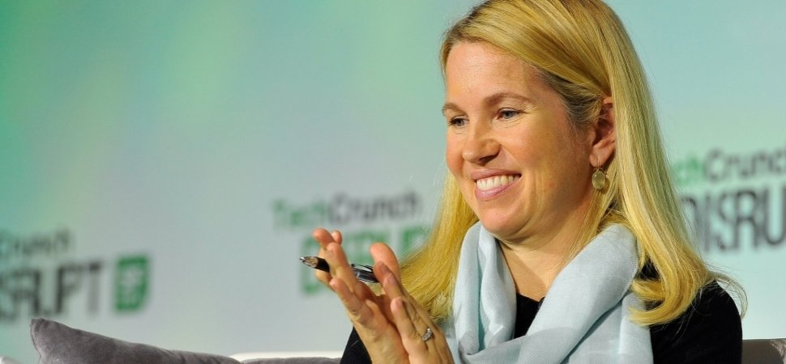

> 와이컴비네이터의 파트너이자 공동 창업자인 제시카 리빙스톤이 2014년 월스트리트 저널에 기고한 칼럼 '[Jessica Livingston: Why Startups Need to Focus on Sales, Not Marketing'를](https://blogs.wsj.com/accelerators/2014/06/03/jessica-livingston-why-startups-need-to-focus-on-sales-not-marketing/?fbclid=IwAR3Xtqvrh8NnqGGbGhOvGxToZIlwLkVDjsKzPtTu1JlUPiy78zss7pl8DdQ) 번역한 글입니다.

초기 단계의 스타트업이 유의해야 할 중요한 사실 중 하나를 말하면 아마 의외라고 느낄지도 모른다. 그것은 '마케팅'이라는 단어가 붙은 대부분의 행위가 지금의 당신에겐 크게 도움되지 않는다는 것이다.

판매와 마케팅은 하나의 고리 위에 얹어져 있으나 서로 마주칠 수 없는 N극과 S극 같다.

판매는 고객과 맞닿는 지점이 좁고 깊은 반면 마케팅은 면적이 넓고 깊이가 얕다. 그리고 초기 단계의 스타트업에 있어 훨씬 중요한 것은 좁고 깊은 관계를 형성하는 것이다. (이것은 단지 고객에게 여러분을 알리는 행위에만 해당하는 게 아니라 제품을 만드는 것에 있어서도 똑같이 적용된다.) 그러므로 여러분이 해야 하는 마케팅 역시도 판매, 즉 여러분의 제품에 깊은 관심을 갖는 소수의 사용자들과 대화하기 위한 형태여야 한다는 것이다. 무관심한 대중에게 소리치는 게 아니라 말이다.

성공적인 스타트업들은 대부분 좁고 깊게 시작한다. 애플은 스티브 워즈니악이 모임 친구들을 놀라게 하려고 만든 컴퓨터로 사업을 시작했다. 수는 매우 적었지만 엄청난 관심을 갖고 있는 청중이다. 페이스북은 하버드대 학생들만을 대상으로 시작했다. 마찬가지로 많은 잠재 사용자를 고려하고 만든 게 아니다. 그저 그것을 엄청나게 좋아할 것 같은 주변 사람들을 위해(어쩌면 인기를 끌기 위해) 만들어진 것이다.

성공적인 창업은 좁고 깊게 시작한다. 사실 많은 대중에게 어필할 수 있는 힘이 부족하기 때문이기도 하지만 소수의 초기 팬들과 소통하며 얻는 인사이트가 초기 스타트업에게 성공의 기반을 제공한다는 점이 아이러니한 성공의 비밀이다.

우리는 와이컴비네이터의 프로그램에 참가하는 대부분의 스타트업에게 몇몇 핵심 얼리 어답터 그룹을 찾아서 고객으로 만드는 것을 가장 먼저 주문한다.

예를 들어, Airbnb의 얼리 어답터는 뉴욕의 호스트들과 손님이었다 (와이컴비네이터는 2009년 겨울 Airbnb에게 투자했다.). 당시 샌프란시스코에 있던 에어비앤비 창업자에게 우리가 조언한 것은 단순하다. '뉴욕으로 가라'. Airbnb는 더 많은 호스트를 확보하고 기존 호스트가 Airbnb에 정착할 수 있게 하는 일에 집중해야만 했고 이는 멀리 떨어져서 하기 어려운 일이었기 때문이다. 브라이언 체스키와 조 개비아(Airbnb의 창업자들)는 매주 뉴욕으로 날아가 그들의 초기 고객들을 만났고 그 고객들의 소개로 새로운 고객들을 확보했다.

스트라이프는 처음부터 눈에 띄는 모든 사람에게 서비스를 홍보하고 고객으로 만드는데 주저함이 없었다. 와이컴비네이터 프로그램에 참가하는 동안에도 함께 프로그램에 참여하는 주변 팀들을 고객으로 만들기 위해 적극적으로 행동했다. 공동 설립자인 패트릭과 존 콜린슨은 그저 명함을 주고받고 이메일을 보내는 정도로 끝내지 않았다. 관심을 보이는 사람이 있으면 그 자리에서 바로 설치하게 만들었다. 우리는 이러한 매우 공격적인 고객 유치 방법을 '콜리슨 설치'라고 부르기로 했다.

와이컴비네이터의 많은 초청 연사들은 그들의 초기 사용자를 얻는 과정이 얼마나 노가다스러웠는지에 대한 많은 얘깃거리들을 공유해주고 있다. 지금이야 엄청난 사용자들이 이용하는 핀터레스트의 창업자 벤 실버맨도 처음에는 팔로알토의 커피숍을 돌아다니며 사람들에게 서비스를 홍보하고 다녔다.

마케팅의 유혹에 빠지는 것이 위험한 이유는 앞서 설명한 것처럼 초기 스타트업에게 매우 중요한 '사용자를 획득하고 제품을 정의하는 과정'을 쉽사리 잘못된 방향으로 끌고 갈 수 있기 때문이다. 잘못된 방향을 향하게 되면 성장은 고사하고 제품의 개선에도 무뎌지기 쉽다. 나는 창업자들이 제품을 만들고 그것을 공표하고 자리에 앉아 사용자를 기다리는 모습을 수도 없이 보아왔다. 그 결과 사용자를 얻지 못할 뿐만 아니라 아무런 피드백도 얻지 못한다.

그렇다면 왜 많은 창업자들은 사용자 한 명 한 명 만나서 소통하는 것으로 사업을 시작하지 않는 걸까? 그야 물론 매우 힘들고 지치는 일이기 때문이다. 얼굴을 마주하고 앉은 첫 고객은 '마케팅'으로는 얻을 수 없는 꽤나 가혹한 피드백을 준다. 좋은 얘기만 듣고 싶겠지만 이러한 피드백이야말로 초기 스타트업에게 필요한 것이다. 내 경험으로 미루어 볼 때, 제품의 미숙한 완성도라던지 비즈니스 곳곳에 자리한 허점들을 지적받는 일을 무의식적으로 피하게 되는 창업자에게 '마케팅'은 그럴듯한 도피처가 되어준다.

그렇다면 수작업의 효과는 어떻게 측정해야 하는가? 절대적인 수가 아닌 성장률에 초점을 맞추는 게 포인트다. 성장률에 포커스 하면 처음 방문한 고객의 수가 적다고 실망할 일은 없다. 지금 20명인 고객이 다음 주에 22명이 되더라도 10%의 성장을 거둔 것이기 때문이다. 일주일에 10%씩 계속 성장한다고 생각하면 그 결과는? 매우 인상적일 것이다.

와이컴비네이터는 초기 스타트업에게 '좋은 제품을 만들고' '발로 뛰어 고객을 확보'하는 것의 중요성을 항상 강조한다. 이 두 가지의 지루한 수작업이야 말로 성공하는 스타트업의 비법이다. 마케팅의 화려함에 현혹되지 마라. 고된 수작업의 수고를 피하는 결과는 스타트업의 죽음이다.

---

**역자 주**

이제는 꽤나 널리 알려진 내용의 글인데 오래전에 저장해 둔 글을 다시 읽으니 감회가 또 다르네요. 지금은 전 세계가 주목하는 와이컴비네이터의 잘 알려진 '우리 제품을 좋아해 주는 100명보다 사랑해주는 1명이 더욱 값지다'는 말의 또 다른 버전인 글이었습니다. 다시 보니 머리로는 알면서도 실행으로 옮기지 못했던 쓰라린 기억이 새록새록 떠오르네요.

---

잘 읽으셨나요? 혹시 이 글이 도움이 되셨다면 아래 버튼을 눌러 커피 한 잔 어떠세요?
여러분의 작은 후원이 창작자에게 큰 힘이 됩니다! 😁
