## 모두가 고객과 직접 대화하기

식스샵에선 서비스 운영팀 분들 외에도 모든 구성원이 고객 상담 업무에 참여하고 있다.

이는 창업 초반 Wufoo의 공동 창업자 Kevin Hale이 ' [How to build products users love](https://www.youtube.com/watch?v=sz_LgBAGYyo) '라는 주제로 YC의 How to start a startup 강연을 통해 발표한 내용에서 영감받아 시작하게 되었다.

고객 중심의 문화를 만들기 위해서는 제품을 만들고 알리는 사람들이 고객과 직접 맞닿아 그들이 느끼는 만족/불만족의 온도를 체감하는 것이 중요하다고 생각하기 때문에 지금까지 꾸준히 이어지고 있는데.

이전 글 [누군가의 삶에 큰 영향을 미치는 제품, 함께 만들기](https://sonujung.com/hire-sixhop-designers)에서 언급했지만 식스샵과 고객 사이에 '너무너무'라는 단어가 항상 존재할 수밖에 없는 만큼, 우리가 고객과 밀접한 관계를 지속하는 것이 지금껏 식스샵이 성장해오는데 아주 중요한 역할을 해왔다고 생각한다.

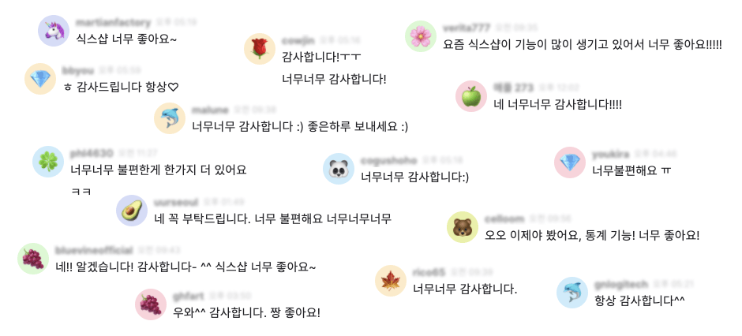

고객 상담은 휴일 포함 매일 오전 9시 부터 밤 11시까지 이어지며 서비스 운영 팀원을 제외한 나머지 구성원들은 영업일 중 오후 채팅, 이메일, 전화 상담과 야간, 휴일 이메일 상담 업무를 로테이션으로 돌아가며 참여중이다. (다음날 이에 따른 대체 휴가가 제공된다.)

## 리마인더가 필요하다

식스샵의 구성원 수가 많지 않을 땐 별도의 알람이 없이도 각자 알아서 자신의 일정을 관리할 수 있었지만 인원이 늘어나며 언제 상담 업무에 참여해야 하는지 헷갈리기 시작했다.

그래서 자신의 담당 시간을 깜빡하고 있다가 미팅 중에 급 깨닫거나, 휴일 중 늦잠 자다 놓치는 경우가 생기기 시작했다.

그래서 리마인더의 필요성이 생겼고, 어느날 호봇이 탄생했다.

### 식스샵 고객 상담 담당자 알리미 '호봇' 두두등장

호봇은 이렇게 생겼다.

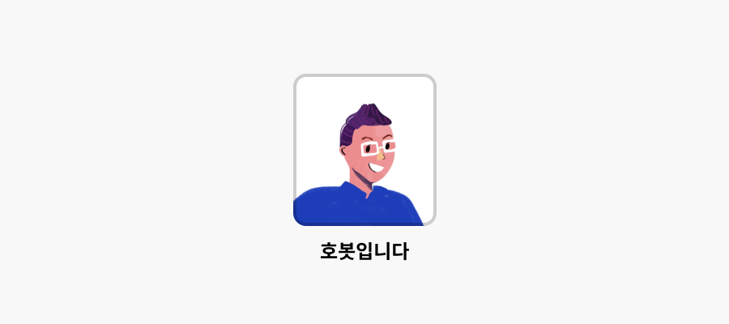

수원 삼성의 영원한 서포터이며 염기훈의 리더십을 최고로 리더십으로 꼽으며, 치킨과 치킨 너겟은 매일 먹어도 질리지 않는다는 그.

그의 정체는 다름 아닌 식스샵 운영 팀장 동호 님이다 ㅎㅎ

인원이 늘며 고객 상담에 늦거나 놓치는 경우가 생기기 시작하자 동호 님이 직접 야간, 주말할 것 없이 때에 맞춰 동료들에게 알람을 보내주기 시작했다.

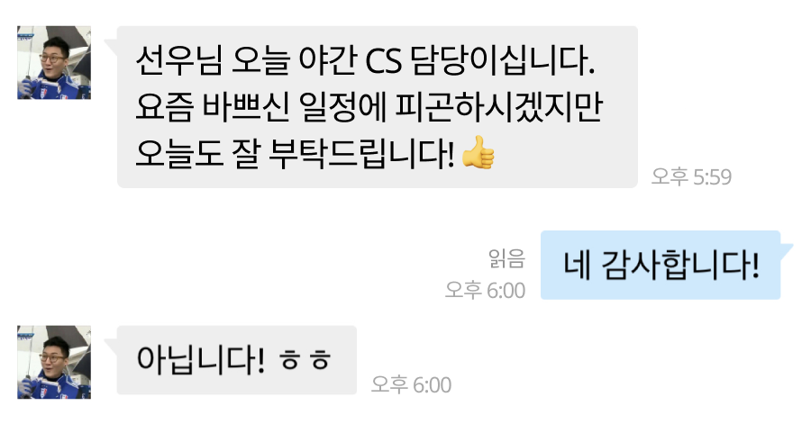

매 근무가 시작될 때는 물론이고, 근무가 끝나는 밤 11시에도 '수고하셨습니다.'라는 메시지를 보냈다.

그러나 모두를 위해 평일 야간과 주말에도 때맞춰 메시지를 보내는 건 쉽지 않은 일이다. 그도 사람인지라 잠도 더 자고 싶고 퇴근 후엔 편하게 쉬고 싶을 텐데 동료들을 위해 불편을 감수하며 호봇의 임무를 수행하였다.

그렇다고 이 상황을 당연하게 생각하며 지속할 수는 없는 노릇이다.

마침 사내 스터디 모임을 하던 중이라 사이드 프로젝트로 이 문제를 해결해보기로 했다.

사람이 아닌 진짜 '호봇'의 첫 버전은 동길, 지혜, 주영 님이 합심하여 만들어 주었다.

호봇 2호기는 기존 CS 일정표의 내용을 파싱해 카카오 알림톡으로 발송한다.

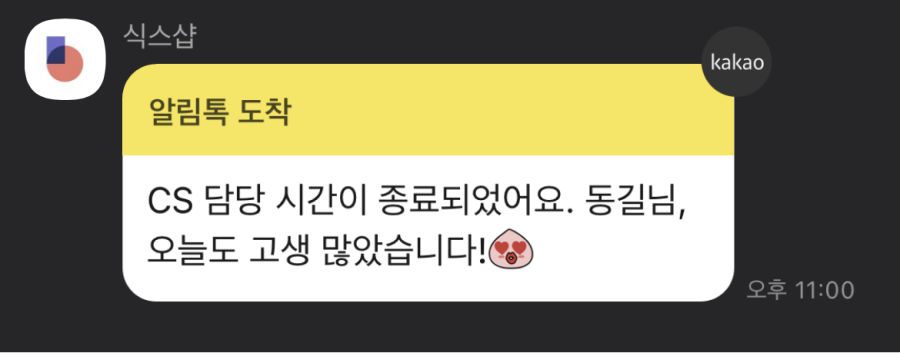

성공적으로 데뷔한 호봇 2호기는 1호기 동호 님의 주말 꿀잠을 되돌려 주었고 본래 목적인 고객 상담 일정을 공유하는 역할도 매우 잘 수행해주었다.

그래서, 이렇게 모두가 만족하며 해피 엔딩으로 마무리 될 거라 생각했다.

그런데 1년 정도의 시간이 흐르며 여러 메인터넌스 이슈들이 생겨났다.

서비스 운영팀 포함, 회사 구성원의 수가 빠르게 늘었고 휴가 제도나 고객 상담 근무 방식이 바뀔 때마다 CS 일정표의 양식이 조금씩 바뀔 수밖에 없었는데 그때마다 파서를 뜯어고쳐야 했다.

회사 내 업무도 계속 늘고 있어서 2호기 개발을 담당했던 동길 님이 사이드 프로젝트로 시작된 앱을 계속 유지보수 하는 게 좋은 옵션은 아니기도 해서 결국 호봇 2호기는 2020년 연말을 기점으로 은퇴하였다.

### 호봇 3호기의 미션

호봇 3호기는 아래와 같은 목적을 달성해야 한다.

1. 인원이 늘어나거나 운영 방식이 변경되어도 쉽게 반영할 수 있어야 한다.
    
2. 개발 환경이 세팅되지 않아도 쉽게 접근할 수 있어야 한다.
    
3. 개인 뿐 아니라 함께 일하는 동료도 부재 상황을 인지할 수 있게 한다.
    

먼저 호봇 2호기의 메인터넌스 비용을 높이는에 일조한 기존 일정표를 살펴보자.

**서비스 운영팀이 관리하는 CS 일정표**

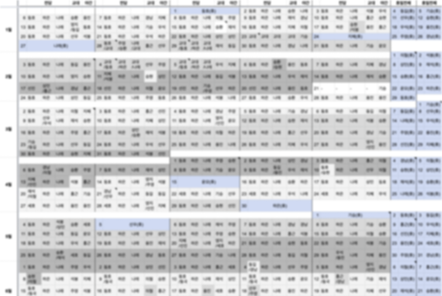

딱 보면 알겠지만 데이터베이스로 활용하기엔 쉽지 않은 포맷이다. 다만 이미 모든 구성원이 익숙하게 활용중인 만큼 알림을 위해 일정표 포맷을 변형하는 것은 옵션에서 제외했다.

### 데이터베이스 도구 정하기

우선 내가 비개발자인 만큼 위지윅으로 관리하기 편한 데이터베이스를 사용하기로 하고, 그것 중 외부 앱 연동이 용이한 2가지 옵션을 골라보았다.

1. [에어테이블](https://www.airtable.com)
    
2. [구글 스프레드시트](https://www.google.com/sheets/about/)
    

Airtable은 자체적으로 자동화를 위한 외부 앱 연동 기능을 포함하고 있다. 다만 알림 DB를 관리해야 하는 서비스 운영팀 분들이 다루기 위해 새로 익혀야 하는 장벽이 있어 옵션에서 제외했다.

결국 모두가 가장 익숙하게 활용할 수 있는 구글 스프레드시트를 데이터베이스 도구로 선정했다.

### 메시지는 어디에 공유되어야 하나?

기존 호봇 2호기는 카카오 알림톡을 활용해 리마인드 메시지를 보내주었다. 모두가 카카오톡을 사용하니 가시성과 접근성이 높지만 평일 오후 근무자의 부재 상황을 동료들이 알지 못해 매번 일정표를 열어보는 이슈가 있다.

그래서 제일 먼저 리마인드 메시지가 전달될 채널은 슬랙으로 정했다. 다행히 Incoming Webhook을 활용해 구글 시트와 슬랙을 연동할 수 있는 방법이 있었다.

---

## 준비하기

### 슬랙 Incoming Webhook 사용하기

먼저 슬랙 [앱 디렉토리 페이지](https://my-new.slack.com/apps)를 방문해보자.

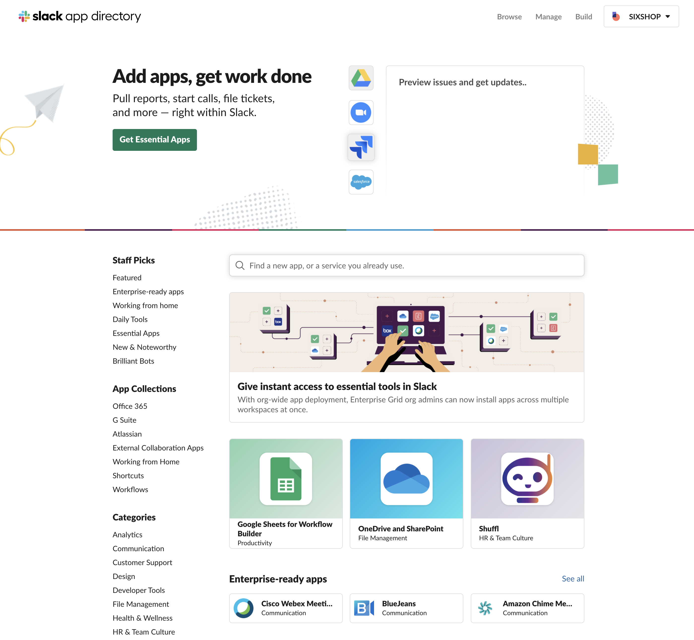

슬랙을 편리하게 활용할 수 있는 다양한 도구가 제공되고 있지만 지금 필요한 것은 Incoming Webhook 이다. 검색창에 Incoming Webhook을 입력하자.

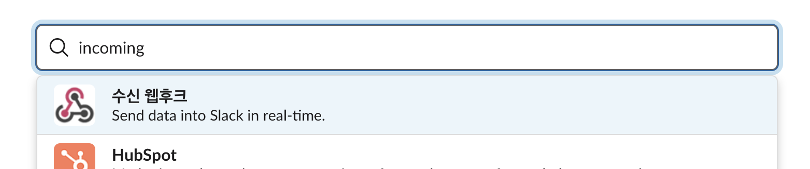

그럼 아래와 같은 화면으로 이동한다.

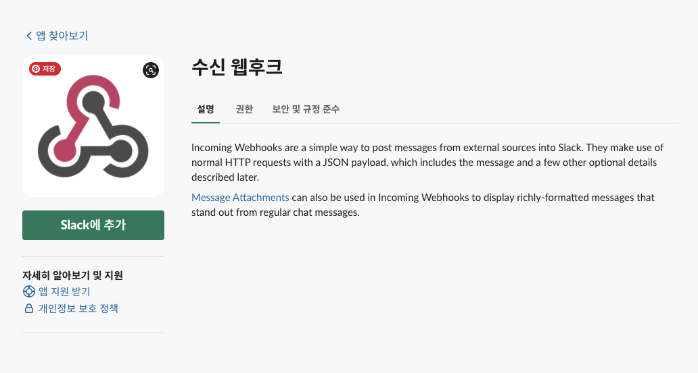

Slack에 추가 버튼을 눌러 웹훅 설정을 진행한다.

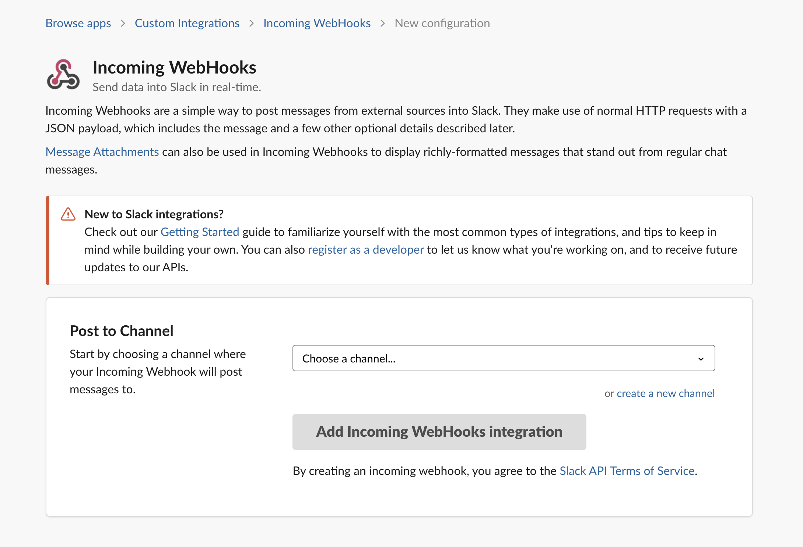

채널은 이후 언제든 변경할 수 있으니 아무거나 선택하고 '수신 웹후크 통합앱 추가'라는 버튼을 눌러 다음으로 넘어간다.

그럼 웹훅에 어떤 형식의 데이터를 보내야 메시지를 출력할 수 있는지 안내되어 있다.

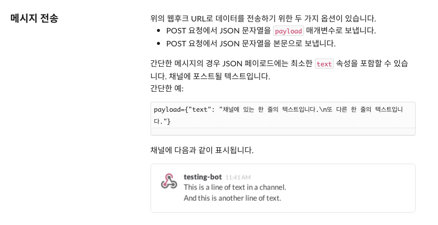

자세한 내용은 [슬랙 API 문서](https://api.slack.com/messaging) 에서 확인할 수 있으니 우선 다음으로 넘어가자.

화면 제일 아래로 내려가면 '통합 앱 설정'이란 섹션이 보인다. 이곳에서 봇에 대한 설정을 할 수 있다. 다른 것들은 무시하고 우선 아래 세 가지만 설정한다.

* **웹 훅 URL:** URL을 복사해서 다른 곳에 보관해두자.
    
* **이름 사용자 지정:** 슬랙에 보일 봇의 이름.
    
* **아이콘 사용자 지정:** 슬랙에 보일 봇의 프로필 사진(아바타).
    

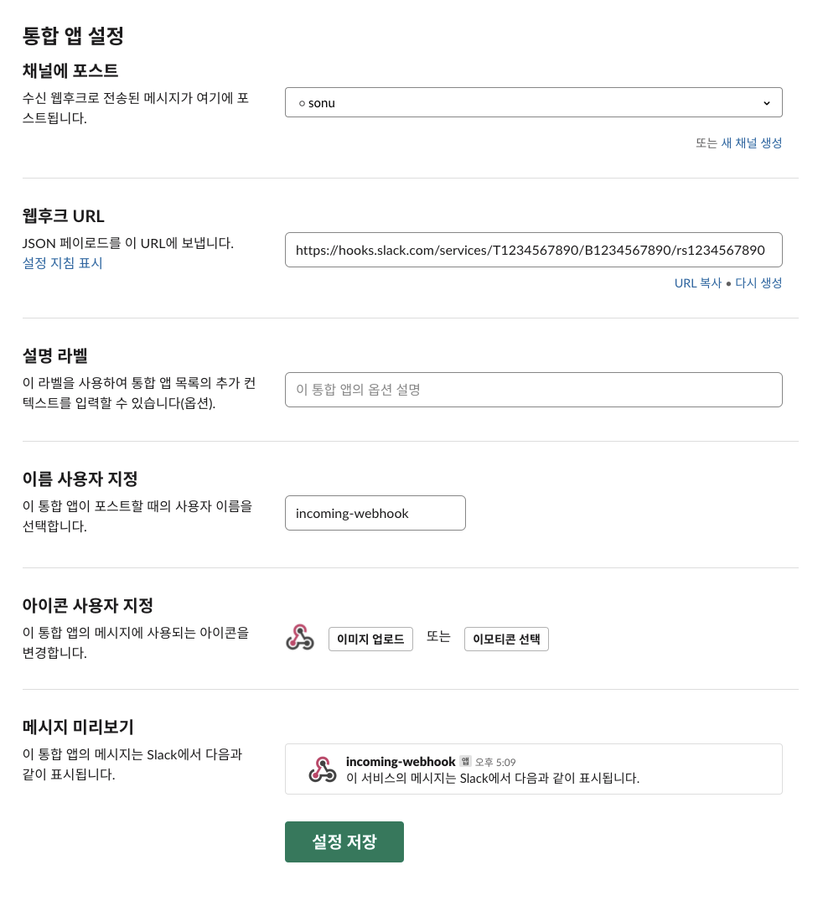

**설정 저장** 버튼을 누르면 봇 생성을 완료할 수 있다. 이제 이 웹 훅에 메시지를 발송하기만 하면 된다.

### 구글 스프레드시트 만들기

기존 일정표와 분리하여 일정 알림을 위한 별도의 전용 시트를 만들기로 했다. 새로운 시트는 아래와 같은 요구사항을 충족해야 한다.

1. 서비스 운영팀에서 관리하기 쉬워야 한다.
    
2. 다양한 근무 유형을 포괄할 수 있어야 한다.
    
3. 하나의 row가 하나의 메시지와 매칭되어야 한다.
    
4. 슬랙에 멘션을 포함한 메시지를 발송할 수 있어야 한다.
    

#### 근무 유형

* 오전: 9:00 AM ~ 12:30 PM
    
* 오후: 1:30 PM ~ 6:00 PM
    
* 야간: 6:00 PM ~ 11:00 PM
    
* 휴일: 9:00 AM ~ 11 AM
    

#### 대체 근무

고정 근무자인 서비스 운영팀원이 휴가를 가거나 부재 시 로테이션 멤버가 대체

* 오전 대체: 9:00 AM ~ 12:30 PM
    
* 오후 대체: 1:30 PM ~ 6:00 PM
    

#### 근무 방식

* 서비스 운영팀은 오전 / 오후 고객 상담 업무 고정 참여
    
* 로테이션 멤버는 1명씩 오후 고객 상담 업무 담당
    
* 야간 / 휴일 고객 상담 업무는 전 직원이 1명씩 돌아가며 담당
    
* 오후 고객 상담 시간 중 서비스 운영팀원이 휴가 및 기타 사유로 부재할 경우 로테이션 멤버가 대체
    

위 조건을 기준으로 시트에 포함되어야 할 정보를 정리해보았다.

#### 직접 입력해야 하는 정보

* 날짜
    
* 근무 유형
    
* 로테이션 근무자
    
* 대체 근무자
    

#### 메시지 발송을 위해 필요한 정보

* 날짜
    
* 요일
    
* 시작 시각
    
* 종료 시각
    
* 로테이션 근무자
    
* 대체 근무자
    
* 참여자의 슬랙 member ID
    

위 정보를 담아 만든 '일정표' 시트는 아래와 같다.

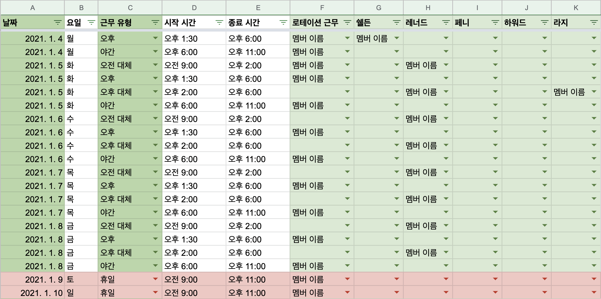

시트를 관리하는 담당자가 날짜와 근무 유형을 선택하면 요일과 시작 / 종료 시각은 자동으로 채워진다.

오후 / 야간 / 휴일 로테이션 근무자를 입력하고 만약 서비스 운영팀 부재로 인한 대체 근무가 필요할 경우 해당 운영팀원 이름(쉘든, 레너드, 페니….)의 필드에 대체 근무자의 이름을 지정한다.

### 슬랙 member ID?

그런데 여기서 빠진 게 하나 있다. 참여자의 슬랙 member ID는 어떻게 알 수 있을까?

> 슬랙 member ID는 슬랙에 메시지를 발송할 때 해당 사용자를 멘션 하기 위해 필요하다.

#### 슬랙 member ID 찾는 방법

사용 중인 슬랙의 좌측 채널이 모인 패널 상단을 보면 People & User Group이라는 메뉴가 보인다. 이 메뉴에서 특정 사용자를 선택하면 아래와 같은 간략 프로필을 볼 수 있다.

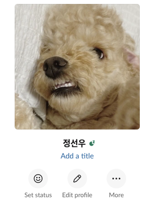

위 프로필에서 'More' 버튼을 누르면 보이는 팝업 메뉴 제일 아래쪽에 위치한 'Copy member ID' 항목을 선택하면 된다.

#### 스프레드시트에 member ID 추가하기

작업하던 스프레드시트 파일에 '구성원'이란 이름의 시트 하나를 추가한다.

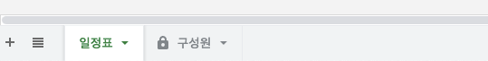

그리고 팀 구성원들의 member ID를 이름과 함께 입력한다.

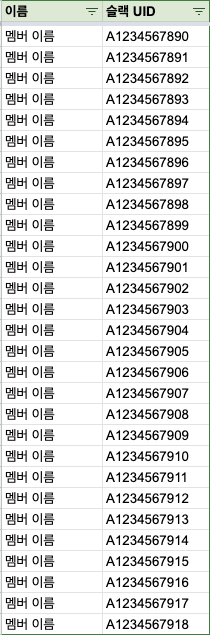

다시 일정표 시트로 돌아가 아래와 같이 컬럼을 추가한다.

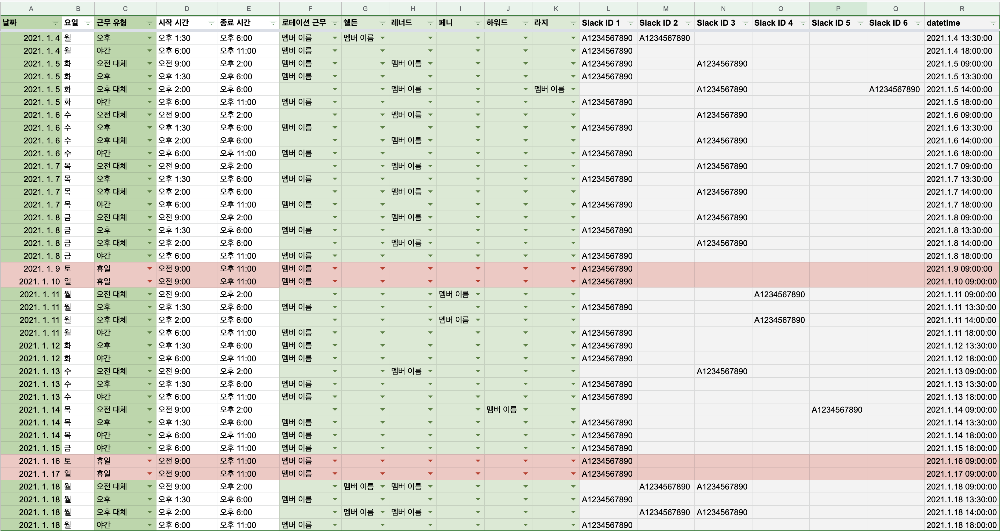

F~K 컬럼에 이름이 선택되면 L~Q 컬럼 각각에 '구성원' 시트의 이름을 참조하여 member ID를 출력한다.

```plaintext
=IFERROR(VLOOKUP(F2, '구성원'!$A$2:G, 2, False), "")
```

사용 편의를 위해 시작 일자와 시각을 A, D 두 개의 컬럼에 나누었는데 이를 활용 가능한 데이터 유형으로 변환하여 R 컬럼에 출력한다.

### Apps Script를 사용해 메시지 만들기

> 앱 스크립트(Apps Script)는 구글 워크스페이스 플랫폼에서 가벼운 애플리케이션 개발을 위해 구글이 개발한 스크립팅 플랫폼이다. - [출처: 위키피디아](https://ko.wikipedia.org/wiki/%EA%B5%AC%EA%B8%80_%EC%95%B1_%EC%8A%A4%ED%81%AC%EB%A6%BD%ED%8A%B8)

작업중인 구글 스프레드시트 문서의 '도구 &gt; 스크립트 편집기' 메뉴를 누른다. 그러면 아래와 같은 구글 앱 스크립트 편집기 화면을 볼 수 있다.

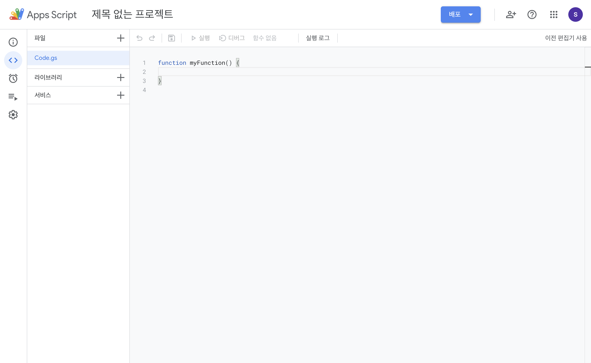

> **여기서 부터는 코드 작업이 필요하다.** 아무래도 내가 개발자가 아니라서 코드는 원하는 방식으로 동작하는 것에 초점이 맞춰져 있다. 이 글을 읽는 개발자 분들이 계시다면 개선된 품질의 코드를 댓글로 달아 주시면 나와 많은 분들께 도움이 될 것 같다.

#### 발송될 채널 지정하기

메시지가 어디에 노출되어야 하는지 지정해야 합니다.

```plaintext
// boolean 값으로 테스트 여부를 정한다. 테스트 하는 동안은 true로 바꿔 사용하면 된다.
function isTest() {
 return false;
}

// isTest의 반환 값에 따라 메시지를 발송할 채널을 지정한다.
function getChannel() {
  if(isTest()) {
    // 테스트 메시지를 받아 볼 채널을 개설한 뒤 이름을 적어주세요.
    return "#test";
  } else {
    // 실제 메시지를 발송할 채널 명을 적어주세요.
    return "#전체 공지";
  }
}
```

#### 메시지 작성하기

위 채널에 어떤 메시지를 출력할지 정해야겠죠?

```plaintext
function createMessage() {
  // sheet는 현재 연결된 스프레드시트 문서이다.
  var sheet  = SpreadsheetApp.getActiveSpreadsheet();

  // 스프레드시트 문서의 참조 범위를 지정한다.
  // 우리는 A:R 열의 1행을 제외한 모든 셀을 사용한다. 
  var column = sheet.getRange("A2:R");
  var values = column.getValues();
  
  // 현재 날짜와 시각을 가져온다.
  var getDate = new Date();

  // getDate에는 UTC기준 시간이 저장되어 있으므로 우리나라 시간대로 변환한다.
  var today = Utilities.formatDate(getDate, "GMT+9", "yyyy-MM-dd");

  // 이후 시간 범위(range)를 지정하기 위해 .getTime() 함수로 ms(1000분의 1초)로 변환한다.
  var now = getDate.getTime();

  // 발송해야 할 메시지 목록 (array로 저장하는 이유는 트리거 설명 부분 참고)
  var messages = []; // 발송해야 할 메시지 모음
  
  // 반복문을 사용해 행과 열을 이동하며 메시지에 포함될 정보를 지정한다.
  for (var i = 0; i <  values.length; i++) {

    // 위에서 가져온 데이터에 2차원 배열을 선언하여(values[행][열]) 필요한 값을 추출한다.
    // value의 값이 비어있지 않은 경우에만 값을 확인한다.
    if (values[i][0] !== null && values[i][0] !== undefined && values[i][0] !== "") {

      // 위에 지정한 today의 값과 비교하기 위해 **A열 '날짜'**를 우리나라 시간대에 맞게 변환한다.
      var date = Utilities.formatDate(values[i][0], "GMT+9", "yyyy-MM-dd");

      // **B열 '요일'** 값을 가져온다.
      var day = values[i][1];

      // **R열 'datetime'** 값을 가져온다.
      var time = new Date(values[i][17]);

      // **C열 근무 유형** 값을 가져온다.
      var type = values[i][2];

      // **D열 시작 시각** 값을 가져온다.
      var start = values[i][3];

      // **E열 시작 시각** 값을 가져온다.
      var end = values[i][4];

      // 해당 시간대에 근무하는 담당자 목록
      var names = [];

      // **L열 부터 Q열에 저장된 슬랙 member ID** 값을 가져온다.
      for (var j = 11; j < 17; j++) {
        if(values[i][j] !== null && values[i][j] !== undefined && values[i][j] !== "") {

         // 담당자 목록에 슬랙 member ID를 저장한다.
          names.push(values[i][j]);
        }
      }

      // 근무 시각까지 남은 시간을 계산한다.
      var range = time - now;
      
      // names 목록에 들어간 멤버 아이디를 각각 <@memeberID> 형태로 바꿔준다.
      var strNames = names.join('>, <@')
      var people = "<@" + strNames + ">"

      // 발송 메시지 만들기 ( [마크다운 문법 참고](https://heropy.blog/2017/09/30/markdown/) )
      if(date === today && now <= time) {
        var message = ">>> 안녕하세요 호봇입니다! 이제 곧 " + date + " " + day + "요일 " + type + " CS 근무가 시작됩니다. \n"
        + ":woman-raising-hand: *담당자:* " + people + "\n"
        + ":alarm_clock: *근무 시간:* " + start + " 에서 " + end + " 까지" + "\n"
        + "염기훈 풔렙어 💙";
 
        // 근무 시각까지 5분 ~ 1시간 사이에 해당하는 경우에만 messages 목록에 추가.
        if(range > 30000 && range < 3600000) {
          messages.push(message);
        }
      }
    }
  }
  // messages 목록을 반환한다.
  return messages;
}
```

#### 슬랙 Incoming Webhook 발신 설정하기

위의 메시지를 지정한 채널에 발송하기 위해서는 앞서 설정한 슬랙의 웹훅 정보를 알아야 합니다.

```plaintext
function triggerSlackRequest(channel, msg) {
  var slackWebhook = "위에서 복사한 웹훅 URL을 입력하세요";

  // 메시지 payload와 options를 설정한다. link_names는 멘션을 지정하는 속성. 자세한 내용은  [슬랙 문서](https://api.slack.com/messaging/webhooks)를 참고
  var payload = { "channel": channel, "text": msg, "link_names": 1};

  // 메시지 헤더에 들어갈 정보
  var options = { "method": "post", "contentType": "application/json", "muteHttpExceptions": true, "payload": JSON.stringify(payload) };

  // 스크립트 편집기에 로깅하여 결과를 확인한다.
  Logger.log(payload);
  Logger.log(UrlFetchApp.fetch(slackWebhook, options));
}
```

자 이제 지정한 채널로 메시지를 발송하기 위한 함수를 만들자.

```plaintext
function notifySlackForCSRotationMember() {
  // getChannel() 함수를 통해 발송할 채널을 가져온다.
  var channel = getChannel();

  // createMessage() 함수를 통해 미리 만들어준 메시지를 가져온다.
  var messages = createMessage();

  // messages 목록의 개별 아이템을 triggerSlackRequest() 함수를 활용해 발신한다.
  for (var idx in messages)
  {
    var msg = messages[idx];
    triggerSlackRequest(channel, msg);
  }
}
```

### 트리거 지정하기

앱스크립트 편집기 좌측의 시계 아이콘은 트리거를 설정할 수 있는 메뉴이다.

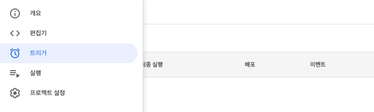

트리거 메뉴에서 새 트리거를 만들어보자.

#### 트리거 생성하기

새 트리거 만들기 버튼을 누르면 아래와 같은 트리거 설정 창이 보인다.

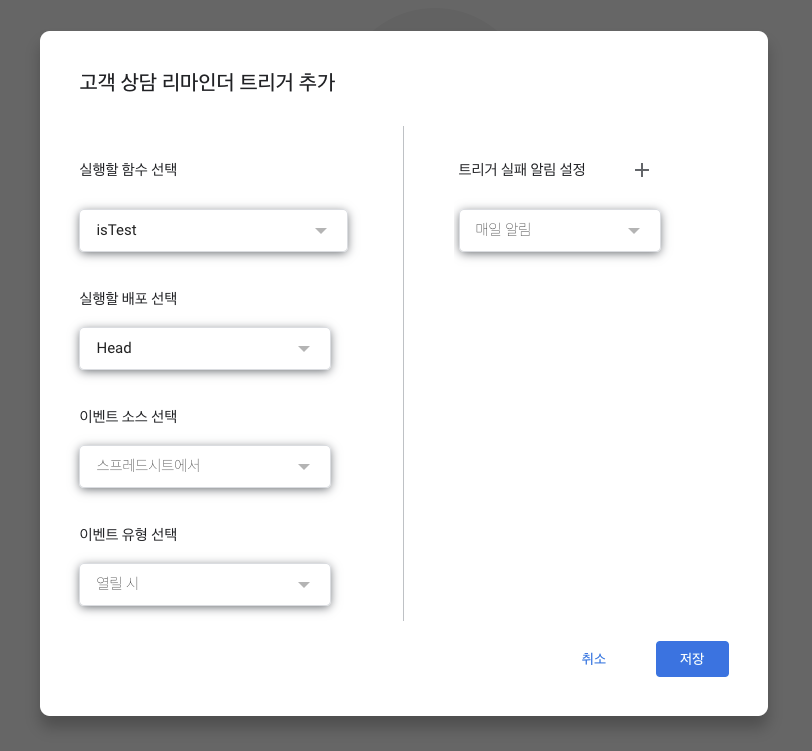

* 먼저 실행할 함수 선택 옵션에서 `notifySlackForCSRotationMember()`함수를 선택한다.
    
* 이벤트 소스 선택 옵션에서 '시간 기반'을 선택한다.
    
* 하위 옵션으로 나오는 트리거 기반 시간 유형의 '분 단위 타이머'를 선택한다.
    
* 다시 하위 옵션으로 나오는 '분 간격 선택'의 30분 마다를 선택한다.
    

위와 같이 설정하면 30분 마다 한 번씩 notifySlackForCSRotationMember() 함수를 실행하여 1시간 이내 근무 일정이 있을 경우 알림을 발송한다.

직접 적용하면서 확인 할 수 있겠지만 트리거 설정이 완전히 자유롭지는 않은 만큼 목적에 맞게 잘 설정하는 것이 중요하다. 일반적으로 알림 메시지 발송시 새로운 Row가 추가되거나 일정 구간마다 발생하는 변화를 트래킹 하는 목적으로 사용하기 때문에 '분 단위 타이머'를 예시로 들었지만.

실제 내가 만든 리마인더의 경우 근무 시간이 고정적이기 때문에 '일 단위 타이머'를 활용한 4개의 트리거를 지정하여 사용중이다.

### 메시지를 발송해보자

이제 실제 메시지가 어떻게 발송되는지 살펴보자.

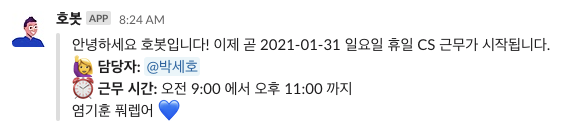

정상적으로 작동한다.

## 마무리하며

사실 누가 딱히 시키지는 않았지만 한 번 정도 직접 슬랙 봇을 만들어보고 싶었다. 구글 스프레드시트도 익숙하지 않고 Apps Script도 처음 사용해보았는데 잘 만들어진 문서가 있어서 큰 어려움 없이 체험해 볼 수 있었다.

현재 호봇 3호기는 정상적으로 자신의 임무를 수행하고 있다. 첫 제작이라 가장 기본적인 알림 기능 수행을 목적으로 가볍게 만들어 보았는데 이후 시간 여유가 생긴다면 Apps Script를 활용해 카카오 알림톡으로 안내하는 기능도 덧붙여 보면 어떨까 생각중이다.

최근 노코드, 로우코드 트렌드가 빠르게 발전하는 덕에 업무 자동화가 점점 더 쉬워지고 있다. 사실 식스샵도 이러한 트렌드와 맞닿는 지점에 있는데, 그래서 앞으로도 이런저런 업무 자동화를 위한 작업들을 취미삼아 시도해 보려고 한다.

---

잘 읽으셨나요? 혹시 이 글이 도움이 되셨다면 아래 버튼을 눌러 커피 한 잔 어떠세요? 여러분의 작은 후원이 창작자에게 큰 힘이 됩니다! 😁
