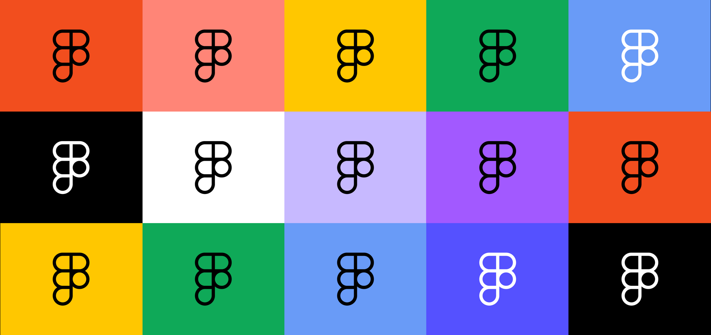

UXTOOLS에서 조사한 '2021년 가장 기대되는 도구 설문조사'에서 브레인 스토밍(Miro)과, 사용자 테스팅(Zoom)을 제외한 6개 부분의 1위를 Figma가 차지했다. ([기사](http://www.aitimes.com/news/articleView.html?idxno=134923))

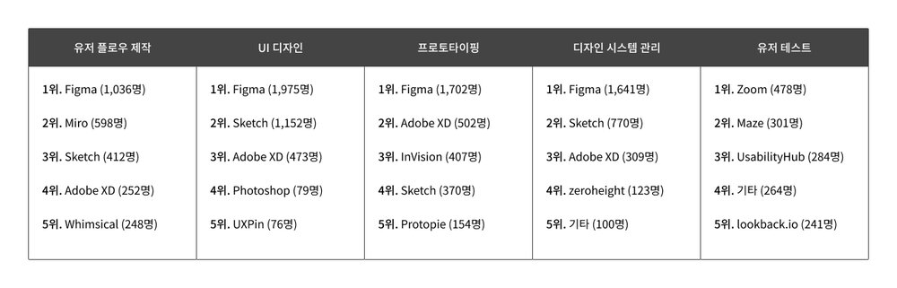

한때 포토샵의 아성을 무너뜨리고 새로운 강자로 떠오르던 스케치가 어느새 피그마의 위세에 밀려나는 모습을 보이고 있다. 작년 2조 2천억 원의 기업가치를 인정받은, 많은 디자이너가 매일같이 사용하고 있는 제품 피그마는 어떻게 인터페이스 디자인 분야에서 No.1 프로덕트의 자리를 차지할 수 있었을까?

---

# 1. 새로운 기술에서 영감을 얻다

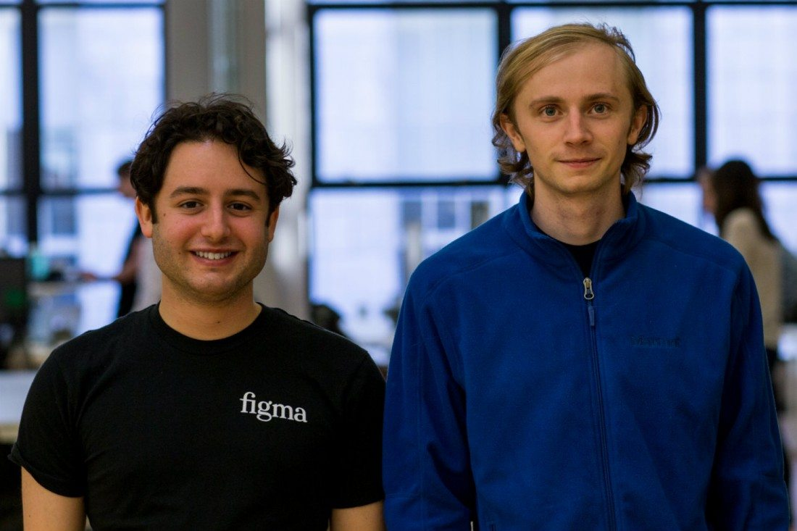

피그마는 [Dylan Field](https://twitter.com/zoink)(현 CEO), [Evan Wallace](https://twitter.com/evanwallace)(현 CTO) 두 대학생에 의해 탄생했다.

이들이 창업을 결심하게 된 계기는 세상을 바꾸고 싶다는 강력한 미션이 있었다거나 우연히 해결하고 싶은 문제를 마주했다는 식의 스토리와는 거리가 멀다.

1. 브라운 대학에서 컴퓨터 사이언스를 공부하고 있던 두 사람은 창업에 관심 있었고 여러 회사에서 인턴 생활을 거치며 경험을 쌓고 있었다.

2. 둘은 페이팔 창업자 Peter Thiel이 운영하는 장학 재단 Thiel Fellowship(대학을 중퇴하고 연구 혹은 창업 활동에 뛰어드는 대학생을 대상으로 $100,000의 연구비를 제공한다.)에 드론 관련 아이템으로 창업하겠다며 신청서를 제출했고, 선정되어 연구비를 받게 되었다.

3. 막상 뭔가 해보기로 결심은 했지만, 딱히 드론에 대한 열정이 있던 것도 아니고 드론으로 사람을 해치거나, 누군가의 프라이버시를 침해하는 일 외의 어떤 기여를 할 수 있을지 확신을 갖지 못한 두 사람은 어떤 아이디어로 창업에 뛰어들면 좋을지 다시 탐색해보기로 했다.

4. Pixar에서 엔지니어로 인턴 생활을 했던 Evan이 Dylan에게 자신의 WebGL* 관련 작업물을 보여 주었는데 이게 피그마 탄생의 본격적인 계기가 되었다.

5. Evan이 보여준 작업은 WebGL을 활용해 정육면체 수조 안에서 구체가 움직이면 수조 안의 물이 인터랙티브하게 변형하는 모습을 표현하는 것이었다.

   %[https://www.youtube.com/watch?v=i6aEQ5pY1aQ]

6. 이전까지 브라우저에서 구현 가능한 그래픽 기술은 충분히 범용적이지 않거나 충분히 만족스러운 품질을 구현할 수 없었다. 그러나 WebGL을 활용하면 매우 높은 수준의 그래픽 결과물을 브라우저에서 즉시 렌더링하여 온라인을 통해 보여줄 수 있게 된 것이다.

7. 마침 Dylan은 인턴으로 일하던 플립보드에서 디자인 분야에 관심을 두게 된 터라 이게 새로운 기회가 될 것이라 확신할 수 있었고, 둘은 WebGL 기술을 활용하여 뭔가 끝내주는 제품을 만들기로 결심했다.

---

# 2. 해결할 가치가 있는 문제 발견하기

1. 새로운 기술에서 미래의 피그마로 이어질 아이디어의 편린을 발견한 두 사람은 '브라우저에서 동작하는 포토샵'을 만들어야겠다고 생각했지만 아직은 막연하기 그지없었다. 포토샵이란 소프트웨어는 이미 오랜 기간 동안 여러 분야에서 엄청나게 많은 사람에게 엄청나게 다양한 목적으로 사용되고 있었기 때문이다.

2. 두 사람은 브라우저에서 이미지를 자르고 필터를 적용하는 가벼운 이미지 편집 툴이나 우스꽝스러운 이미지에 글자를 얹은 밈 제너레이터(Meme Generator) 같은 것들을 만들며 아이디어를 탐색해 나갔다.

   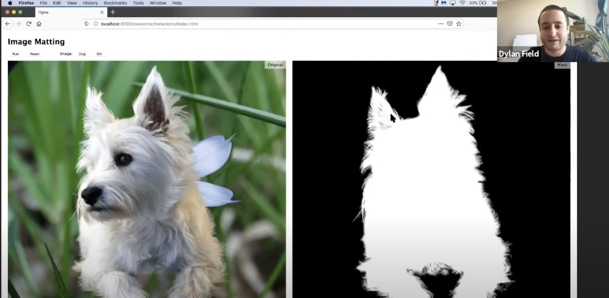
   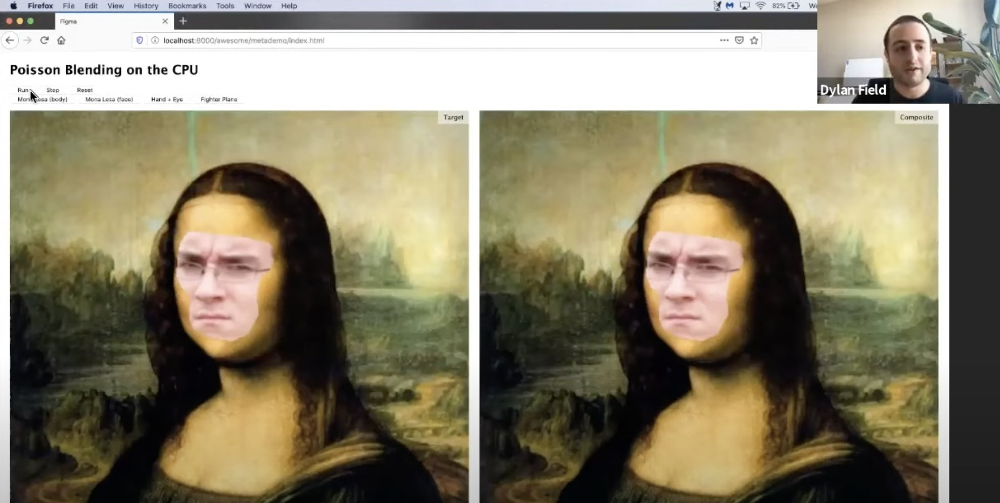
   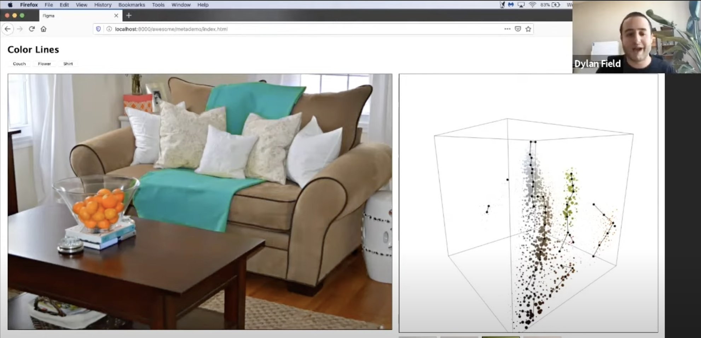

3. 팀에겐 집중할 수 있는 목표가 필요했다. 어느 날 Dylan은 모든 팀원을 한데 모아서 지금껏 나왔던 여러 아이디어를 하나씩 지우며 앞으로 집중해야 할 영역을 인터페이스 디자인으로 정했다. 디지털 프로덕트의 수요는 빠르게 늘어나고 있었고 인터페이스 디자인이야말로 피그마가 만들어내고 싶은 제품에 적합한 분야였다.

4. 당시에도 클라우드란 단어는 널리 사용되었지만, 그 방식은 저장된 파일을 클라우드 스토리지에 자동으로 저장하는 수준에 머물렀다. 여전히 여러 명의 디자이너가 하나의 파일을 두고 동시에 작업할 경우엔 기존 작업을 덮어쓰게 될 위험이 있었고 아래 이미지처럼 하나의 프로젝트를 위해 수많은 파일을 만들어야 하는 상황은 10년 전이나 지금이나 전혀 달라진게 없었다.

   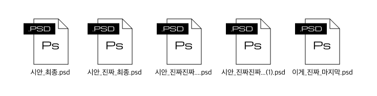

5. 팀은 '브라우저에서 동작하는 디자인 도구'가 이러한 협업 과정의 문제를 확실하게 해결해 줄 수 있으리라 확신했고 마치 Google Docs처럼 '브라우저를 기반으로 실시간 협업 가능한 인터페이스 디자인 도구'를 만드는 것이 그들이 해결해야 할 문제라는 것을 직감했다.

> 10년 전 Writely(현재 Google Docs)가 출시된 이후 저는 모든 소프트웨어가 온라인에서 실시간으로 공동 작업 가능해야 한다고 믿어왔습니다. 다만 디자인 도구는 기술의 한계로 오랜 기간 멈춰 있었고 이제 WebGL은 이 모든 것을 바꿀 수 있습니다. 디자인이 프로덕트 협업의 중심에 있음에도 불구하고 여전히 연결되어 있지 않고 로컬 환경을 중심으로 이뤄지고 있다는 것은, 반대로 우리가 Google Docs와 같이 협업에 최적화된 디자인 도구를 만들 수만 있다면 수십 년 동안 큰 혁신이 없던 이 시장을 차지할 수 있다는 뜻입니다.
— Dylan Field, CEO & Co-founder, Figma

---

# 3. 높은 수준의 협업 경험을 위한 투자

1. 2012년 8월 설립된 피그마는 2015년 12월 3일 비공개 프리뷰 제품을 처음 런칭했고 2016년 9월 퍼블릭 베타를 시작했다. 아이디어가 현실에서 사용 가능한 제품이 되기까지 장장 4년의 시간이 필요했다. 유료화가 이뤄진 시점이 2017년 임을 감안하면 설립 이후 5년간 피그마는 한 푼도 벌지 못하는 제품이었던 것이다.

3. 린스타트업이나 애자일 방법론을 추종하는 사람들의 관점에서 피그마는 전형적인 실패 사례가 될 수도 있었다. 그런데 재밌는 것은 피그마의 최초 투자자가 Zero to One의 저자인 [Peter Thiel](https://twitter.com/peterthiel)이 운영하는 재단이란 점이다. Peter는 평소 창업가의 비전보다 프로세스에 집중하게 만드는 린스타트업이나 애자일에 부정적인 입장을 보여왔다.

4. 피그마팀은 자신들이 만들어 낼 변화에 대한 확신을 갖고 있었고 말 그대로 Vision-driven한 방식으로 제품에 과감히 투자했다.

   > 우리의 비전은 어디서나 쉽게 사용할 수 있는 디자인 도구를 제공하는 것입니다. 우리가 피그마를 브라우저 기반 클라우드 제품으로 구축한 이유도 그 때문입니다. 피그마를 만들기 시작할 때부터 우리는 큰 도전이 될 것을 알고 있었습니다. 이 비전을 구체화하려면 디자인 전문가가 만족할 수준의 고품질 작업 경험을 어디에서나 일관되게 제공할 수 있어야 했고 그 과정은 어려웠습니다. 사실상 우리는 브라우저 안에 새로운 브라우저를 구축해야 했습니다.
— Evan Wallace, CTO & Co-founder, Figma

5. 다행히도 Index Ventures의 [Terrence Rohan](https://twitter.com/tmrohan)이나 Greylock Partners의 [John Lilly](https://twitter.com/johnolilly) 등 피그마의 비전에 공감한 투자자로부터 필요 자금을 유치할 수 있었기 때문에 가능했던 일이라고도 볼 수 있다.

6. 피그마팀이 제품을 출시하기 위해 마주해야 했던 기술적인 과제들이 궁금하다면 Evan Wallace가 피그마 블로그에 기고한 ['Building a professional design tool on the web'](https://www.figma.com/blog/building-a-professional-design-tool-on-the-web/), ['How Figma's Multiplayer Technology Works'](https://www.figma.com/blog/how-figmas-multiplayer-technology-works/)등의 글을 읽어보기를 추천한다.

7. 피그마의 이러한 노력은 결코 헛되지 않았다. 2016년 9월 세상에 공개된 피그마는 디자인 커뮤니티의 뜨거운 주목을 받았다. 그 컨셉에 매료된 많은 얼리어답터는 빠르게 이 화제의 제품을 여러 사람과 함께 사용하며 '페어 디자인' 경험을 주변에 전파하기 시작했다.
   
   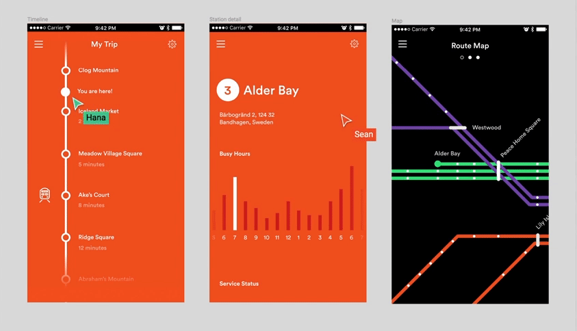

8. 또한 피그마만의 차별화된 가치. 즉, 브라우저 기반의 'Fully-Shareable'한 협업 경험은 피그마 출시 이후 직접 경쟁자 혹은 유사 경쟁자들이 손쉽게 카피할 수 없는 방벽 역할을 하며 피그마가 시장 점유율을 확대하는 과정에 가장 강력한 무기가 되었다.

---

# 4. 스케치가 쏘아올린 작은 공

1. 피그마 출시 이전, 디자인 소프트웨어의 최신 트렌드를 이끌던 제품은 누가 뭐래도 보헤미안 코딩의 [스케치](https://sketch.com)였다.

   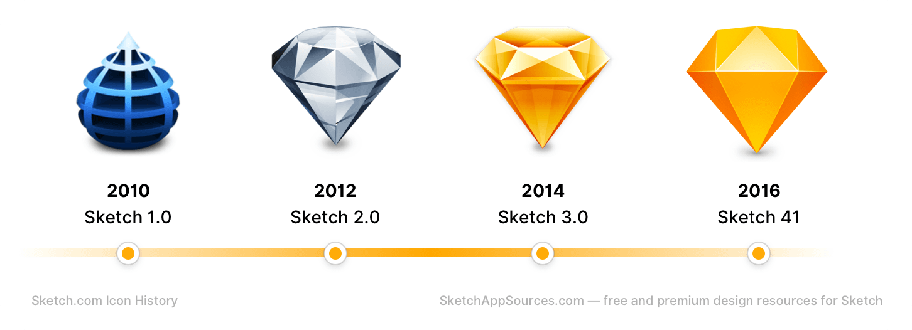

2. 스케치는 수십 년간 어도비가 독점하던 그래픽 소프트웨어 시장의 판도를 완전히 뒤집으며 디지털 프로덕트 디자인의 새로운 장을 열었다. 이를 휴대전화에 비유하자면 노키아 세상이던 휴대폰 시장에 아이폰이 등장한 상황이랄까?

3. Steve Jobs의 사망, Scott Forstall의 사임은 스큐어모피즘([Skeumorphism](https://namu.wiki/w/%EC%8A%A4%ED%81%90%EC%96%B4%EB%AA%A8%ED%94%BC%EC%A6%98))의 종말을 의미했다. 현실 오브젝트를 메타포 삼아 터치스크린이란 신문물을 빠르게 전파하는 데 큰 역할을 했지만 이미 새로운 문물에 완벽히 적응한 시장에선 빠르게 늘어나는 수요에 대응할 수 있는 생산성이 더욱 소중해졌다. 특히 모바일 생태계라는 신천지를 두고 빠르게 늘어나는 스타트업은 그들의 부족한 리소스를 도트와 씨름하는데 사용할 여유가 없었다.

4. 미니멀리즘의 젊은 기수 조너선 아이브가 주도한 애플의 새로운 디자인 룩과 MS의 메트로 디자인 등 플랫 스타일의 인터페이스 디자인이 새로운 트렌드로 떠오르며 사람들은 포토샵이 인터페이스 디자인에 최적화된 도구가 아니라는 것을 새삼 깨닫기 시작했다.

5. 스케치는 이틈을 파고들어 빠르게 성장하는 디지털 프로덕트 생태계의 중심에 위치하였다. 많은 스타트업이 스케치로 화면을 설계하여 앱을 만들고 앱이 성장할수록 스케치를 중심으로 한 프로세스가 테크 업계의 표준 프로덕션 방식으로 자리 잡게 되었다.

6. 스케치는 생태계의 중요성을 알았다. 누구나 스케치와 연동 가능한 앱을 만들 수 있게 하여 제플린, 앱스트랙트 등 스케치 기반의 써드파티 앱이 등장했고 사랑받았다. 깃헙을 통해 공유되는 수많은 스케치 플러그인도 마찬가지다. 생태계가 커질 수록 디자이너의 생산성은 높아졌고 이는 다시 생태계의 성장으로 이어졌다.

   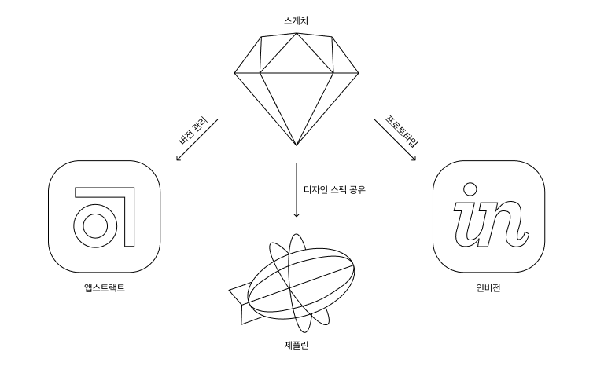

7. 스케치는 디자이너의 핵심 역량이 화면 시각화에서 UX 설계, 프로세스, 협업, 기술, 도메인 전문성으로 옮겨가는 흐름과 함께 성장한 도구였고 새로운 디자이너 커뮤니티의 필수(Essential) 프로덕트로 자리매김하고 있었다. 실제로 많은 사람이 스케치야 말로 디자인 도구의 미래라고 생각하고 있었다.

---

# 5. 피그마 vs. 스케치

앞서 살펴보았듯이 2016년 첫선을 보인 피그마에게 스케치는 넘어야 할 산이었다. 이제 막 출시한 제품이 좀 전까지 어도비의 위치를 넘보던 대세 제품과 경쟁하는 것은 쉬운 일이 아니다. 그러나 피그마는 이러한 경쟁 상황을 자신에게 유리한 방향으로 적극 활용하여 성장의 에너지원으로 삼았다.

### 온보딩 전략: 바퀴를 재발명 하지 않는다.
1. 피그마가 출시하기 6개월 전인 2016년 3월 어도비는 새로운 인터페이스 디자인 전용 도구인 어도비 XD를 대대적인 홍보와 함께 출시했다. 그들은 뒤늦게 스케치에 빼앗긴 주도권을 되찾고자 했지만 이미 스케치를 중심으로 공고하게 형성된 디지털 프로덕트 디자인 생태계 안에서 눈에 띄는 임팩트를 만들어내지 못했다.

2. 어도비가 성공적인 성과를 거두지 못한 까닭은 이들이 빠르게 진화하는 디자인 커뮤니티의 흐름을 과거에 묶어두려 했기 때문이다. 여전히 포토샵 중심 생태계에 미련을 버리지 못한 어도비는 자사 제품과의 호환을 강점으로 어도비 XD를 정의했고 결국 시장 내에서 아직 스케치를 선택하지 않은 사용자가 보다 적은 리스크로 선택할 수 있는 제품이 되는 정도에 그치게 되었다.

3. 피그마는 어도비처럼 스케치 생태계를 부정하는 대신 그 흐름을 자신의 것으로 만드는데 집중했다. 피그마의 초기 그로스 전략은 이미 스케치를 사용하고 있는 사람들이 마찰없이 피그마를 체험하게 하고 이를 통해 피그마의 차별화된 강점을 확실히 느낄 수 있게 하는 것이었다.

   - **유사한 사용 방식:** 피그마는 스케치를 사용하던 디자이너가 새로 배워야 하는 것을 최소화 하여 거의 동일한 방식으로 원하는 설계 산출물을 만들어 낼 수 있게 하였다. 앱의 화면 구성은 물론 핵심적인 개념까지 스케치와 거의 유사하게 제공하여 러닝 커브를 최소화했다.

   - **스케치 파일 그대로 사용하기:** 피그마는 첫 출시 버전부터 스케치 파일 임포트 기능을 제공했다. 스케치 사용자들은 기존의 작업 파일을 피그마에 불러와서 바로 사용할 수 있었고 이를 통해 피그마가 초기 제품임에도 불구하고 실무에 바로 도입할 정도로 높은 완성도를 갖추고 있음을 확인 할 수 있었다.

   - **무료로 사용하게 하기:** 피그마는 출시 후 약 1년간 완전 무료로 제공되었다. 피그마는 처음부터 Freemium 모델을 선택할 수도 있었다. 하지만 이들은 사용자가 피그마의 가치를 느끼는 지점(동료와 함께 사용하는 순간)을 잘 알고 있었기 때문에 거기에 도달하기까지 어떤 장애물도 남겨두지 않았다.

4. 아래 이미지는 2016년도에 Sketch vs. Figma라는 주제로 작성된 글을 검색한 결과 화면이다. (반가운 이름도 보인다.) 이제 막 출시된 제품이 불과 몇 개월도 안 되는 짧은 시간 안에 스케치라는 당시 가장 핫한 제품과 양강 구도를 만들어내는 데 성공할 수 있었던 것은 높은 완성도의 제품을 거의 마찰 없이 바로 경험할 수 있게 한 피그마의 온보딩 전략이 먹혔음을 보여주는 증거다.

   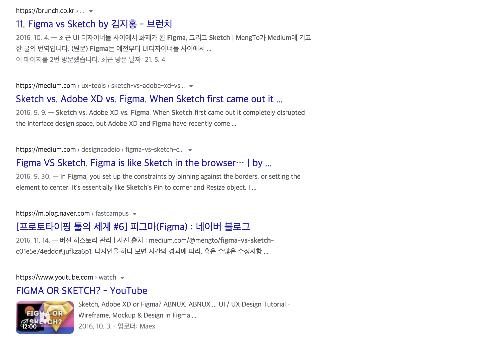

### 프레이밍 전략: 디자인이 아닌 협업에 초점을 맞추다.
1. 스케치는 이미 매우 뛰어난 인터페이스 디자인 도구였다. 후발 주자인 피그마가 '인터페이스 디자인 도구'로써 스케치와 경쟁했다면 스케치 중심의 생태계가 공고해진 상황에서 승기를 잡기 어려웠을 것이다. 

2. 대신 피그마는 처음부터 스스로 '디자인 중심의 협업 도구'임을 강조하며 경쟁의 프레임을 '디자인'에서 '협업'으로 바꿨다. 출시 영상부터 여러 사람이 실시간으로 동시 작업하는 모습을 강조한 게 좋은 예시이다. 바뀐 기준에서 피그마는 '팀이 함께 사용하는 협업에 최적화된 제품'인 반면 스케치 등의 기존 경쟁 제품은 '디자이너 혼자 쓰는 협업에 부족한 제품'이 되었다.

3. 당시 테크 업계에선 애자일 프로세스나 교차 기능 조직 등 실행 속도를 높일 수 있는 협업 방식에 대한 관심이 빠르게 커지던 중이었고 피그마는 이런 관심에 부합하는 매력적인 제품이었다.

   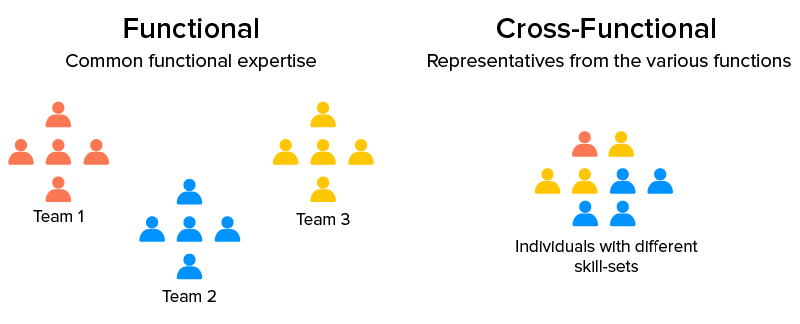

4. 피그마 이전까진 디자인 작업을 공유하기 위해 아래 3가지 방식을 주로 활용했다.

   - 이미지로 Export 하여 공유한다. -> 수많은 이미지 파일이 인박스에 가득하다. 
   - 소스 파일을 공유한다. -> 파일을 전달받아야 하고 이를 열기 위한 앱을 설치해야 한다. 
   - 제플린을 사용하여 공유한다. -> 제플린 설치하고 계정을 생성해야 한다. 

   당시 스케치를 사용하던 많은 팀은 디자인 화면 공유를 위해 제플린을 주로 활용하였다. 이전보다 나은 방식임은 분명했지만 이 역시 디자이너가 직접 동기화하지 않으면 최신 변경 사항을 확인할 수 없다는 한계가 있었다. 그리고 결정적으로 스케치는 윈도우 사용자에게 최악의 협업 경험을 제공했다. (스케치는 2019년 까지 MacOS만을 지원)

   반면 피그마는 공유 링크를 전달하는 것만으로도 현재 작업 중인 화면을 브라우저에서 즉시 확인할 수 있었다. 이는 디자이너뿐 아니라 함께 일하는 이들에게도 편리한 경험인 만큼 팀이 디자인 도구로 피그마를 선택하는데 가장 중요한 이유가 되었다.

5. 피그마의 제품 로드맵을 살펴보면 협업 강화에 얼마나 공을 들였는지를 알 수 있다.
   - 출시 시점부터 Slack과의 연동을 지원했다.
   - 출시 시점부터 Framer와의 연동을 지원했다.
   - 2016년 12월 컴포넌트 기능을 출시하여 디자인 시스템을 활용한 협업을 지원했다.
   - 2017년 2월 팀 라이브러리 기능을 출시하여 팀이 컴포넌트를 더욱 편리하게 활용할 수 있게 했다.
   - 2017년 7월 처음 선보인 개발자 핸드오프 도구는 이전까지 Zeplin 등의 별도 앱을 설치해야만 가능하던 디자이너-프런트엔드 개발자 간의 협업을 피그마 하나로 단순하게 끝낼 수 있게 했다. 
   - 같은 날 출시된 프로토타이핑 기능 역시 인비전, 마블 등 별도 프로토타이핑 도구 없이 피그마에서 Lo-fi 프로토타입을 제작하여 동료와 손쉽게 공유할 수 있게 했다. 
   - 2017년 9월 지라, 트렐로, 컨플루언스 등 PM 도구와의 연동을 강화하며 프로젝트 문서에 즉시 삽입할 수 있는 Live Embed Kit을 출시하여 이슈 로그와 프로젝트 문서에서 최신 버전의 디자인 시안을 확인할 수 있게 했다. 

6. 또한 피그마는 최근(2021년 4월) [피그잼이란 화이트보드 앱을 런칭](https://www.figma.com/blog/introducing-figjam/)했다. 이미 Miro나 Mural, Whimsical 등이 널리 사용되고 있는 상황에서 피그마 까지 새로운 앱을 출시한 것은 예상 밖의 일이지만 피그마만큼 잘 만들 수 있는 곳이 있을까 생각해보면 왠지 당연한 수순처럼 느껴지기도 한다. 여하튼 피그잼을 통해 피그마가 더욱 본격적으로 팀의 협업을 제품 내로 끌어들이고 있음을 주목할 필요가 있다. 기존에도 제품팀의 여러 구성원이 피그마를 통해 협업 해왔으나 어디까지나 디자인 프로세스에 참여하는 형태에 그쳤다. 그러나 피그잼을 통해 제품 관리자 및 교차 기능팀의 여러 구성원이 본격적으로 피그마 생태계로 유입될 예정이다.

7. 즉, 피그마는 디자인 도구의 개념을 '디자이너만 사용하는 것'에서 '제품팀이 함께 사용하는 것'으로 바꾸었고 이를 통해 협업을 중시하는 교차 기능 조직의 필수(Essential) 프로덕트로 자리매김하였다. 이러한 접근 방식이 피그마가 빠른 성장을 거두는데 가장 큰 영향을 미쳤다.

### 올인원 전략: 파편화된 생태계를 한 곳에 품는다.
1. 앞서 언급했듯 스케치는 써드파티 참여자가 자유롭게 플러그인을 만들 수 있게 하여 이미 여러 써드파티 앱과 플러그인이 디자인 업무의 생산성을 높이는데 활용되고 있었다. 디자이너들은 여러 플러그인을 조합해 자신만의 워크플로우를 구축했고 때로 주변에 공유하기도 했다. 

2. 다만 스케치 생태계의 고질적인 문제는 외부 도구와 라이브러리가 파편화 되어있어 관리가 어렵다는 점이었다. 혼자 작업할 땐 문제가 되지 않지만 다른 사람과 함께 일하려면 복잡한 환경 설정 과정이 필수였다. 마치 개발자가 패키지 매니저 없이 라이브러리를 하나하나 설치해야 하는 상황 같았다. 프론트엔드 개발자는 제플린을 설치해야 하고 팀의 동료 디자이너가 나와 같은 플러그인을 사용하지 않으면 깨진 화면을 봐야 했다. 

3. 또한 구매 관리자에게 스케치는 여간 불편한 선택이 아닐 수 없었다. 디자이너마다 각기 다른 날 새로운 라이선스를 구매해야 하고 직군에 따라 함께 구매해야 하는 써드파티 앱도 달랐다. 새로운 사람이 올 때마다 이것저것 신경 쓸 것도 많으니 기업 입장에서 달가울 리 없었다. 그래서 적지 않은 기업이 단지 관리 편의성을 이유로 스케치가 아닌 어도비 XD를 선택하기도 했다.

4. 반면 피그마는 SaaS 제품인 만큼 결제 정보만 등록하면 이후 별도의 구매 과정 없이 주기적으로 일괄 청구되고 디자인 스펙 공유, 버전 관리, 프로토타이핑 등 필수적인 기능이 앱 내 통합되어 있어 여러 써드파티 앱을 별도로 구매할 필요도 없었다. 또한 플러그인 역시 앱스토어(커뮤니티)를 통해 쉽게 설치, 관리할 수 있기 때문에 협업 환경을 세팅하는 과정도 심플하여 팀의 관리 비용을 낮출 수 있어 기업이 선택하기 좋았다.

5. 피그마는 2019년 10월 [커뮤니티를 런칭](https://www.figma.com/blog/introducing-figma-community/)했다. 현재 피그마 커뮤니티에선 수많은 디자이너가 공유한 디자인 리소스를 통해 다른 기업이 일하는 방식을 배울 수 있으며 개발자들이 공유한 플러그인으로 업무 생산성을 높이는데 활용할 수 있다. 또한 최근 런칭한 피그잼용 템플릿도 팀 액티비티에 활용될 수 있을 것으로 보인다. 이렇게 피그마의 커뮤니티는 디자이너뿐 아니라 전 세계 제품팀이 피그마를 활용해 더 스마트하게 일할 수 있는 방법을 공유하는 장으로써 서로에게 영향을 주고 있으며 피그마의 생태계를 더욱더 공고히 하는 역할을 하고있다.

6. 즉 피그마는 파편화된 스케치 생태계를 하나의 앱 안에 옮겨 담음으로써 기업이 선택하기 좋은 제품이 되었다. 업무용 소프트웨어의 사용자는 개인이지만 구매자가 기업임을 고려한 올인원 전략은 스케치가 미처 대응하지 못한 취약점을 보완하며 빠르게 시장 점유율을 높일 수 있었던 중요한 이유 중 하나였다.

---

# 6. 5년 뒤, 우리는 피그마를 사용하고 있을까?
이 글을 쓴 이유는 짧은 시간 안에 스케치를 제치고 새로운 대세로 자리매김한 피그마가 어떻게 빠른 성장을 이룩했는지 그들의 과거를 되짚어 살펴보며 제품의 성장에 도움이 될법한 힌트를 찾고 싶었기 때문이다. 

그리고 글을 마무리하는 지금 내가 이해하는 '피그마가 대세가 될 수 있었던 이유'는 아래와 같다. 

시장의 경쟁 상황이 고도화되면서 기업은 실행 속도를 가속화하기 위해 유기적이고 긴밀하게 협업하는 팀을 원했고 제품팀과 디자이너는 이러한 기업의 요구에 부응할 필요가 있었다. 피그마는 시장에 존재하는 여러 제품 중 이러한 시장 니즈에 가장 적합하게 맞아떨어지는, 협업에 최적화된 제품이었기 때문에 빠르게 성장할 수 있었다.

그동안 GUI -> UI / UX -> Product 등 디자이너 앞에 붙는 단어가 바뀔 때마다 디자이너에게 요구되는 역량과 사용하는 도구 역시 함께 바뀌어왔다. 

- GUI 디자이너에겐 시각 표현에 최적화된 포토샵이 필요했고 
- UI 디자이너에겐 화면 설계에 최적화된 스케치가 필요했다. 
- 그리고 프로덕트 디자이너에겐 협업에 특화된 피그마가 필요했다. 

결국 업무 도구의 변천사는 시장의 변화가 사용자에게 어떤 역량을 요구하느냐에 따라 결정된다고 볼 수 있다. 

포토샵에서 스케치, 다시 피그마로 대세가 바뀌는 과정을 보면 디지털 프로덕트를 만드는 디자이너의 역할이 그래픽 디자인에 가까운 지점에서부터 점점 더 프론트엔드 개발에 가까운 지점으로 옮겨가고 있음을 알 수 있다.

이미 2016년에 발행된 [DesignInTech 보고서](https://sonujung.com/kpcb-designin-tech-report-2016)에서도 '디자이너에게 코딩은 필수적인가요?'라는 질문에 93.5%의 응답자가 그렇다고 답했던 것이 이러한 흐름의 반증이다. 

특히 리액트, 뷰, 스벨트 등을 활용한 모던 프론트엔드 개발 방식의 표준이 바뀌고 기업이 디자인 시스템을 채택하는 흐름이 이어지면서 디자이너의 업무 방식은 점점 더 빠른 속도로 바뀌고 있다. 

그래서 나는 향후 5년 정도를 기준으로 디자인 도구가 모던 프론트엔드 개발 과정 중 뷰 구현 작업의 대부분을 대체하는 방향으로 발전할 거라 생각한다.

이런 의미에서 현재 디자인 도구의 미래상에 근접한 제품 중 하나는 [프레이머](https://www.framer.com/)이다. 프레이머는 현재 코드와 위지윅 인터페이스의 긴밀한 결합을 통한 디자인 프로세스를 제시하고 있다.

피그마 역시 유력한 후보다. 피그마는 디자이너와 프론트엔드 개발자 사이에서 조금씩 우측으로 균형을 옮겨가고 있으며. 프레이머에 비해 사용자 기반과 생태계가 탄탄히 다져있어 앞서가고 있는 상태다.

프레이머는 개발에서 디자인으로 피그마는 디자인에서 개발로 각자 제품/시장 핏을 조정하며 지속적인 변화를 도모하고 있는 만큼 현재의 여러 후보들 중 미래의 대세 자리에 가장 가깝게 근접해 있는 제품이 아닐까 싶다.

물론 이런 균형이 언제 뒤바뀔지는 모를일이다. 아직 순위권엔 없지만 위지윅 웹 앱 개발 도구인 Webflow라던지 Bubble 같은 제품도 있고 막 출시된 Relate같은 제품도 디자인 도구의 미래상에 부합하는 요건을 일부 갖추고 있기 때문이다.

그렇다면 좀 더 멀리가서 10년 뒤엔 어떨까?

아직까진 스피커에나 적용되는 VUI가 자동차나 가전 전반으로 확장 된다면? 머신러닝이나 VR내 메타버스가 본격적으로 대중화 된다면?

그때의 디자이너들은 어떤 도구를 사용하게 될까?
그때도 피그마는 여전히 디자이너의 도구로 사용되고 있을까?

---

잘 읽으셨나요? 혹시 이 글이 도움이 되셨다면 아래 버튼을 눌러 커피 한 잔 어떠세요?
여러분의 작은 후원이 창작자에게 큰 힘이 됩니다! 😁
