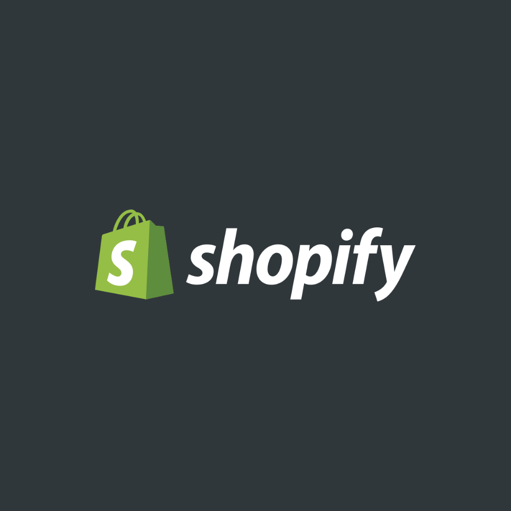
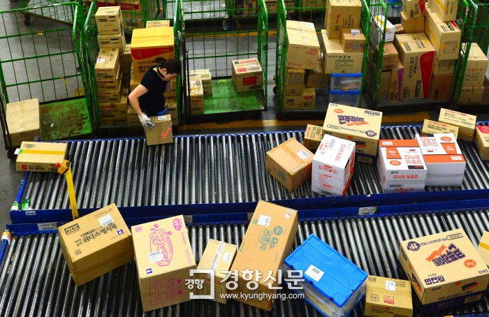

신기하게도 지금껏 쇼피파이에 대한 글이나 생각을 공개적인 채널에 공유한 적이 별로 없다.

아무래도 일과 직접 연관되어 있다 보니 가볍게 적는 게 어렵기도 했고(물론 블로그를 수년간 방치한 것도 이유지만….) 작년, 재작년까지만 해도 쇼피파이란 기업을 아는 사람보단 모르는 사람의 수가 훨씬 많았기 때문에 이야기에 흥미를 느낄지도 의문이었다.

하지만 2017년 카페24의 테슬라 상장 전후로 국내 매체에 쇼피파이란 기업에 대한 얘기가 다뤄지기 시작했고 이후 코로나의 여파로 쇼피파이의 기업가치가 천정부지로 솟으며 지금은 여러 매체에서 아마존 제국의 유일한 대항마로 소개하고 심지어 최근엔 네이버 스마트스토어와 쿠팡을 쇼피파이, 아마존에 비유하는 뉴스도 자주 보인다. 참 신기하고 반가운 기분이다.

그래서 오늘은 조금 가벼운 마음으로 쇼피파이라는 기업이 성장해온 과정에 대해 소개해볼까 한다.
그리고 기회가 된다면 종종 이커머스 분야와 관련한 마이크로 트렌드에 대한 글도 가끔 공유해 볼 예정이다.

---

# 1. 쇼피파이의 탄생

> **사진 출처:** [The Canadian Press, Justin Tang](https://thelogic.co/intelligence/subscriber-survey/shopifys-tobi-lutke-is-canadian-tech-founder-of-the-year-subscribers-say/)

1. 쇼피파이의 공동 창업자이자 CEO인 토비 뤼케(Tobi Lütke)는 독일 태생이다. 어릴적 그의 모습은 모범생과는 거리가 멀었다. 게임이나 즐기려니 하며 사준 컴퓨터를 붙잡고 방에 틀어박혀 게임을 만들고 있는 아들을 보며 그의 부모는 아들에게 문제가 있는건 아닐까 걱정했다고 한다.

   > **토비:** 학교의 수업이나 시험을 제대로 수행하기 어려웠어요. 의사인 어머니 덕에 여러 상담과 진단을 받아보았는데 당시로썬 명확한 원인을 알기 어려웠지만 지금은 ADHD라고 부르고 있죠. 기본적으로 저는 학교가 지루했습니다. 제가 해결하려는 문제를 제대로 이해하고 해결하기 위한 좋은 방법은 아니었죠.

   컴퓨터에 빠져 살던 그는 10학년 때 일반 학교를 그만두고 당시 최신 기술을 배울 수 있던 일종의 직업 전문학교인 Koblenzer Carl-Benz-School에 들어가 [지멘스](https://ko.wikipedia.org/wiki/%EC%A7%80%EB%A9%98%EC%8A%A4_(%EA%B8%B0%EC%97%85)의 자회사에서 견습으로 일하며 본격적으로 프로그래머의 길에 들어섰다.

2. 토비가 즐기는 또 다른 취미는 스노보드였다. 보드를 타기 위해 캐나다 휘슬러 지역을 여행하던 중 토비는 운명의 짝을 만나게 된다. 마찬가지로 보드를 타기 위해 오타와에서 놀러 온 피오나 맥킨(Fiona McKean)과 사랑에 빠진 토비는 그녀가 학사를 마치고 독일로 넘어올 때까지 원거리 연애를 이어갔다. 이후 10개월간 독일에서 함께 지내던 그들은 피오나의 석사 과정을 위해 오타와로 옮기게 되었고 그녀의 집에서 부모님과 함께 지냈다. 그리고 이 러브스토리 덕분에 캐나다 🇨🇦 IT 업계 최고 스타 기업이 탄생할 수 있게 되었다.

3. 쇼피파이의 또 다른 공동 창업자 [스콧 레이크(Scott Lake)](https://twitter.com/scottica)는 친구들이 창업한 스타트업에서 일하며 자신의 회사를 창업하기 위한 계획을 세우고 있었다. 어느 날, 친구 브루스의 초대를 받고 저녁 식사를 위해 방문한 스콧은 브루스의 딸 피오나의 독일인 남자친구를 만나게 된다. 12살 연하의 독일인 프로그래머와 대화하며 그가 입사 예정 중이던 회사와 비자 문제로 인해 계약할 수 없게 되었고 다만 사업은 문제없이 시작할 수 있단 사실을 알게 되었다.

   둘의 대화는 자연스럽게 사업 아이디어에 대한 얘기로 이어졌는데, 온라인에서 스노보드를 구매할 수 있는 곳이 별로 없으니 온라인으로 팔아보면 좋으리라 생각한 두 사람은 온라인 쇼핑몰 '스노데빌'을 함께 창업하기로 했다.

4. 우선 쇼핑몰을 구축해야 했다. 토비는 야후 스토어와 OsCommerce등 몇가지 솔루션을 살펴본 뒤 이들이 적합하지 않다는 결론을 내렸다. 당시 이커머스 솔루션들은 주로 대형 기업을 고객으로 삼고 있었기 때문에 ERP 등의 복잡한 시스템과 연동하고 이를 관리하기 위해 많은 인력을 필요로했다. 스콧과 토비가 각각 2,000만 원씩 투자하여 시작한 스노데빌로선 월 수억 원 가량의 유지 비용이 드는 솔루션을 사용하는 것은 불가능한 일이었다.

    > **토비:** 당시 이커머스 솔루션은 정말 최악이었습니다. 판매 경험이 없는 사람들이 설계한 것이 그대로 드러났어요. 용어는 물론이고 모든 면에서 접근 방식이 잘못되어 있었습니다.

   스노데빌 웹사이트를 직접 구축하기로 한 토비는 당시 관심 갖고 있던 [Ruby On Rails](https://namu.wiki/w/Ruby%20on%20Rails)(이하 RoR)를 사용하기로 결심했다. - RoR은 프로그래밍 언어 Ruby를 기반으로 덴마크의 개발자 데이비드 핸슨(David Heinemeier Hansson)이 시작한 매우 쉽고 높은 생산성을 갖춘 오픈 소스 웹 개발 프레임워크이다. (참고로 [데이비드 핸슨](https://twitter.com/dhh)은 이 블로그에서 자주 언급되고 소개되는 [Basecamp](https://basecamp.com/)의 CTO이다.) - 얼마전까지 캐나다 이주 비용 마련을 위해 지멘스의 대형 외주 작업에 시달리며 지쳐있던 토비에게 이 새로운 도구는 영감을 주는 재미난 장난감이었다.

   

5. 당시 RoR은 신생 오픈 소스 프로젝트로 이제 막 커뮤니티가 생겨나던 중이었고 이를 통해 구축된 상용 프로젝트가 많지 않았다. 토비는 RoR 웹사이트에 쇼핑몰 구축 사례로 스노데빌이 소개되면 좋겠다고 생각했다. 스노데빌을 구축하는 과정을 커뮤니티와 공유하며 RoR 프로젝트에 이커머스를 위한 여러 도구를 만들어 기여했다. 2달이 지나고 스노데빌이 완성될 때쯤 토비는 RoR 프로젝트의 핵심 커미터(프로젝트에 코드로 직접 기여하는 개발자)가 되어있었다.

   

6. 웹사이트 오픈 후 스노보드 사업은 생각보다 순조로웠다. 하지만 스노보드 사업의 성장보다 이들이 만든 웹사이트의 코드를 얻고 싶어 하는 사람의 수가 더 빠르게 늘고 있었다. 토비와 스콧은 쉽게 쇼핑몰을 구축할 수 있는 이 새로운 소프트웨어가 더 큰 비즈니스 기회가 되리라 생각했고 사업 방향을 전환했다. 이들은 피오나의 아버지 브루스, 토비의 삼촌 등 가족으로부터 약 2억 원의 추가 자본금을 구한 뒤 사명도 Jaded Pixel로 변경했다. 그리고 토비는 독일에서 함께 일하던 동료 프로그래머 [대니얼 웨이넌드(Daniel Weinand)](https://twitter.com/danielweinand)를 공동 창업자로 합류시켰다.

   

   > 쇼피파이의 세 공동 창업자는 Bridgehead란 커피숍을 사무실 삼아 사업을 시작했다. [(**사진 출처:** Tripadvisor)](Bridgehead) 

---

# 2. 쇼피파이의 초창기

1. 2006년 6월 쇼핑몰 솔루션 쇼피파이가 공식 런칭했다. 평소 디자인 분야에도 많은 관심을 보이던 대니얼(이후 쇼피파이 CDO로 근무했다.) 덕에 여러 디자이너가 쇼피파이를 위한 테마 제작에 손을 보탰다. 쇼피파이는 전자 결제, 재고 관리 등 전자상거래의 기본적인 기능을 하나씩 더해가며 더욱 손쉽게 쇼핑몰을 구축할 수 있는 제품으로 조금씩 알려지기 시작했다.

   

   > 출시 직후 쇼피파이 웹사이트 첫 페이지 [(**사진 출처:** Wayback Machine)](https://web.archive.org/web/20060701014531/http://shopify.com/)

2. 2007년 쇼피파이는 월 900만 원 정도의 매출을 내고 있었다. 이들의 수익 모델은 웹사이트 제작 도구를 무료로 제공하고 판매가 이뤄지면 결제 금액의 2~3%를 거래 수수료로 받는 방식이었다. 이러한 과금 방식은 웹사이트를 제작하는 개발자나 디자이너에겐 더할 나위 없이 좋지만 정작 사업을 운영하는 판매자 입장에선 매출이 늘어날수록 수수료에 대한 부담이 커질 수밖에 없었다. 실제로 직접 웹사이트를 구축할 여력이 생긴 판매자가 하나둘 쇼피파이를 떠나기 시작했다. 이제 쇼피파이의 과제는 쇼핑 웹사이트를 만드는 도구에서 벗어나 고객의 판매와 성장을 돕는 서비스로 발전하는 것이었다.

3. 쇼피파이는 같은 해 새로운 요금제를 공개했다. 가장 크게 달라진 점은 월 사용료가 생겼다는 것이다. 지불하는 월 사용료에 따라 거래 수수료가 차등 적용되고 월 75불이면 거래 수수료는 면제되었다. 물론, 무료에서 유료로 바뀐 만큼 신규 고객 유입이 눈에 띄게 감소했다. 하지만 이들은 멈추지 않고 고객들의 온라인 판매와 사업 성장에 실질적인 도움을 줄 수 있는 여러 개선 사항을 제품에 담는 데 주력했다. 덕분에 쇼피파이는 꾸준히 성장을 이어갈 수 있었고 존 필립스(John Phillips)가 운영하는 Klister Credit으로부터 약 35억 가치에 2억 7,000만 원 가량의 시드머니를 유치했다.

      
   > 2007년 변경한 쇼피파이의 요금제, 월 단위 요금은 현재까지도 유지하고 있다.

4. 2008년 쇼피파이는 쉬운 사용 방식과 온라인 브랜드 구축을 위한 다양한 도구를 제공하는 올인원 솔루션으로서 인지도를 높여가고 있었다. 월 매출은 어느새 7,000만 원(MRR: Monthly Recurring Revenue)을 넘겼다.

   
    > 2008년 쇼피파이 웹사이트 첫 페이지 [(**사진 출처:** Wayback Machine)](http://web.archive.org/web/20080530193153/http://www.shopify.com/)

   모든 게 순조로운 듯 보였지만 아쉽게도 팀 내부 사정은 그렇지 못했다. 당시 스콧과 토비는 여러 방면에서 의견이 부딪혔는데 특히 성장에 대한 둘의 관점이 크게 달랐다. 게다가 쇼피파이는 기술 중심 기업이니 비 개발자인 스콧이 자신의 의사를 관철하기도, 지속적인 흥미를 갖기도 어렵지 않았을까? 결국 스콧은 회사를 떠났고 토비가 CEO 역할을 맡게 되었다.

5. 이제 토비는 나날이 늘어나는 인프라 비용과 부족한 인력을 충원하기 위해 돈을 마련해야 했다. 우선 캐나다의 여러 투자자를 먼저 만났지만, 누구도 긍정적인 의견을 주지 않았다. 아직 시장에는 90년대 말 닷컴 버블에 대한 강한 트라우마가 남아 있었고 그 중심에 [Pets.com](https://en.wikipedia.org/wiki/Pets.com) 등의 이커머스 기업이 있었기 때문이다.

    > **토비:** 처음 VC를 만나러 다녔을 때 그들의 반응은 매우 비관적이었습니다. 그들은 우리가 하려는 일을 이해하지도, 이해하려 노력하지도 않았습니다.

    2008년 말이 되자 현금 흐름 상황이 더욱 악화되어 겨우 4주 치 잔고로 아슬아슬하게 운영되는 상황이 되었다. 당장 수익을 내지 않는다면 언제 돈이 떨어져도 이상하지 않을 정도였다. 하지만 토비와 대니얼은 내색하지 않고 팀원들이 장기적인 관점에서 제품을 발전시켜갈 수 있도록 독려했다. 그들은 눈앞의 단기 성과를 쫓는 것이 성공적인 제품을 만드는 데 방해가 될 것이라 확신했다. 쇼피파이 팀은 어려운 상황에서도 그들의 비전을 착실히 구체화해가고 있었다.

---

# 3. 유니콘이 되기까지

1. 두 공동창업자의 어쩌면 무모하기까지 한 선택은 결과적으로 지금의 쇼피파이가 있게 중요한 결정으로 이어졌다. 쇼피파이는 그간 개발자 커뮤니티와 밀접하게 소통해왔기 때문에 많은 개발자가 쇼피파이 고객을 위한 앱을 구축하고 판매하는데 관심 있다는 것을 잘 알고 있었다. 이들을 쇼피파이로 끌어들이면 고객은 더 다양한 옵션 중 자신이 필요로 하는 것만 선택하여 비즈니스에 활용할 수 있게 된다. 그리고 파트너와 쇼피파이엔 새로운 수익원이 될 수도 있고 말이다.

   쇼피파이 팀은 2009년 외부 개발자가 사용할 수 있는 [API를 공개하고 그들이 제작한 앱을 선보일 수 있는 앱스토어를 런칭](https://news.shopify.com/shopify-launches-api-platform-and-app-store)했다. 이로써 쇼피파이는 쇼핑몰 제작 도구를 만드는 회사에서 온라인 판매자를 위한 이커머스 플랫폼 기업으로 진화하기 위한 첫발을 내디뎠다.
   
   > **토비:** 이커머스는 매우 개별화된 비즈니스입니다. 대부분의 판매자가 고객에게 고유한 구매 경험을 제공하길 원하지만 이를 위해 너무 많은 기능을 제품에 구겨 넣으면 번잡하고 사용하기 어려워집니다. 쇼피파이 API는 판매자가 자신의 판매 채널을 최대로 활용하기 위해 필요한 것을 원하는 만큼 선택할 수 있게 하는 중요한 첫걸음입니다.

2. 2009년 쇼피파이의 고객은 5,000명을 넘었고 누적 거래액은 1,000억 원을 돌파했다. 그리고 BEP를 달성하며 처음으로 적자를 벗어났다. 서브프라임 모기지 사태로 빚어진 경제 불황은 온라인 창업에 대한 사람들의 관심을 키웠고 이커머스 시장은 성장을 거듭하고 있었다. 또한, 매일같이 폭발적으로 늘어나는 스마트폰 사용자 기반은 이커머스 시장을 새로운 차원으로 이끌어가고 있었다. 쇼피파이는 스마트폰에서 판매 상황을 모니터링하고 관리할 수 있는 모바일 전용 앱을 출시하여 늘어나는 예비 판매자들을 쇼피파이의 고객으로 끌어들이는 한편 신규 고객 확보를 위한 마케팅 활동을 강화했다.

   쇼피파이가 2009년 시작한 '창업 경진 대회'도 그중 하나다. 쇼피파이는 매년 1월부터 6월까지 2개월 연속 매출이 가장 높은 2개 상점에 1억 원의 상금과 저명 인사의 멘토링을 제공하는 캠페인을 진행했고 1,000명 이상의 신규 판매자, 30억 이상의 매출을 거둬들였다. 이 캠페인은 뉴욕타임스에 소개되며 쇼피파이에 대한 사람들의 관심을 높였다.

   

3. 쇼피파이는 실리콘밸리의 명문 VC Bessemer Venture Partners로부터 두 차례에 걸쳐 약 260억 원의 자금을 유치했고 성장 속도를 높이는데 박차를 가했다. 쇼피파이를 통해 판매하는 온라인 상점의 수는 2011년 15,000개에서 2012년 40,000개로 빠르게 늘어났고 연 거래액은 약 9,000억 원에 달했다. 쇼피파이는 빠르게 늘어나는 고객들의 성장을 돕기 위해 쇼피파이 익스퍼츠(Shopfy Experts)를 출시하여 온라인 판매를 시작하는 누구나 전문가의 지원을 받을 수 있게 하였다. 세일즈,  마케팅, 프로그래밍, 디자인 등 각 분야 전문가가 쇼피파이가 만든 새로운 채널에 참여하여 그들의 지식과 노하우를 쇼피파이 고객에게 판매할 수 있었다.

4. 이제 쇼피파이는 전 세계 90개국에서 5만개 이상의 크고 작은 이커머스 기업이 사용하는 글로벌 제품이 되었다. 토비와 대니얼이 커피숍에 모여 만들던 그 제품이 말이다. 쇼피파이는 자신들이 중소규모 이커머스 기업이 일하는 방식에 미치는 영향을 잘 알고 있었고 더 좋은 제품을 제공하는 것에 대한 강한 책임감을 갖고 있었다. 이들은 2013년 4월 [60개 이상의 기능과 업데이트를 포함한 쇼피파이2](https://investors.shopify.com/news-and-events/press-releases/news-details/2013/Shopify-Releases-Revolutionary-New-Online-Store-Building-Platform/default.aspx)를 공개하였고 2013년 8월 UX 컨설팅 기업인 Jet Cooper를 인수하여 사티쉬 칸와(Satish Kanwar, 현 VP of Product)를 중심으로 제품의 사용자 경험을 개선해 나갔다.

   
   > 2013년 릴리즈된 쇼피파이2의 모습 ([**사진 출처:** Techcrunch](https://techcrunch.com/2013/04/11/after-7-years-50k-storefronts-launched-shopify-launches-major-redesign-to-simplify-online-store-building/))

5. 쇼피파이의 초기 미션은 '누구나 손쉽게 아름답고 강력한 온라인 상점을 만들 수 있도록 하는 것'이었고 수년간 그 미션을 가장 잘 달성한 기업임을 성장으로 입증해왔다. 그리고 이제 다음 단계로 나아가기 위해 미션은 새롭게 재정의 되어야 했다. 2013년 토비는 쇼피파이의 새로운 미션을 선언했다.

   > **모두를 위한 더 나은 커머스**  
   > [Make commerce better for everyone.](https://www.sec.gov/Archives/edgar/data/1594805/000119312515129273/g863202g46e72.jpg) 

   이는 쇼피파이가 지금껏 웹사이트라는 판매 채널을 중심으로 고객에게 제공해오던 것을 다양한 판매 채널로 확장해야 함을 의미했다. 쇼피파이는 그들의 새로운 비전인 '토탈 이커머스 플랫폼'으로 성장하기 위해 Insight Partners와 OMERS Ventures에게서 [1억 달러의 투자를 유치](https://news.shopify.com/shopify-announces-100-million-funding)했다.

   

6. 쇼피파이가 토탈 이커머스 플랫폼으로 성장하기 위해 가장 먼저 시도한 일은 오프라인 소매점을 위한 [쇼피파이 POS](https://www.shopify.com/pos)를 출시하는 것이었다. 이는 기존의 POS 산업에 새로운 경쟁자가 하나 추가되는 것과는 다르다. 쇼피파이가 POS를 제공하는 것은 **오프라인 판매자가 언제든 온라인 판매를 시작할 수 있게 되는 것을 의미**한다. 또한 쇼피파이는 [쇼피파이 페이먼츠](https://www.shopify.com/payments)를 출시하여 온오프라인 판매를 하나로 묶어 통합 관리할 수 있게 하였다.

   

7. 2014년 쇼피파이는 기업가치 1조 원을 넘어서며 유니콘에 등극했다.(그리고 드디어 토비와 피오나는 부모님의 집에서 독립했다.) 직원은 어느덧 500명이 넘었고 전 세계 140,000개의 상점이 쇼피파이를 통해 4조원에 가까운 돈을 벌어들이고 있었다. 쇼피파이는 빠르게 성장했고 [2015년 5월 뉴욕 증시(NYSE)에 성공적으로 상장](https://www.cbc.ca/news/business/shopify-stock-soars-in-new-york-debut-after-ipo-1.3082270)하였다.

   %[https://www.youtube.com/watch?v=QYl8iwD-6tk]
   > 쇼피파이가 IPO를 앞두고 기관 투자자들에게 공개한 로드쇼 영상

   당시 최고 플랫폼 책임자였던 할리 핀클스타인(Harley Finkelstein, 현 사장)은 CBC News와의 인터뷰에서 아래와 같은 소감을 밝혔다.

   > **할리:** 우리는 앞으로 100년 이상 성장하는 세계 최고의 커머스 회사를 만들고 싶습니다.

---

# 4. 쇼피파이의 성장 모델
1. 지금까지 쇼피파이의 시작부터 기업 공개까지 어떤 일들이 있었는지 성장 과정을 살펴보았다. 이들은 쇼핑몰 제작 도구에서 쇼핑몰 플랫폼으로 그리고 토탈 이커머스 플랫폼으로 비전을 확장하며 성장의 속도를 높여왔다. 쇼피파이는 아래 플라이휠을 통해 그들이 성장을 위해 집중하는 것을 세가지로 압축하여 설명한다.

   

2. 플라이휠을 구성하는 세 가지는 아래와 같다.
   - **More Merchants:**  
      쇼피파이를 이용하는 고객을 늘린다.
   - **More Channels, Partners & Capabilities:**  
      그러면 고객을 대상으로 비즈니스 기회를 찾는 채널(페이스북, 구글, 틱톡 등)과 파트너(쇼피파이 앱스토어, 쇼피파이 익스퍼츠 등)를 늘리는 게 쉬워지고 고객들이 할 수 있는 일이 늘어난다.
   - **More GMV:**  
      이를 활용하여 고객의 거래 규모가 커지면 쇼피파이의 영향력과 수익이 커져 새로운 고객 유치 및 성장에 투자할 수 있다.

쇼피파이는 위 세가지 축에 리소스를 집중하여 성장을 만들어내고 있다.

   잘 알려진 아마존의 플라이휠이 '소비자의 선택(Selection)을 늘리는 것'을 강조하고 있다면, 쇼피파이의 플라이휠에선 '판매자의 선택(Selection)을 늘리는 것'을 강조한다는 점이 흥미롭다.

3. 화살표는 휠의 회전을 가속하는 역할을 한다.

   **Opportunities - 성장을 위해 쇼피파이가 집중하는 기회 요인** 
   - **International:**  
      쇼피파이는 175개국의 사용자를 확보하고 있지만, 아직 전체 거래의 85%가량이 영어 사용 국가인 미국, 캐나다, 영국, 호주 4개국에서 발생한다. 전체 시장에서 범 아시아권의 성장 비중이 높은 만큼 비영어권 국가 침투율을 높이는 것이 지속 성장을 가능케 할 중요한 도전이다. 수년 전부터 동남아시아, 일본 시장에서 영향력을 확보하기 위해 노력해왔고 최근엔 한국어 지원 및 파트너 확보를 통해 진출을 시도하고 있다.

   - **Share of Wallet:**  
      쇼피파이를 이용하는 상점의 수는 빠르게 늘고 있지만 소비자 향 제품이 아닌 만큼 개체 수 증가엔 한계가 있다. 그런 만큼 고객당 수익을 높일 수 있는 새로운 비즈니스 기회를 찾는 것이 쇼피파이의 장기적인 성장에 중요한 요인이다. 대부업(쇼피파이 캐피털)과 물류 사업(쇼피파이 풀필먼트 네트워크) 진출 역시 이러한 노력의 일환이라 볼 수 있다.

   - **Machine Learning:**  
      쇼피파이는 매일 엄청난 양의 거래 데이터를 다루고 있다. 쇼피파이는 머신러닝 기술에 대한 지속적인 투자를 통해 방대한 데이터를 새로운 비즈니스 기회로 만들어 가고 있다. 앞서 언급한 대부업과 물류 사업 진출 역시 쇼피파이가 가진 데이터 역량 덕에 가능한 결정이었다.

   **Secular Tailwinds - 비즈니스 성장에 긍정적인 영향을 미치는 거시적 트렌드**
   - **E-commerce growth:**  
      이커머스 시장은 계속하여 성장하고 있다. 2014년 1,200조 규모의 시장은 2020년 5,000조 규모로 성장했다. 특히 펜데믹을 거치며 온라인 구매가 일상 깊숙히 자리잡은 이상 더 많은 영역의 오프라인 거래가 온라인으로 옮겨 올 것으로 예상된다. 쇼피파이의 성장에 가장 큰 영향을 주는 트렌드라고 볼 수 있다.

      

      > 자료 출처: [Statista, Retail e-commerce sales worldwide](https://www.statista.com/statistics/379046/worldwide-retail-e-commerce-sales/)

   - **Consumerization of the enterprise:**  
      흔히 SaaS의 성장을 설명할 때 많이 인용되는 표현으로 기업이 소프트웨어를 선택하고 구매하는 방식이 소비자가 제품을 선택하는 것과 유사하게 바뀌고 있음을 뜻한다. 기업이 직접 온프레미스 환경에 이커머스 시스템을 구축하는 대신 클라우드 기반의 쇼피파이나 쇼피파이 플러스를 활용하여 자체 판매 채널을 구축하고 관리하는 흐름이 더욱 거세질 것을 강조하고 있다.

   - **Rise of entrepreneurship:**  
      2009년 경제 위기 이후 쇼피파이가 한 단계 점프업 했던 것 처럼 2010년대 이후 가속화되는 스타트업 창업 열풍이 팬데믹 이후 이커머스 영역으로 빠르게 몰려드는 트렌드를 강조한다. 특히 빠른 실행을 강조하는 최신 창업 트렌드는 쇼피파이의 성장에 좋은 신호를 주고있다.

---

# 5. 성장을 위한 제품 전략
이제 위 성장 모델을 기반으로 성장을 만들기 위해 쇼피파이가 제품 레벨에서 어떤 일들을 수행해왔는지 살펴보자.

### 옴니 채널 커머스
#### 다양한 온/오프라인 채널 통합 및 확장된 고객 관리 도구 제공

> 사진 출처: [2017 Shopify Investor Deck](https://investors.shopify.com/home/default.aspx) 

1. 앞서 2009년 쇼피파이는 도구에서 플랫폼으로 변모하기 위해 자사 API를 외부에 공개하고 [앱스토어](https://apps.shopify.com/)로 통해 써드파티 개발자와 기업을 쇼피파이 생태계로 끌어들여 개발 생산성을 극대화하고 고객에게 선택의 폭을 넓혀주었다. 이후 쇼피파이 익스퍼츠([Shopify Experts](https://experts.shopify.com/))를 통해 다양한 전문가를 쇼피파이 생태계에 포함했고 2013년 공개적으로 'Make Commerce Better for Everyone'이란 미션을 공개하며 토탈 이커머스 플랫폼으로의 진화를 선언했다.

2. 쇼피파이의 비전인 '토탈 이커머스 플랫폼'을 이루는 중요한 핵심 축 중 하나는 '옴니 채널 커머스(Omni Channel Commerce) 구축'을 통해 고객에게 확장된 경험을 제공하는 것이다.

   > 옴니 채널은 고객이 이용 가능한 온오프라인의 모든 쇼핑 채널 - 웹, 모바일, 카탈로그, 오프라인 매장 등 - 을 고객 중심으로 유기적으로 통합 및 연결하여 고객 경험을 극대화하고 이를 통해 판매를 촉진하는 방식을 말한다. 고객 중심의 일관된 통합 경험 제공이 멀티 채널과 옴니 채널을 구분하는 가장 큰 핵심이다. (출처: [디지털 트랜스포메이션](https://digitaltransformation.co.kr/%EC%98%B4%EB%8B%88%EC%B1%84%EB%84%90omni-channel-%EC%9D%B4%EB%9E%80-%EB%AC%B4%EC%97%87%EC%9D%B8%EA%B0%80-%EC%98%B4%EB%8B%88%EC%B1%84%EB%84%90-%EC%A0%95%EC%9D%98-%EC%99%80-%EC%9D%98%EB%AF%B8/))

3. 쇼피파이는 2013년 오프라인 판매자를 쇼피파이로 끌어들이기 위해 쇼피파이 POS를 출시한 뒤 지속적으로 고객이 선택할 수 있는 판매/소통 채널을 확대해왔다.

   - 2014년 쇼피파이 모바일과 POS를 통합하였고 스마트폰 전용 결제 동글을 출시했다.
   - 2015년 쇼피파이 대시보드에서 여러 채널 판매 활동을 손쉽게 관리할 수 있도록 개편하였다.
   - 2015년 Buy Button을 출시해 쇼피파이로 제작되지 않은 웹사이트에서 판매 할 수 있게 하였다.
   - 2015년 상품 카탈로그를 페이스북, 인스타그램과 연동하여 노출할 수 있게 하였다.
   - 2017년 쇼피파이 판매자가 이베이, 아마존을 연동하여 바로 판매할 수 있게 하였다.
   - 2018년 페이스북 메신저와 연동하여 고객과 소통할 수 있는 쇼피파이 Ping을 출시하였다.
   - 2018년 구글 Nest와 협력하여 Store캠을 출시, 오프라인 매장의 공간 관리 방식을 개선할 수 있게 하였다.
   - 2019년 쇼피파이 Ping을 통해 애플 비즈니스 챗과 연동하여 고객과 소통할 수 있게 하였다.
   - 2020년 쇼피파이 판매자가 월마트와 연동하여 바로 판매할 수 있게 하였다.
   - 2020년 페이스북, 인스타그램, 핀터레스트, 틱톡 등 소셜 미디어에서 상품을 판매할 수 있게 하였다.
   - 2020년 위치 기반 쇼핑앱 Shop을 런칭하여 주변 상점의 상품을 구매할 수 있게 하였다.

   아직 쇼피파이가 완전한 의미의 옴니 채널 경험을 제공한다고 볼 수는 없다. 하지만 중소 규모의 브랜드와 소매 상인이 다양한 채널을 통합하고 그들의 고객과 더 나은 방식으로 상호 작용할 수 있는 가장 쉬운 방식을 제공한다는 점만큼은 분명하다.

   또한 페이스북, 틱톡 등 다양한 소셜 미디어가 이커머스를 주요 성장 동력으로 삼고 있다는 점은 장기적으로 쇼피파이의 글로벌 확장에 큰 도움이 될 것으로 보인다.

### 쇼피파이 플러스
#### 하이퍼 그로스 기업을 위한 확장된 DTC 도구 제공

1. 2014년 쇼피파이는 새로운 제품 라인업인 쇼피파이 플러스를 출시했다. 쇼피파이가 중소 규모 판매자에 초점이 맞춰진 제품이라면 쇼피파이 플러스는 월 사용료가 최소 2,000달러에서 시작하는, 대형 이커머스 기업을 위한 제품이다. 쇼피파이 플러스는 대량 트래픽 처리, 글로벌 확장 지원, 향상된 웹사이트 제작 도구와 템플릿, 헤드리스 커머스 지원, 더 많은 판매 채널 연동 지원, 유연한 기술 스택 구성, 다수의 플러스 회원 전용 앱 그리고 전담 고객 지원 등 다양한 확장 기능을 포함하여 기업들이 자체적으로 이커머스 시스템을 구축하는데 들어가는 많은 시간과 비용을 줄일 수 있는 통합 솔루션을 제공한다.

   

   > 사진 출처: [The genie lab](https://www.thegenielab.com/post/shopify-development-for-shopify-plus) 

2. 쇼피파이 플러스의 출시 목적은 빠르게 성장하는 쇼피파이 고객이 이탈하지 않고 지속해서 비즈니스를 확장해 나갈 수 있도록 지원하는 것이었지만 이커머스 시장이 빠르게 커지며 초단기간에 급격히 성장하는 하이퍼 그로스 스타트업이 늘어나며 쇼피파이의 중요 수익원 중 하나로 자리매김했다. 쇼피파이는 2016년 쇼피파이 플러스 개발을 가속하기 위해 소프트웨어 에이전시 Boltmade를 인수하기도 했다.

3. 쇼피파이 플러스의 대표적인 고객사로는 하이네켄, 올버즈 등이 있으며 카다시안 패밀리로 잘 알려진 셀럽 겸 사업가 카일리 제너의 [카일리 코스메틱](https://www.kyliecosmetics.com/)도 쇼피파이 플러스의 고객이다. 카일리 코스메틱은 2015년 설립 후 18개월 만에 5,000억 원의 매출을 달성하며 빠르게 성장했고 팝업 이벤트를 진행할 때마다 수십만 명이 동시접속하는 인기 브랜드이다. 카일리 코스메틱은 쇼피파이 플러스를 통해 빠른 성장 과정에서 필요한 다양한 도움을 받을 수 있었다.

   

   > 사진 출처: [Kylie Cosmetics](https://www.kyliecosmetics.com/)

4. 현재 쇼피파이 플러스를 이용하는 기업의 수는 약 10,000개가량이며 175만 판매자가 사용 중인 쇼피파이에 비하면 0.5% 수준이다. 하지만 전체 사용료 매출(MRR) 중 쇼피파이 플러스 사용료 매출이 차지하는 비중은 25~29%에 달한다. 또한 외부에 공개되진 않았지만, 개별 계약을 거치는 쇼피파이 페이먼츠 결제 수수료(쇼피파이의 Merchant Solution 매출의 상당 부분을 차지한다.)는 수 년 내 더 빠르게 비중을 늘려갈 것으로 예상된다. 

   

### SFN(Shopify Fulfillment Network)
#### 판매자들의 물류 역량 강화를 위한 쇼피파이의 지원 사격

1. 이커머스의 경쟁력을 꼽을 때 상품 경쟁력 다음으로 중요하다고 여겨지는 것이 바로 물류, 배송 역량이다. 그리고 가장 어려운 문제 역시 물류와 배송이다. 우선 천문학적인 투자 비용이 들어가는 것은 물론이고 돈만 있다고 잘할 수 있는 것도 아니기 때문이다. 쿠팡과 컬리가 빠르게 성장하는데 물류와 배송이 얼마나 큰 역할을 했는지, 그리고 이를 위해 그들이 얼마나 많은 투자를 했는지 떠올려 보자.

   

   > 사진 출처: [경향 신문](https://m.khan.co.kr/view.html?art_id=201809161039001)

2. 쇼피파이는 그동안 고객들이 다양한 물류 업체의 서비스를 이용할 수 있게 연결을 제공하는 방식으로 간접 지원해왔다. 자체 제공하는 물류 관련 서비스는 배송 요금 할인과 배송 접수 과정을 편리하게 도와주는 쇼피파이 쉬핑(Shopify Shipping)이 유일했다. 소규모 판매자 입장에선 쇼피파이가 제공하는 서비스 만으로도 충분히 편리함을 누릴 수 있었지만 아마존 덕분에 높아진 배송 속도에 대한 소비자의 기대를 만족시키는 일은 여전히 불가능한 일이었다.

3. 쇼피파이는 2019년 풀필먼트 및 물류 자동화 시스템을 만드는 6river systems를 인수 하였고 6월 연례 컨퍼런스에서 쇼피파이 풀필먼트 네트워크(SFN: Shopify Fulfillment Network) 출시를 발표했다.

   %[https://youtu.be/XRmDGjEAwDA]

   이들은 2023년까지 총 1조 2,000억가량의 투자를 통해 써드파티 물류 업체와의 파트너십을 공고히 하고 자체 물류센터와 인프라를 구축하여 판매자들을 직접 지원하겠다는 계획을 밝혔다.

   현재 SFN은 미국, 캐나다 내의 판매자 중 SKU 200개 미만, 하루 2~300개 이상의 배송이 발생하는 기업을 대상으로 서비스를 제공 중이다.

4. 시작부터 소프트웨어 기업으로 정체성을 다져온 쇼피파이 입장에서 물류 영역에 직접 뛰어드는 것이 매우 이례적인 결정인 듯 보이지만 사실 누구보다 잘 할 수 있는 일이기도 하다.

   배송 속도를 높이는 가장 좋은 방법은 수요를 사전에 예측하는 것이다. 누가 어디서 어떤 상품을 주문할지 알 수 있다면 재고를 가까운 물류 창고에 미리 옮겨두는 것만으로 배송 소요 일수를 현저히 줄일 수 있다. 쇼피파이는 175만 개 이상의 상점이 매일 어디로 어떤 상품을 보내는지 알고 있는 데다가 수년간 머신러닝과 빅데이터 분석 기술에 많은 투자를 해왔다. 이미 2019년 발표에 따르면 이들의 수요 예측 정확도는 85%에 달한다고 한다.

5. SFN은 향후 쇼피파이의 성장에 매우 중요한 역할을 할 수 있는 서비스이다. 2023년 투자 금액 완전 회수를 예상한다고 하니 성장 속도도 빠르다. 결국 장기적으로 쇼피파이가 SFN 서비스를 어디까지 확장할 수 있는지가 중요한 관전 포인트가 될 것으로 보인다. 현재 전체 거래의 85%가 미국, 캐나다, 영국, 호주에서 이뤄지고 있는 만큼 영국이나 호주가 다음 후보지로 유력하다. (다만 호주의 경우 인프라 문제로 주요 거점 도시 우선 진출 가능성이 높다.) 다만 이 물류 서비스가 전 세계 크로스보더 커머스 판매자를 대상으로 제공되기까지는 꽤 많은 시간이 걸리지 않을까 예상해본다.

### SHOP
#### 쇼피파이의 B2C 시장 진출?

1. 쇼피파이는 2020년 새로운 제품 Shop을 출시했다. 원래 구매자를 위해 배송 추적 기능을 제공하는 Arrive라는 앱을 개선한 것인데 국내로 치면 카카오톡채널이나 네이버 플레이스에 커머스가 더해진 형태 혹은 배달의 민족이나 쿠팡 이츠의 리테일 버전 앱이라 볼 수 있다.

2. 많은 매체가 쇼피파이의 새로운 비즈니스가 무척 이례적인 결정이며 B2C 비즈니스로의 진출을 염두에 둔 결정이 아닐까 추측하고 있다. 이는 Shop이 기존 쇼피파이 제품에 없던 소비자 향 카탈로그 리스팅(여러 상품을 모아 보여주는)을 제공하기 때문이다. Shop을 이용하면 소비자는 상품을 추천받고 간편 결제로 손쉽게 구매한 뒤 배송 과정을 즉시 확인할 수 있다.

   > Shopify는 지난 10년간 이커머스에 보다 쉽게 접근할 수 있게 하여 창업자의 어려움을 해결하는 데 집중했습니다. 이제 우리는 고객을 위해 똑같은 일을 하고 싶습니다. 우리는 오늘날 구매자의 쇼핑 여정에서 발생하는 문제를 해결하는 동시에 여러 로컬 브랜드의 성장을 도울 수 있는 제품을 만들고 있습니다. - 칼 리베라(Carl Rivera, General Manager of Shop)

3. 개인적으로 Shop의 출시가 특별히 이례적인 결정으로 보이진 않는다. 쇼피파이 성장 과정의 수많은 의사 결정은 이들의 미션을 따라 이뤄졌고 Shop 역시 그 연장선상에 있기 때문이다. 팬데믹 쇼크로 위기를 맞이한 오프라인 상점이 온라인 판매로 보다 손쉽게 전환할 수 있도록 편리한 모바일 도구를 제공하고 이를 통해 모객 과정을 돕는 일은 '모두를 위한 더 나은 커머스'라는 쇼피파이의 미션에 매우 부합하는 일이다. 게다가 쇼피파이 페이먼츠를 통한 거래를 늘릴 수도 있고 말이다.

4. 쇼피파이가 Shop을 통해 아마존, 이베이 등 B2C 마켓플레이스와 직접 경쟁에 뛰어드는 것일까? 물론 쇼피파이가 B2B 플랫폼이 갖는 유저베이스의 규모의 한계를 마켓플레이스로 해소하고 싶을지도 모르겠다. 하지만 성장 모델의 핵심인 다양한 채널과의 파트너십을 크게 해칠 수 있는 리스크를 감수하는 결정을 쉽게 내릴 수 없는 만큼 적어도 한동안은 기존 마켓플레이스와 직접 경쟁하지 않는 방향을 고수하며 여러 시험을 이어갈 것으로 보인다.

5. 그중 하나가 지속 가능성(Sustainability)이다. Shop이 기존 마켓플레이스의 핵심인 '저렴한 가격' 대신 '위치 기반 상품 추천'이란 제품 특성을 '로컬 브랜드의 성장'과 '라스트 마일에서 탄소 배출 감소'와 직접 연결하여 셀링 포인트로 삼고 있다. 특히 북미 20, 30대 구매자들이 지속 가능성에 큰 관심을 보이는 만큼 이러한 접근이 얼마나 효과가 있을지 지켜보는 재미가 있을 것 같다.

---

# 6. 숫자로 보는 쇼피파이의 성장

그렇다면 이런 다양한 시도를 통해 쇼피파이는 정말 성장하고 있을까?

때때로 기업 공개 이후 성장이 둔화하거나 급격히 거품이 꺼지는 예도 있지만, 쇼피파이는 기업 공개 이후에도 꾸준히 높은 성장을 이어오고 있다.

1. 상장 직후인 2015년 3분기 약 20만 개였던 쇼피파이 상점 수는 2020년 4분기 약 175만 개로 8배 가량 증가했고 연관 매출인 구독 솔루션(Subscription Solution) 매출은 약 354억 원에서 약 3,353억 원으로 9배 이상 늘었다.

   

   

2. 상점 총 거래액(GMV)은 2015년 약 8조 원에서 약 161조 7,000억으로 20배 가량 증가했으며 연관 매출인 판매자 솔루션(Merchant Solution) 매출은 약 278억 원에서 약 8,379억 원으로 30배 가량 늘었다.

   
   

   > 자료 출처: [MarketplacePulse](https://www.marketplacepulse.com/stats/shopify) 

3. 이런 빠른 성장 덕에 2019년 쇼피파이는 이베이의 시총을 넘어섰으며 2020년엔 거래액으로도 이베이를 넘어섰다. 이제 쇼피파이는 이커머스 기업 중 아마존 다음으로 기업가치가 높은 2위 기업의 자리를 차지하게 되었다.

   

   > 자료 출처: [Financial Times](https://www.ft.com/content/c72ae0f0-c036-11e9-b350-db00d509634e)

   
   > 자료 출처: [MarketplacePulse](https://www.marketplacepulse.com/articles/shopify-overtakes-ebay)

4. 그럼 이커머스 1위 기업인 중 압도적인 규모를 자랑하는 아마존과 비교하면 어떨까?

   거래액 기준으로 [아마존 마켓플레이스 대비 쇼피파이의 거래액이 차지하는 비율](https://www.marketplacepulse.com/articles/shopify-is-40-as-big-as-amazon-marketplace)은 2018년 25%, 2019년 30% 그리고 2020년 40%로 빠르게 커지고 있다.

   

   2020년 아마존 마켓플레이스의 연간 거래액 성장률 50%, 쇼피파이의 거래액 성장률 119%가 5년간 유지된다고 가정할 경우 쇼피파이의 거래액은 아마존 마켓플레이스의 거래액을 넘어서게 된다.

   스노보드를 판매하던 쇼핑몰이 그 아마존과 비교되는 글로벌 기업으로 성장했다.

---

# 7. 마무리하며

### 메이커 창업자의 비전
쇼피파이의 성장 과정을 살펴보면 매 단계마다 중요한 결정들을 단기적인 손익 대신 장기적인 비전을 중심으로 내려왔음을 알 수 있다. 아직 스노보드를 팔던 시절부터 창업자인 토비 뤼케는 메이커로서 더 큰 가치를 창출하는 방법을 직관적으로 이해하고 있었다. 플랫폼으로의 전환을 결정하는 과정 역시 아직 작은 신호에 불과하던 가능성에서 쇼피파이의 넥스트 스텝을 찾아 정의했는데 당시 팀의 현금 흐름을 고려했을 때 결코 쉬운 일은 아니었을 것이다. 쇼피파이의 초기 성장 과정은 초기 스타트업에서 창업자의 비전과 직관이 성패에 얼마나 큰 영향을 미치는지 보여주는 좋은 사례이다.

### 다음 과제는 i18n
북미 시장에서 쇼피파이가 이룬 성공은 인상적이다. 하지만 현재의 높은 주가는 쇼피파이의 글로벌 진출에 대한 기대치가 반영되어 있다. MS 오피스나 구글 독스 등 클라우드 소프트웨어 중 특정 업무 방식에 초점 맞춰진 제품과는 달리 쇼피파이는 비즈니스를 시작하고 운영하는 과정을 포함하는 BiaB(Business-in-a-Box) 제품이다. 영국, 호주 등 영어권 국가로의 진출은 꽤 성공적으로 이뤄냈지만 유럽, 동아시아, 동남아시아 등 언어, 문화, 기업 환경이 다른 곳에서도 인터내셔널라이제이션에 성공하여 북미에서와 동일한 성과를 재현할 수 있을지가 물음표로 남아있다.

### DTC 브랜드의 성장 → 쇼피파이의 성장
유통 채널을 거치지 않고 고객에게 직접 판매하는 [DTC(Direct to Consumers)](https://en.wikipedia.org/wiki/Direct-to-consumer)트렌드가  '[Amazonized](https://www.news1.kr/articles/?3947319)' 현상의 반대편에서 빠르게 세를 불리고 있다. 특히 나이키, 이케아, 버켄스탁 등 빅 로고가 동참하며 더욱 가속화되고 있다. 이 DTC 트렌드에 최적화되어 진화한 브랜드를 DNVB(Digitally Native Vertical Brand)라고 하는데 이들은 독자적인 판매 채널을 구축하고 다양한 디지털 마케팅 방식을 통해 충성 고객을 확보하여 브랜드의 영향력을 확장하고 있는다. 그리고 많은 브랜드가 쇼피파이를 통해 성장해 가고 있다보니 DTC/DNVB 트렌드와 쇼피파이는 뗄래야 땔 수 없는 밀접한 관계를 맺고 있다.

### 아마존과 경쟁할까?
옴니 채널 커머스를 지향하는 쇼피파이 입장에서 아마존은 중요한 파트너이지만 아마존 입장에선 탈 아마존 트렌드가 가속화될수록 시장 지배력을 잃게 될 수도 있는 만큼 대책이 필요하다. 작년, 제프 베조스는 'Project Santos'라는 이름의 태스크포스를 가동하여 쇼피파이 따라잡기를 요청했고 올초 쇼피파이와 유사한 호주 스타트업 [Selz](https://selz.com/)를 인수했다. 원하건 원하지 않건 쇼피파이는 현재 거대 유통 제국 아마존에 맞서는 연합군 전진기지 역할을 하고 있기 때문에 쇼피파이의 미래를 점칠 땐, 아마존과의 경쟁을 고려하지 않을 수 없다. 다만 변수는 반독점법이 아마존의 목을 조이고 있다는 점이다. 근래 조 바이든 행정주에 입각한 주요 인사 중 반 아마존 성향의 학자가 다수 포함되어 있다는 점이 아마존의 행보에 어떤 영향을 미칠지 알 수 없다.

### 브랜드가 힘을 갖는 방법
아마존과 쇼피파이가 상징하는 마켓플레이스, 브랜드 간의 줄다리기는 세계 곳곳에서 유사한 모습으로 이뤄지고 있다. 많은 마켓플레이스가 아마존을 따라서 판매자들이 내는 돈으로 성장하며 충분한 데이터를 쌓은 뒤 자체 PB(Private-labels Brand)를 출시해 판매자의 뒤통수를 때린다. 이런 불합리한 일이 가능한 것은 마켓플레이스가 갖는 채널 파급력 때문이다.

   하지만 이제 쇼피파이 등의 이커머스 플랫폼이 제공하는 여러 기술과 도구만 적절히 활용하면 브랜드가 직접 고객을 확보하고 자신만의 차별화된 강점을 통해 지속적인 성장을 만들어 갈 수 있다. DTC는 원래 당연한 것이다. 내가 만든 제품을 고객에게 직접 파는 것을 뜻하기 때문이다. 하지만 온라인 환경에서 유통 채널의 파급력이 커지며 어느샌가 브랜드는 많은 권력을 유통 채널에게 내어주고 있었다. 그리고 이제서야 내어줬던 힘을 다시 되찾아 오기 시작한 셈이다.

---