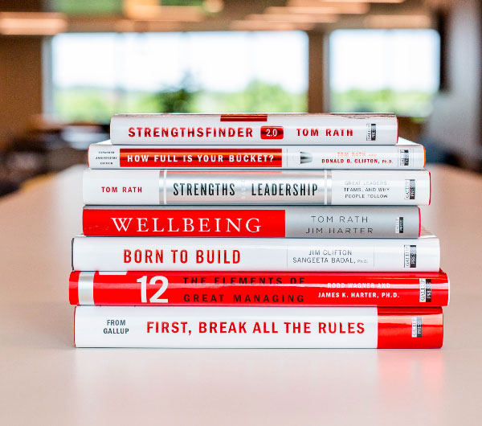

요즘 따라 MBTI를 소재로 한 콘텐츠가 특히 자주 눈에 띈다. 과거 혈액형이 그랬듯이 단순히 재밌으니까 인기를 끄는 면도 있겠지만 그런 셈 치더라도 이 정도의 인기는 놀랍다.

사람을 알기 쉽게 몇 개의 유형으로 분류할 수 있다면 정말이지 사는 게 훨씬 더 편해질 텐데 실제로 살다 보니 열 길 물속은 알아도 한 길 사람 속 알기가 참으로 어렵더라. 그래서 옆에 앉은 사람이 내게 MBTI를 알려준다고 해서 그 사람과의 대화나 협업이 더 잘 풀릴 거란 기대를 하지는 않는다.

그럼에도 최근의 MBTI 열기에 긍정적인 관심을 두게 되는 까닭은 더 많은 사람이 '나 자신이 어떤 사람인지' 알아가기 위해 많은 관심과 노력을 기울이고 있다는 생각이 들어서다.

오늘은 사람들이 열광하는 MBTI와 어쩌면 조금은 비슷한, 내 20대 중반 이후의 진로와 성장 방향을 결정하는데 도움이 되었던 도구를 하나 소개해 보려고 한다.

---

# 위대한 나의 발견 강점 혁명
10년 전 일했던 회사에는 필독서가 몇 개 있었다. 하나는 피터 드러커의 '[자기 경영 노트](https://ridibooks.com/books/703000080)', 그리고 이나모리 가즈오의 '[카르마 경영](http://www.yes24.com/Product/Goods/1782720)', 그리고 다른 하나가 도널드 클리프턴의 '[위대한 나의 발견 강점 혁명](http://www.yes24.com/Product/Goods/1783564?OzSrank=11)'이다.

세 권 모두 좋은 책이지만 이 중 도널드 클리프턴의 '...강점 혁명'이란 책은 사실 읽는 것 외의 다른 이유로 필독서에 포함되었는데...

우선 책의 내용은 이렇다.
- 나를 사랑하고 인생을 즐기며 살기 위해 자신감은 매우 중요한 요건이다.
- 자신감을 느끼기 위해 자신의 재능을 알아내고 이를 강화하여 형상화 & 구체화해야 한다.
- 약점을 고치는 데 드는 노력을 자신의 재능, 즉 강점을 강화하는데 쓰는 게 훨씬 효과적이다.
- 모든 걸 잘할 수 없다. 우리 안에 내재한 재능 중 가장 중요한 것에 집중해야 한다.

꽤 두꺼운 책이지만 다 읽으면 위의 요약한 내용을 좀 더 길고 상세하게 풀어 적은 것이라 봐도 무방하다. 그럼 요약본을 읽으면 되지 굳이 책을 구매할 필요가 있을까? 싶지만 그건 책의 마지막 장을 펼치면 바로 알 수 있다.

이 책의 마지막 면에는 [CliftonStrengths](https://www.gallup.com/cliftonstrengths/en/home.aspx)라는 온라인 테스트를 받을 수 있는 Redeem Code가 포함되어있는데 이 테스트가 클리프턴의 책을 필독서로 삼은 이유였다.

도널드 클리프턴은 미국의 저명한 심리학자이면서 동시에 유명한 리서치 기업인 갤럽의 전 회장이기도 하다.

기업 컨설팅을 업으로 삼았던 만큼 그는 비즈니스 성과를 높이는 방법을 끊임없이 연구하며 뛰어난 성과를 발휘하는 수 백만 명을 인터뷰하여 CliftonStrengths라는 평가 도구를 만들었다.

CliftonStrengths를 간단히 설명하면 '자신의 타고난 재능과 강점을 찾을 수 있도록 도와주는 자기발견 도구'이다. 총 34개의 테마를 기준으로 참가자의 강점에 해당하는 역량이 무엇인지 알려주는데 많은 기업이 구성원을 보다 큰 성과를 낼 수 있는 일에 배치하기 위해 사용해왔다.

---

# 나의 5가지 대표 특성
CliftonStrengths 온라인 테스트에 참여하는 방식은 MBTI 테스트를 해 본 사람이라면 매우 익숙할, 끝도 없이 나오는 질문에 '매우 그렇다', '그렇다', '모르겠다', '아니다', '전혀 아니다'를 체크하는 방식이다.

나도 회사에 제출하기 위해 테스트에 참여해 약 20분 가량 끝없는 질문에 하나하나 답했다.
마지막 질문에 답을 하고나니 한글과 영문으로 적힌 결과지를 보여주었다.

결과지엔 전체 34개의 테마 키워드 중 나의 특성에 가장 부합하는 키워드 5개와 각 키워드에 대한 설명이 포함되어 있었다.

아래 5개의 키워드가 2011년의 나를 설명하는 테마이다. 위에서부터 강하게 드러나는 특성이라고 한다.

1. 발상 (Ideation)
2. 전략 (Strategic)
3. 행동 (Activator)
4. 주도력 (Command)
5. 존재감 (Significance)

아래는 실제 받아본 테스트 결과지의 내용을 일부 발췌 요약한 내용이다.

**발상** 테마를 가진 사람은 복잡한 현상의 근본 원인을 설명해 주는 명쾌하고 단순한 원리를 발견할 때, 그리고 서로 관련 없어 보이는 별개 현상 사이의 연결고리를 발견할 때 큰 흥미를 느낀다. 그래서 익숙한 문제를 여러 새로운 각도에서 바라보는 것을 좋아하고 새로운 계획이나 캠페인, 스타트업에 대한 아이디어를 낼 때가 많다.

**전략** 테마는 가르친다고 배울 수 있는 기술이 아닌 독특한 사고방식이자 세상에 대한 특별한 시각이다. 이 시각을 통해 복잡한 혼돈 속에 숨겨진 패턴을 발견할 수 있고 많은 정보 중 중요한 것을 찾아낼 수 있다. 이 테마를 가진 사람은 하나의 목표 달성을 위해 시도할 수 있는 여러 방법을 빠르게 찾아내고 불필요한 선택과 장애물을 제거하여 최선의 방법을 도출하는데 뛰어나다.

**행동** 테마를 가진 사람은 분석이나 토론의 가치를 인정하지만, 행동만이 실제 결과를 가져온다고 생각한다. 그 때문에 아직 모르는 부분에 주춤하기보다 실행하는 것이 최선의 학습 방법이라 믿으며 실행의 결과에서 배운 것을 토대로 다음 행동을 고민하는 것만이 성장할 수 있는 방식이라 믿는다.

**주도력** 테마를 가진 사람은 일을 주도하는 것에 익숙하며 목표가 정해지면 주위 사람들이 목표에 공감하도록 만들어야 마음이 편해진다. 의사소통이 분명하고 정확한 것을 선호하여 사람들에게 솔직하게 표현할 것을 요구한다. 편안한 환경보다 새로운 영역에 뛰어들어 불가능해 보이는 목표에 도전할 때 기운을 얻는다. 이로 인해 주변에서 압박을 느끼고, 독선적이라 평가하기도 하지만 대게의 경우 명확한 의견과 방향을 제시하는 모습에 따르는 사람이 많은 편이다.

**존재감** 테마를 가진 사람은 자신이 가진 전문성을 통해 널리 인정받기를 원한다. 자신의 능력을 통해 신뢰와 존경을 받고싶어하는 욕구가 있으며 자신의 주위 사람도 인정받는 사람이길 바란다. 일을 생계를 위한 직업의 개념보다는 하나의 생활 방식으로 여기며 구속 없이 자유롭게 일하는 것을 선호한다. 목표와 성취를 매우 중시하여 한곳에 머무는 것을 참지 못하고 끝없이 더 높은 곳을 향해 도전하길 원한다.

---

# 강점을 발휘할 환경

테스트는 회사의 요청으로 마지못해 치렀지만, 내 인생에 큰 영향을 끼친 좋은 경험이었다.

우리는 대체로 자신의 특기나 능숙한 스킬 등에 대해서는 비교적 명확히 알고 있다. 하지만 그것들을 포괄하는 '강점'에 대해서 그만큼 잘 알고 있을까?

적어도 나는 그렇지 못했다. 테스트 결과지엔 보고 읽을 수 있는 글의 형태로 나의 강점이 기록되어 있었고 나열된 항목을 하나하나 살펴보는 것으로 나의 '업'과 '커리어'에 대하여 생각해 봄 직한 여러 질문을 찾아낼 수 있었다. 마치 잘 드는 나침반을 갖게 된 것 같은 기분이었달까?

6개월 뒤 나는 기존의 직장을 퇴사하고 당시 막 생겨난 스타트업 인큐베이터로 이직했다.

당시 나를 포함한 주위 사람들에게 스타트업이란 단어는 낯선 것이었고 특히 디자이너 중에서 스타트업에 관심 두는 사람이 지금보다 훨씬 적었던 시기였던 만큼 연봉까지 낮춰가며 낯선 곳에 뛰어드는 내 결정에 우려를 표하는 사람도 있었다.

하지만 결론적으로, 열정 넘치는 동료들 사이에서 일하는 경험은 내 시야를 크게 넓혀주었고 2012년 기준 5년 차 디자이너였던 나는 비로소 내 천직을 찾았다고 확신하였다.

초기 스타트업은 이전까지 겪은 모든 환경 중 내 강점을 가장 잘 발휘될 수 있는 곳이었다. (물론 모든 스타트업이 같지는 않았겠지만)

어릴 적 취미로 시작했던 일이 직업이 된 후, 나는 늘 기업이 디자이너에게 기대하는 역할의 범위가 '구현'과 '표현'에 한정된 것에 답답함을 느껴왔다.

언제나 누군가 정한 문제를 부여받고 이를 해결하는 과정에서도 아주 한정적인 영역에 대해서만 권한을 가질 수 있었다. 심지어 그마저도 문제 자체에 집중하기보단 의사 결정자의 취향에 부응해야 하는 상황이 부지기수였다.

하지만 초기 스타트업에선 해결해야 할 문제를 정의하고 해결책을 찾는 과정 모두를 함께하는 것이 당연했고, 모든 동료가 문제 해결을 위해 할 수 있는 다양한 일을 스스로 찾아서 수행했다. 이런 환경 덕분에 나는 기존, 디자이너가 해야 할 일로 여겨지던 것 이상으로 넓은 범위의 다양한 문제를 다루는 경험을 쌓을 수 있었다.

나의 강점에 집중하니 이전까지 '튀어나온 못'처럼 여겨지던 것들이 능력과 기여로 받아들여졌다.

---

# 강점을 아는 것

나의 강점을 알고 그것에 집중하는 것은 내가 모든 걸 잘할 수 없다는 것을 받아들이는 것과 같다.

따라서 자신의 강점을 명확히 인지하는 사람에게 기회는, 타인에 의해 주어지는, 수용해야 하는 종류의 것이 아니라 내가 직접 찾아내고 선택하는 종류의 것이 된다.

채용 면접을 진행하다 보면 종종 듣는이를 만족시켜야 한다는 부담을 느끼고 있는 게 드러나는 사람이 있다.

이 부담은 기업을 '뽑는' 대상으로, 자신을 '뽑히는' 대상으로 인식하기 때문에 생겨나는 것으로 지원자는 면접관이 좋아할 답을 찾기 위해 긴장하며 시험을 치르는 상황에 놓여있던 셈이다.

그런데 자신의 강점을 명확히 인지하는 경우, 면접은 시험이 아니라 소개팅과 비슷하단 걸 알게 된다. 즉 '나와 기업이 얼마나 잘 맞는지 서로가 검증하는 자리'일 뿐이니 부담을 가질 필요가 없다는 뜻이다.

지원자는 면접에서 그저 자신의 강점을 솔직히 드러내고 기업이 그것을 어떻게 평가하는지 확인하는 데 집중하면 된다. 내 강점을 가치 있게 평가하지 않는 곳은 남들에게 아무리 좋은 기업이라도 자신의 성장을 가꾸기엔 어려울 것이기 때문이다.

또 강점을 아는 것은 취업이나 이직뿐 아니라 시간이 흐르며 바뀌는 역할을 정의하고 선택하는 과정에도 도움이 된다.

작년 한 해 팀의 구성원이 빠르게 늘어나며 일이 생각처럼 잘 풀리지 않는 상황을 마주했다. 시간이 좀 더 지난 뒤에 깨달았지만, 팀이 커지며 내게 '제품을 잘 만드는 것 이상'의 역할이 요구되기 시작했기 때문이었다.

이제는 '메이커'가 아닌 '리더'로 성장의 방향을 옮겨서 내가 할 수 있는 것 이상을 여러 사람이 함께해낼 수 있도록 업무 환경과 제품 문화를 만드는 역할을 해야하는 상황이 된 것이다.

이를 깨닫고 난 뒤 여러 시행착오를 겪으며 좋은 리더가 되기 위해 필요한 것을 배워가는 중이다.
예를 들어 잘 알려진 리더들의 서적이나 블로그 등을 통해 여러 유형의 리더가 사고하는 방식의 차이를 살펴보거나 리더로 성공적인 경험을 쌓아가는 분들을 만나 조언을 구하며 나의 강점과 부합하는 리더십의 형태를 구체화하는 식이다.

내 강점을 아는 것은 새로운 역할을 수행해야 하는 상황에서 내가 잘 해낼 수 있는 것이 무엇인지 찾는 데 도움을 준다. 동시에 더 큰 노력을 들여야 하는 것, 혹은 쉽게 극복하기 어려운 것을 알게 하여 자신이 역할에 어울리는지 판단하는 데 도움이 된다.

---

# 매니저가 활용하는 법

앞서 개인 차원에서 CliftonStrengths라는 도구를 활용해 자신의 강점을 파악하고 이를 커리어 선택 과정에 활용하기를 추천했다.

그런데 이 도구는 자기 자신을 위해서만 사용할 수 있는 게 아니다. 만약 당신이 팀에서 매니저 역할을 맡고 있다면 이를 아주 유용하게 활용할 수 있다.

### 매니저로 자신의 강점을 활용하는 법이 궁금하다면

[CliftonStrengths for Managers](https://store.gallup.com/h/en-sg)라는 매터리얼을 활용할 수 있다. 사실 이런 게 있는 줄 몰랐는데 이 글을 적으며 갤럽 웹사이트에서 새롭게 추가된 것을 발견하였다.

CliftonStrengths for Managers는 기존 CliftonStrengths에서 강조하는 상위 5개의 강점에 5개를 더한 총 10가지 강점을 중심으로 각 강점이 매니저로 일하는 데 어떻게 활용될 수 있는지를 알려준다. 보고서에는 매니저로 주의해야 할 점과 적용해 보면 좋은 과제들이 함께 담겨있다. 다만 아직 번역본은 제공하지 않는 듯하다.

### 매니저로 팀원들의 성장을 돕고 싶다면

또한 리더, 혹은 매니저의 주된 역할 중 하나는 함께 일하는 구성원의 성장을 함께 고민하며 돕는 것이다. 아마 함께 일하는 동안 그들의 강점을 파악하기 위해 큰 노력을 기울이고 있을 거라 생각되는데 그때 CliftonStrengths는 매우 유용한 도구이다.

앞에서도 말했지만, 강점이란 개념은 상당히 추상적이어서 관찰을 통해 알 수 있는 드러난 행위를 추상화하여 언어로 구체화하는 게 쉽지 않을뿐더러 생각보다 많은 사람이 자신의 성장 패스에 대해 깊이 고민해보지 않았기 때문에 1 on 1등을 통해 직접 들어서 알 수 있는 것도 한계가 있다.

이때 잘 분류, 정리되어 우선순위와 함께 제공되는 강점 리스트는 그 정확도와 별개로 관찰과 질문의 범위를 좁히는 데 도움이 된다. 의외로 가까이 있으면서 놓치고 있던 부분을 새롭게 알게 되는 경우도 많다.

### 다른 인적성 평가 도구와의 차이점

기업에서 인·적성 평가를 위해 사용하는 도구는 다양하다. MBTI도 그중 하나고 버크만 테스트, DISC 등이 있는데 대체로 누군가의 성향을 그룹으로 묶어 분류하는 방식의 결과를 제공한다.

위와 같은 테스트의 장점은 사람마다 같은 문제도 다른 관점에서 바라볼 수 있다는 '차이'를 매우 직관적으로 받아들이게 만든다는 점이다. 반면 사람을 몇 가지 유형에 대입해 버림으로써 팀 내 선입견을 조장하는데 활용될 수 있다. 예를 들어 누가 의견을 말할 때 '아 OOOO아니랄까봐 그냥 넘어가질 못하네'하며 흘려듣는다든지 말이다.

즉 CliftonStrengths와 다른 도구의 차이점은 전자는 개인의 개성과 강점에 집중하게 하여 이해를 높이는 용도로 쓰일 수 있지만 후자는 개인을 그룹화된 키워드에 담아 몰개성화하는 방식으로 볼 수도 있다. 후자의 방식은 개개인의 성장을 함께 고민할 필요가 있는 경우엔 큰 도움이 되지 않는다.

---

# 마치며

최근 함께 일하는 동료와 성장 방향을 함께 고민하는 과정에서 CliftonStrengths를 활용한 경험이 인상 깊어 이 글을 적게 되었다.

한참 적고 보니 돈 한 푼 안 받고 남의 상품 홍보에 열 올린 것 같아 조금 억울하지만, 개인적으로 많은 도움을 받은 도구라 거리낌 없이 추천해본다.

피터 티엘은 그의 저서 Zero To One에서 '독점'할 수 있는 시장을 정의하는 것의 중요성을 강조한다. 이를 개인에 대입하면 자신의 강점을 알면 일반적인 직업의 정의나 표준화된 커리어 패스에서 벗어나 나의 일을 스스로 정의할 수 있는 선택권을 갖게 된다고 볼 수도 있다.

함께 일하는 환경에서 자신의 치명적인 약점을 알고도 방치하는 것은 무책임한 일이다. 그러니 약점을 보완하는 것도 분명 중요한 일이다.

하지만 많은 경우 두드러지는 약점과 강점 없이 무난한 사람보단 작은 약점이 있을지언정 뛰어난 강점을 가진 사람과 함께 일하는 것이 낫다. 자신만의 강점을 확고히 구축하는 것은 시장에서 자신의 가치를 높일 방법이다.

그리고 그 강점에 대해 진지한 고민을 시작하는데 오늘 소개한 도구를 적절히 활용해보기를 권해본다.

### CliftonStrengths 온라인 테스트 참여 방식

1. [갤럽 스토어](https://store.gallup.com/c/en-sg/assessments)에 방문한다.
2. [Top5 CliftonStrengths](https://store.gallup.com/p/en-sg/10108/top-5-cliftonstrengths)(27,600원) 코드를 구매한다. 더 많은 특성을 보고 싶다면 모든 테마를 볼 수 있는 CliftonStrengths 34(69,000원)를 구매해도 된다.
3. 결제를 마친 후 화면 상단 Account 메뉴를 통해 갤럽 액세스 앱에 접속한다.
4. 좌측 메뉴의 '코드 관리' 메뉴를 눌러 '코드 배포' 버튼을 누른다.
5. 구매한 코드를 선택하고 본인 이메일로 초대장을 발송한다.
6. 초대장을 통해 온라인 테스트에 접속하여 테스트를 진행한다.
7. 결과를 받아본다.

---