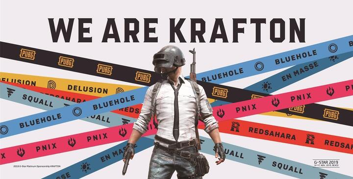

# 난 배그를 해본 적이 없다

업계에서 장병규 대표님의 중량감이 있기에 블로홀로 불릴 때부터 회사의 존재는 알고 있었다. 테라라는 게임을 만들었으나 크게 성과가 나지 않았다는 것도.

그러다 출시한 배틀 그라운드가 공전의 히트작이 되고 이어서 크래프톤이란 이름으로 사명으로 바꾸어 대대적인 조직 개편이 있었다는 것도 알고 있었다.

하지만 장병규 대표님은 내게 본엔젤스의 대표로 더 크게 각인되어 있었고 게임을 하지 않는 나로선 배그의 성공도 그저 e스포츠나 스트리밍 서비스 트렌드 정보 중 하나에 불과했다.

책이 나온다는 것은 알고 있었지만 사실 별 관심 없었다. 우선 게임 업계에 대해 잘 모르기도 하고 그렇다고 잘 알고 싶었던 것도 아니었기 때문이다.

책을 보게 된 건 주변 지인들이 소셜 미디어를 통해 추천하는 것을 보며 호기심이 생겨서였다.   

그렇게 첫 장을 펼쳤고 마지막 장까지 잠시도 멈추지 않고 밤을 새워가며 읽었다.
크래프톤 웨이는 최근 내가 본 책 중 가장 몰입하여 읽은 책이다.

---

# 인상 깊었던 내용

### 연쇄 창업가와 스타 게임 제작자가 만나다
크래프톤 웨이는 2006년 첫눈을 매각하고 본엔젤스를 창업한 장병규와 엔씨소프트에서 리니지2의 성공을 이끈 게임 제작자 박용현이 만나는 것으로 시작한다.

이들은 300억이란 자금을 들여 3년 안에 대작 MMORPG 출시를 목표 삼아 게임 제작 스튜디오를 창업하기로 한다.

공동 창업자는 장병규와 박용현 그리고 박용현과 오랜 기간 호흡 맞춘 게임 업계 드림팀 황철웅(아트 디렉터), 김정한(게임 엔지니어), 박현규(게임 기획자) 그리고 마지막으로 장병규와 네오위즈에서 함께 일했던 김강석까지 총 6명이었다.

이들은 블리자드(눈보라)도 삼키는 블루홀(바닷속에 거대하게 움푹 팬 지형)이 되자는 의미에서 블루홀 스튜디오로 지었다.

블루홀 스튜디오는 경영과 제작의 분리를 모토로 역사에 남을 위대한 명작을 만드는데 모든 역량을 쏟아부어 MMORPG의 명가가 되기 위한 여정을 시작한다.

### 기업의 비전
블루홀이 탄생하는 책의 초반에는 장병규 의장의 연쇄 창업가로서의 면모가 잘 드러난다. 

특히 창업 초기, 기업의 비전을 수립하고 모든 구성원이 기업의 비전에 동참하도록 전방위적으로 커뮤니케이션하는 모습이 인상적이다. 

> 기업의 목적이 이윤 추구에만 함몰되었을 때 기업답지 못합니다. 이윤 창출보다 중요한 것은 비전이나 꿈, 도전과 같은 가치를 확립하고 집중하는 것입니다. 오랫동안 잘 나가는 기업은 비전과 핵심에 대해 집착에 가깝도록 집중합니다.

심지어 워크숍 공지 메일을 통해 사주(소맥)를 돌려 마시는 행위에도 의미를 부여하는 모습을 보며 예전 탐사보도 프로그램에서 봤던 사이비 종교가 떠오르기도 했다. (강한 정서적 신뢰 'affect-based trust' 구축에는 이런 디테일한 장치들이 중요다는 의미에서) 

또한 책의 중반부로 넘어가면 기업의 방향성이 재정립되는 과정에서 비전이 새롭게 수립되고 이로 인해 팀이 겪는 혼란스러운 상황들이 다뤄진다.

> 변화가 필요한 시기라 하더라도 그 비전이 다수의 구성원에게는 보이지 않는다. 즉, 비전이 잘 뿌리내린 조직일수록 다수의 구성원이 해당 비전을 ‘공공의 선’이라 강하게 믿고 있을 것이기에, 비전을 변경하는 것 자체가 도전이 된다.

### 인터넷 비즈니스와 게임 비즈니스

> 장병규와 김강석은 박용현팀에게 “잘해줄 것이라 믿는다”라고 말했다. 시시콜콜 게임 개발을 두고 경영진이 왈가왈부하지 않겠다는 다짐이기도 했다. 제작 이외의 것은 장병규와 김강석이 맡았다.

블루홀 스튜디오는 창업을 논의하는 단계부터 '경영과 제작의 분리'라는 모토를 앞세웠다. 제작 과정에서 경영진의 끊임없는 간섭에 염증을 느껴온 박용현에겐 꿈에 그리던 이상적인 회사의 모습이었고 인터넷 비즈니스에선 성공을 거뒀으나 게임에는 문외한이던 장병규에겐 말이 되는 되는 얘기였다. 

그러나 시간이 흐르며 반복해서 격렬하게 드러나는 갈등은 IT 업계 출신의 공동 창업자와 게임 업계 출신의 공동 창업자 사이의 반목이다.

물론 실제 갈등의 원인은 사람 사이에 있었지만 그 배경에는 '작게 출시해서 지속 개선하는 것을 지향'하는 IT 업계 문화와 '장인정신으로 시간을 들여 역사에 길이 남을 마스터피스를 만들고자 하는' 게임 업계 문화 사이의 근본적인 DNA 차이가 자리잡고 있다.

책에서 장병규 의장과 김강석 대표는 반복적으로 '흥행 비즈니스'라는 표현으로 그들이 느끼는 이질적 특성을 표현하고 있다. 

> 김강석이 게임판에 들어와 퍼블리셔로 일해보니, 게임은 감성적인 부분이 주요하게 작동하는 흥행 비즈니스였다. 게임은 당연히 재미있어야 흥행한다. 그런데 사람마다 느끼는 재미가 다르다는 게 문제였다.   

<!-- -->

> 게임 제작업은 본질적으로 흥행 비즈니스였다. 히트작을 내야 생존할 수 있었다. 제작 중인 게임이 홈런 일지 파울 일지 미리 알기란 불가능에 가깝기에, 최소한 타석에 여러 번 서는 것이 중요해졌다.

결국 측정 가능한 결과와 계획을 중시하는 경영진과 게임을 종합 예술 작품으로 바라보는 제작자의 시각 차이는 쉽게 좁혀지지 않았고 경영과 제작의 분리라는 원칙은 물거품이 되어 사라진다.   

<!-- -->

> 블루홀 경영진은 기회가 있을 때마다 제작자들에게 “예측 가능하게 게임 개발을 해달라”라고 주문했다.   

<!-- -->

> 어쩌면 종교를 대하듯 테라의 성공을 믿고 있는 것인지도 모르겠다. 하지만 합리성에서 믿음의 영역으로 발을 내딛는 순간, 제작은 현실과 동떨어진다.   

<!-- -->

> 훌륭한 제작은 제작과 비非제작, 경영 사업 등 여러 가지 영역들이 훨씬 더 유기적이어야 한다’ ‘문제가 발생하면 더욱 솔직하게 커뮤니케이션할 수 있어야 한다’ ‘영역을 자꾸 나누고 있는 게 문제. 그러다 보니 진짜 문제가 터졌다.   

<!-- -->

> 블루홀에서 제작과 경영의 분리 원칙은 사망 선고를 받았다. 이제 더 이상 그 누구도 ‘제작과 경영의 분리’란 말을 입에 올리지 않았다.

테라 출시를 기점으로 회사의 균형은 제작에서 경영으로 기울고 김강석 대표와 장병규 의장은 더욱 적극적으로 게임 제작과 사업의 여러 영역에 관여하며 고군분투 하지만 그렇다고 더 좋은 성과가 나온 것은 아니었다.

### 성공을 위해 어디까지 버릴 수 있어?
굉장히 성공적인 커리어를 그려가던 이들이 모여 창업을 했다. 
나름대로 자신의 위치에서 존경받고 있는 사람들이었다. 

창업이 그들에게 준 것이 무엇일까? 얼마 전 크래프톤의 상장이 있었으니 Exit을 통해 상당한 부를 획득했을지도 모르겠다. 그럼에도 그들은 자신들이 원하던 바를 이뤘다고 말할 수 있을까? 

책의 많은 부분이 고뇌하고 싸우고 갈팡질팡하고 실수하고 그 와중에 어떡해서든 살아남기 위해 치열하게 버티는 그들의 모습으로 이뤄져 있다. 과연 나는 저렇게까지 할 수 있을까? 싶을 만큼 모두가 너무나 많은 것을 걸었다. 

> 20년간 제작자로 살며 처음으로 2주 이상 휴가를 냈다. 박현규는 여태껏 한 번도 일주일 넘게 쉬어본 적 없다는 사실을 새삼스레 상기해냈다. 인생 헛살았네 하며 피식 웃음이 났다. 그 세월 아내는 병을 얻었다. 삶을 바꿀 필요가 있겠구나 싶었다. - 공동 창업자 박현규    

<!-- -->

> 심정적으로 더 이상은 견디기 힘드네요. 이쯤에서 T2팀에서 빠졌으면 좋겠습니다. 지난 수년 동안 고생하며 키워온 팀이 무너져가는 모습을 지켜보는 것도, 의기투합하면서 비전을 공유했던 팀원들이 저를 조롱하고 비난하는 것도 저에게는 매우 힘든 일입니다. 조용히 물러날 테니 빠른 검토 부탁드립니다. - 공동 창업자 황철웅    

<!-- -->

> 맥주 한 모금 들이켜고 장병규가 입을 열었다. “지쳤어요. 번아웃됐습니다.” - 공동 창업자 장병규    

<!-- -->

> 올해 가을이면 제가 약속했던 CEO 3년 임기가 끝납니다. 더 이상 CEO 역할을 하긴 힘들 것 같습니다. 희망을 가져보려 했는데 블루홀 식구들에게조차 인정을 못 받고 현실에선 돈만 축내고 있네요. - 공동 창업자 김강석   

만약 지금 창업을 하기 위해 고민하는 사람이라면 크래프톤 웨이를 읽고 '나는 어디까지 버릴 수 있을지' 고민해보는 것이 도움이 될지도 모르겠다. 이 책은 창업을 하지 말아야 하는 이유를 아주 많이 담고 있다.

### 리더의 조건
> 제가 최근에 미쳐 있는 프로젝트가 있습니다. 이제 제안서의 형태가 되었으니 프로젝트 승인을 얻기 위한 활동을 하고 싶습니다. 절차도 모르겠고, 일단 대표님께 브리핑을 하고 뭐가 됐든 향후를 의논하고 싶습니다. - 김창한이 경영진에게 브리핑을 요청하며 

지금의 크래프톤이 있게 한 플레이어언노운스 배틀그라운드와 김창한 현 크래프톤 대표의 일화는 양으로 치면 책 내 차지하는 비중이 크진 않지만 가장 형광펜을 많이 그어가며 읽었다. 

배그를 만들며 스프린트를 떠올리는 개발 프로세스를 도입하거나 스팀, 트위치 등의 신생 플랫폼을 유통 채널로 적극 공략하는 모습은 IT 스타트업의 프로덕트 매니저를 떠오르게 하였고. 

캐주얼한 모바일 게임보다 몰입감을 극대화할 수 있는 PC 게임에 애정을 보인다거나 배틀 로열 장르의 게임성에 완전히 빠져버린 모습은 게임 제작자로서의 면모를 드러낸다. 

이러한 내용이 앞서 책에서 다뤄진 경영진과 제작자들의 갈등과 대조되어 더 흥미롭게 다가왔다. 

개인적으로 인상 깊었던 부분은 크리에이티브 디렉터 브랜든의 요청으로 리더에 대한 자신의 생각을 정리한 '창조적인 일을 위한 리더십과 팀 매니지먼트'란 글이었는데 이를 그간 블루홀이 굴곡을 버텨오며 보여준 리더십의 모습과 비교하며 보는 것이 또 여러 생각을 하게 만들었다. 

> 중요한 건 어떤 유형의 리더라도 결과를 내지 못하면 신뢰를 쌓을 수 없다는 점이다. 모든 리더는 결과를 내기 위해 자신만의 방법을 사용한다. 억지로 방법을 만들어내는 게 아니라, 자기가 이미 가지고 있는 장점을 찾아내는 게 좋은 리더가 되는 유일한 길이다. 

상당히 긴 내용이라 전체를 담을 수 없지만 책의 후반부에 실려있고 특히 '리더는 결과를 내야 한다'는 부분이 이 책 전체를 관통하며 아프면서도 중요한 메시지의 역할을 하고 있다는 생각이 들었다.

> 김창한은 오랜 시간 함께 달려온 팀원들에게 미안해하면서도, “17년 망했는데 1년 망한다고 해서 큰 손해 안 본다”라는 말을 자주 했다. ‘성공해야지’라고 생각하면 보수적인 행동을 하게 되는데 ‘망해도 된다’고 생각하면 해보지 않은 일을 도전하게 된다는 것이다.

배틀그라운드와 김창한 대표의 짧막한 일화는 결국 성공을 위해선 위해 필요한 수 많은 것 중 운과 타이밍이 가장 중요하다는 사실을 씁쓸히 되뇌이게 했다.

---

# 이 책에 담긴 것은 스토리가 아니다.

마지막 장을 덮은 뒤 이 책을 읽고 내가 무엇을 느낀 것들을 정리해보려 했으나 쉽지 않았다. 머릿속에 책 속 등장인물들이 발산한 감정의 부산물이 계속 떠다니는 기분이었고 무엇보다 피로했다.

이렇게 서평을 적으면서도 이 책에 대해선 글로 정리하지 않는 편이 더 나은 독서법이 아닐까 하는 생각이 들만큼 말이다.

만약 배틀 그라운드의 성공으로 이어지는 고난과 역경의 드라마틱한 성공 스토리가 궁금한 사람이라면 읽고 난 뒤 뭔가 미완성된 책을 보는 듯한 느낌을 받을 수도 있다.

하지만 한 번이라도 창업을 경험했거나 지금도 경험 중인 사람이라면 책을 읽는 중간중간 가슴 한편이 무겁게 짓눌리는 기분을 리얼하게 느낄 수 있을 것이다.

직원의 시각으로 책을 볼 땐 이 회사에서 당장이라도 퇴사하고 싶다는 생각이 들었고. 창업자들의 시각으로 책을 볼 땐 공허한 외로움이 마음을 감싸 눌렀다.

그것은 크래프톤 웨이란 책 속에 살아 숨 쉬는 진짜 사람들이 인생의 한 지점, 한자리에 모여 성공하기 위해 모든 것을 바치며 보낸 10년의 치열한 역사가 담겨있기 때문이다.

이 책을 통해 얻을 수 있는 교훈이 있다면 그것은 절대 '크래프톤처럼 성공하는 노하우'가 아니다.

그저 현실은 드라마나 영화처럼 기승전결 깔끔히 떨어지는 시나리오가 아니라는 냉정한 사실이다.

그저 수많은 순간들이 있고 우리가 눈을 돌릴 때 보이는 게 그저 결과일 뿐인 셈이다.

기업은 하나의 이름으로 불리지만 기업을 거친(합류하고, 떠나고) 모든 사람의 인생 중 수 년을 모아 모두 합쳐야만 비로소 기업의 역사를 제대로 볼 수 있다.

만약 지금 내가 일하고 있는 곳의 역사를 책에 옮긴다면 내 이야기는 몇 페이지에서 읽을 수 있게 될까?

---

#### 광고

<iframe src="https://coupa.ng/b5O872" width="120" height="240" frameborder="0" scrolling="no" referrerpolicy="unsafe-url"></iframe>
> 위 링크는 쿠팡 파트너스를 통해 제공되는 크래프톤 웨이 구매 링크입니다. 위 링크를 통해 책을 구매할 경우 쿠팡이 저에게 일정액의 수수료를 지급합니다.