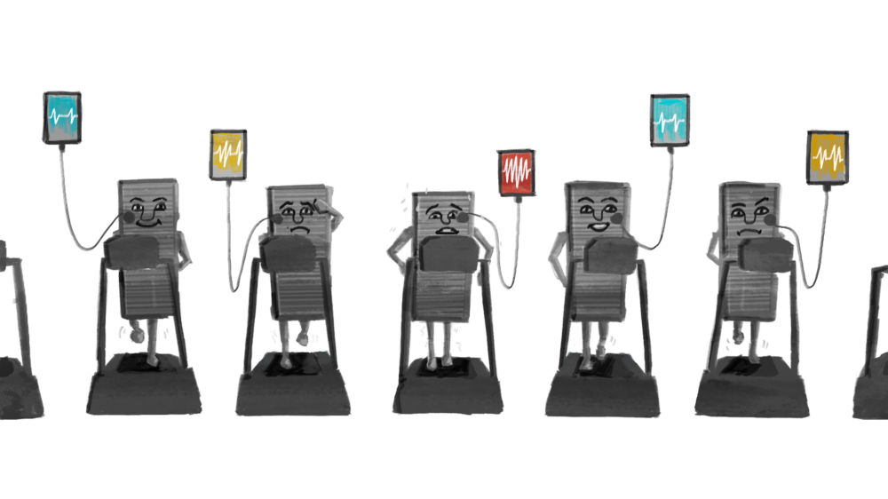

* 이 글은 원 저자인 세쿼이아 캐피털 데이터 과학팀의 허락을 받고 번역한 글입니다.
    
* 효과적인 정보 전달을 위해 일부 의역 및 편집된 부분이 있을 수 있으며 오역을 발견하신 경우 [이곳](mailto:iam@sonujung.com)으로 알려주시면 빠르게 수정하도록 하겠습니다.
    

---

# 데이터 기반 제품 만들기 시리즈

1. [제품은 어떻게 진화하는가?](https://sonujung.com/data-informed-product-building-no1)
    
2. [제품 성장 건전성 측정하기](https://sonujung.com/data-informed-product-building-no2)
    
3. [제품의 성공 정의하기](https://sonujung.com/data-informed-product-building-no3)
    

---

# 들어가며

> [Measuring Product Health](https://medium.com/sequoia-capital/measuring-product-health-626b2186cece) / 2018년 6월 6일 게재

좋은 제품은 마음속 깊은 곳에 자리한 인간의 진짜 니즈를 충족시켜줍니다. 좋은 제품은 흥미진진하고 높은 신뢰를 가지며 제품을 사용하는 유저들이 스스로 브랜드를 널리 알리고 싶게끔 만듭니다.

우리는 이런 '건강한 제품'을 다양한 곳에서 목격할 수 있습니다. 기업향 제품, 소비자향 제품, 틈새를 공략한 버티컬 솔루션일 수도 있고 효율성 개선을 위한 유용한 도구를 제공하고 있을 수도 있습니다. 이 글에선 특히 소비자향 제품을 중심으로 건강한 제품이란 어떤 것인지 다각도에서 탐구하려 합니다. 특히 성장(growth), 유지(retention), 밀착(stickiness), 참여(engagement)와 같은 측면을 살펴봅니다.

당신의 제품에서 제대로 먹히고 있거나 혹은 반대로 기대만큼 먹히고 있지 않는 것은 뭔가요? 신규 사용자는 꾸준히 늘고 있나요? 기존 사용자는 제품을 꾸준히 사용하고 있나요? 최근 유입된 사용자는 이전 사용자보다 더 열심히 사용하고 있나요? 누구보다 열심히 사용하는 열정적인 사용자 층이 있나요?

좋은 제품은 시장에 침투해 그들의 사용자를 확보하고 이들이 지속적으로 다시 방문하게 하는 건강한 콘텐츠 루프를 통해 성장합니다.

---

# 사용자 획득과 성장 (User Adoption & Growth)

제품의 사용자 획득과 성장을 촉진하는 것은 제품이 가진 잠재력을 최대한 발휘해 많은 사용자에게 높은 수준의 가치를 제공하기 위해 중요한 일입니다.

> TAM(Total Accesable Market): 제품이 포함된 전체 시장의 규모  
> 예시) 국내 반려동물 관련 시장의 규모  
> SAM(Serviceable Addressable Market): 실제 우리가 차지하기 위한 시장 규모  
> 예시) 그중 사료 시장의 규모  
> SOM(Share of Market): SAM 중 우리가 점유하고자 목표하는 시장 규모  
> 예시) 우리가 수년 내에 목표하는 점유 시장 규모 / Service Obtainable Market

제품의 성장을 평가하기 위해선 아래와 같은 질문에 답할 수 있어야 합니다.

1. 시장에 대한 이해
    
    * 당신의 제품을 얼마나 많은 사람이 사용하고 있으며 이는 전체 시장에서 어느 정도 비중에 해당합니까?
        
    * 제품이 실제 타깃 하는 시장의 규모는 어느 정도이며 얼마나 빠르게 커지고 있습니까?
        
    * 경쟁 업체의 시장 점유율은 얼마이며 점유율 증대 속도는 어떻습니까?
        
2. 제품 성장의 세부 사항 이해
    
    * 제품이 얼마나 빠르게 성장하고 있습니까?
        
    * 자연 성장이 성장을 주도하고 있습니까?
        
    * 신규 사용자가 성장에서 차지하는 비율이 어떻게 되나요?
        
    * 시장 점유율이 높아질수록 성장에 어떤 변화가 일어나고 있나요?
        
    * 이탈 사용자와 부활 사용자 사이의 균형은 어떤 수준입니까?
        

[이전 글](https://sonujung.com/data-informed-product-building-no1)에서 언급했듯 건강한 제품은 여러 단계로 이뤄진 S형 곡선을 그리며 성장합니다. 많은 제품이 완만하고 얕은 성장(초기 단계)을 거쳐 경사가 급해지다(성장 단계) 최대 성장 지점에 다다를 때까지 기하급수적인 성장(고도성장 단계)이 이어지며 이후 성장 속도가 더뎌지는 성숙기에 도달합니다.

제품에 대한 수요, 즉 시장이 충분히 크지 않다면 제품의 성공은 매우 어렵습니다. 또한 시장의 규모가 지속적으로 커질 것이라는 기대가 있어야 합니다. 아직 성장이 고도화되기 전 단계의 시장에 들어가 제품과 시장의 성장 사이클이 일치하는 것이 성공에 있어 매우 중요합니다.

이것은 매우 어려운 일이라 많은 제품이 타이밍 때문에 실패하기도 합니다.

그렇다면 '올바른' 속도로 성장하고 있는지 어떻게 알 수 있을까요? 우리 제품과 동일한 성장 단계에 있는 다른 제품과 비교해보는 것도 좋은 방법입니다. 시장 특성이 유사한 경우 타제품의 성장 패턴과 비교하여 우리의 제품 성장이 어떤 수준인지 확인해 볼 수 있습니다.

만약 제품이 앱으로 제공되고 있다면 제품의 전체 다운로드 수, 설치 수 등을 파악하는 것이 좋은 방법입니다.  
역자 주: 글이 소비자향 제품(페이스북/인스타그램 등)을 중심으로 하고 있어 앱을 예로 들어 설명하고 있습니다.

제품을 설치하는 사용자 수가 얼마나 빠르게, 얼마나 크게 늘어나고 있는지 확인하고 활성 사용자 비중이 어떤지, 그중 신규 사용자, 부활 사용자의 비중은 어떻게 되는지 등을 위 S자 성장 곡선과 비교해 우리가 어떤 단계에 위치하고 있는지 가늠하고 평가할 수 있습니다.

### 시장 지표 (Market Metrics)

#### MAU/Installs, Installs/TAM

* 총 활성 사용자 수는 제품의 영향력을 가장 정확하게 측정하는 지표입니다.
    
* 성장을 추적하려면 전체 설치 대비 활성 사용자 수와 전체 시장 규모 대비 전체 설치 수를 살펴보는 것이 유용합니다.
    
* Install/TAM이 0에 가까울수록 MAU 중 신규 사용자 비중이 높고 1에 가까울수록 신규 사용자 확보가 어렵습니다. 성장을 위한 실행 계획을 수립할 때 이를 참고하여 신규 고객 획득에 집중할 것인지 이탈한 고객을 재방문하게 하는데 집중하게 할 것인지 전술적 판단을 내릴 수 있습니다.
    
* 전체 설치 수가 전체 시장 규모에 가까워져 신규 사용자 확보가 어렵다면 이탈 고객을 재활성화시키는데 투자하는 것이 활성 사용자를 늘리는 좋은 방법입니다. 만약 좋은 제품을 제공하고 있다면 이탈 고객을 부활시키는 게 더 수월해집니다.
    
* 다만 제품 카테고리에 따라 이탈 고객을 다시 끌어오기 어려운 경우도 있습니다. 특히 게임의 경우 일종의 유통기한이 존재하는데 예를 들어 Zynga에서 제작한 [Empires & Allies](https://www.zynga.com/games/empires-and-allies/)의 경우 폭발적인 인기를 끌며 많은 사람들이 설치했고 그중 다수가 활성 사용자가 되었습니다. 신규 사용자의 유입은 꾸준히 늘어났지만 어느 시점이 지나며 훨씬 더 많은 사용자가 이탈하며 MAU가 감소하기 시작했고 시간이 흘러 신규 사용자 역시 감소하며 소수의 열성 사용자 만이 남은, 사실상 죽은 앱이 되었습니다.
    
    
    

### 성장률 평가 지표 (Growth Metrics)

#### DAU, WAU, MAU

* 제품이 추적해야 하는 최상위 성장 지표는 활성 사용자 수입니다. 주로 월간, 주간, 일간 활성 사용자 수를 측정 지표로 삼으며 제품 특성에 따라 무엇을 중점적으로 관리해야 할지 달라질 수 있습니다.  
    역자 주: 보편적으로 방문 빈도가 우선 평가 척도인 소셜 미디어의 경우 DAU, 필요에 의해 사용하는 업무용 생산성 제품의 경우 WAU, 구매를 기준으로 삼는 이커머스의 경우 MAU 등을 측정하는 편입니다.
    

#### D/D, W/W, M/M, Y/Y 변화

* 일간(D/D: day-over-day), 주간(W/W: week-over-week), 월간(M/M: month-over-month), 연간(Y/Y: year-over-year) 활성 사용자 수의 변화를 이해하는 것 역시 매우 중요합니다.
    
* 제품의 DAU의 변동이 클 때엔 7일 간 일일 활성화 유저의 평균을 살펴보는 게 효과적일 수 있습니다. 일반적으로 롤링 메트릭(같은 기간 단위로 반복 측정하는 방식)을 많이 활용하는데 예를 들어, 2월과 1월의 MAU를 비교해야 한다면 월의 길이가 달라 왜곡이 생길 수도 있기 때문입니다. 이럴 때 28일 단위로 나눠서 추적할 경우 결과의 왜곡을 피할 수 있습니다.
    

#### Quick Ratio: (신규 사용자 + 부활 사용자) / 이탈 사용자

* 성장을 이해할 때 신규 사용자, 부활 사용자로 나눠보는 것이 성장에 기여하는 원인을 이해하는데 도움이 됩니다.
    
    > 성장 = 신규 사용자 + 부활 사용자 - 이탈 사용자
    
* Quick Ratio가 1 이상인 경우 순 증가가 플러스(+)이며, 1보다 작은 경우 활성 사용자가 매월 감소합니다.
    
* 대부분의 회사가 성숙기에 도달하면 부활과 이탈이 서로를 상쇄하며 대부분의 순 성장은 신규 사용자 증가를 통해서만 발생하는데, 예를 들어 미국의 Facebook과 같이 시장 포화 상태에 도달한 경우 신규 사용자 확보가 적고 이탈과 부활이 균형을 이룹니다.
    

#### New Users/MAU

* 여러 번 언급했듯 초기 단계 제품의 성장은 대부분 신규 사용자로 인해 일어나며 이탈과 부활은 극히 적습니다.
    
* 이후에도 신규 사용자는 순 성장에서 큰 비중을 차지하지만 MAU 대비 차지하는 비중은 조금씩 줄어듭니다.
    
* 회사가 성숙해짐에 따라 순 성장에서 신규 사용자의 비중은 줄고 기존 사용자가 MAU에서 차지하는 비중이 더 커집니다.
    
* 건강하지 않은 제품의 경우 시장 침투율이 높은 수준을 달성한 상황에도 순성장에서 신규 사용자가 차지하는 비중이 큰데, 이를 죽음의 나선(death spiral)으로 부르기도 합니다.  
    역자 주: 성숙 단계에서 낮은 유지율이 매우 좋지 않다는 점을 강조하고 있습니다.
    

#### Sign-ups/Installs

* 신규 사용자 확보와 기존 사용자의 유지는 소비자향 제품 기업에게 가장 중요한 제품 활동입니다.
    
* 초기 단계에는 새로운 사용자를 확보, 유지 및 참여시키는 것이 모두 중요합니다.
    
* 제품의 유지율이 높고 참여도가 높다면 신규 사용자 성장을 늘리는데 집중하는 것이 좋습니다. 소셜 미디어, 디스플레이 광고, 어필리에이트 마케팅, SEO/ASO, 이메일 마케팅, PR 등 여러 채널 운용 전략을 통해 신규 고객을 확보할 수 있습니다.
    
* 또한 이 과정에서 사용자가 어떤 채널을 통해 유입되었는지 파악하여 채널의 효과를 이해하는 것은 자원 배분과 우선순위를 정하는데 중요합니다. 신규 사용자 획들을 위해 퍼널을 관리하고 개선하세요.
    
* 국가, 장치, 연령, 성별, 전화, 제품 사용 기간 등 비즈니스에 의미 있는 정보를 다각도에서 관찰하는 것이 유용합니다. 특히 전환 추적(유료, 오가닉, SEO, 앱스토어)이 특히 중요합니다.
    

---

# 유지 (Retention)

* 유지율은 제품이 시장 적합도와 가치를 나타내기에 가장 좋은 지표입니다.
    
* 일반적으로 새로운 사용자가 유입된 날에서부터 일주일 사이가 승부처입니다. 그들이 필요로 하는 콘텐츠가 충분히 제공되고 있는지, 그들과 연결된 친구가 얼마나 되는지, 그들이 제품을 이해하는데 어려움을 겪진 않는지 등을 고려하며 유지율을 관리해야 합니다.
    
* 건강한 유지율 지표를 갖고 성공적인 제품을 구축하기 위해선 제품을 깊이 사랑하고 크게 관심 갖는 핵심 사용자 층이 있어야 합니다.
    
* 핵심 사용자 층에 초점을 맞춰 신규 방문자 중 이 핵심 사용자에 해당할 것으로 예상되는 이들에게 최적화된 '매지컬 모먼트'를 제공하고 제품에 락인(Lock-In)시킬 수 있는 락인 티핑 포인트를 찾아내기 위해 노력하세요.
    
    * 매지컬 모먼트는 서비스에 대한 호감을 높이는 첫 경험입니다. 예를 들어 Facebook의 경우 가입 직후 자신의 친구를 발견해 연결되는 것이고, WhatsApp의 경우 친구로부터 받게 되는 첫 번째 받는 메시지일 수 있습니다. 만약 Amazon이라면 구매자가 첫 구매 상품을 받아보거나 처음 CS 상담을 하게 되는 때일 수도 있습니다.
        
    * 이렇게 호감을 형성한 뒤 지속 경험을 위한 락인 티핑 포인트를 찾아 제공해야 합니다. 예를 들어 Facebook의 경우 10일 안에 7명의 친구와 연결된 사용자가 이탈하는 확률이 매우 낮다는 것을 발견했고 이후 신규 가입자가 10일 안에 7명의 친구와 연결될 수 있게 하는 여러 경험을 개선하였습니다.
        
* 또한, 유지율은 제품 성장을 위한 가장 중요한 수단이기도 합니다. 유지율이 낮은 제품은 장기적으로 지속할 수 없습니다. 의존할 수 있는 충성 사용자 없이 새로운 사용자만을 찾아 시장을 헤매는 상황이 될 것입니다.
    
* 마케팅과 광고를 통해 사용자 획득에 투자하기 전에 유지에 영향을 미칠 수 있는 여러 변수를 파악하고 초기 고객을 안착시키는데 도움 되는지 확인해야 합니다.
    
* 초기 유지율은 장기 유지율에 가장 효과적인 예측 변수입니다. 제품 유형 별로 유지율의 중요도는 조금씩 다르지만 유지율이 높을수록 성장에 도움이 된다는 점은 동일합니다.
    
* 유지 곡선에는 세 가지 기본 형태가 있습니다.
    
    * 가장 최악의 시나리오에서는 장기 코호트 유지율이 0으로 낮아지고 결국 망합니다.
        
    * 두 번째 시나리오에서는 유지 곡선이 0보다 큰 숫자에서 플랫 하게 유지됩니다. 이는 제품이 충성 사용자를 확보하고 있으며 지속 성장하고 있는 상태입니다.
        
    * 세 번째 시나리오는 제품이 매우 건강하게 성장하고 있고 시장 적합도가 높아 고도성장 단계에 접어들어 평평하게 유지되던 유지율이 다시 상승하는 경우입니다. (물론 더 높은 지점에서 플랫 하게 바뀌게 될 것입니다.) 아래는 Evernote의 스마일 그래프의 예시입니다.
        
        
        

### 유지율 평가 지표 (Retention Metrics)

#### Dn, Mn, Wn 지표

* 리텐션은 코호트를 기준으로 측정합니다. 즉, 특정 기간에 제품을 설치한 사용자 집단을 시간 흐름에 따라 추적하고 몇 퍼센트가 지속 사용하는지 측정하는 방식입니다. 궁극적으로는 제품이 더 오랜 기간 높은 수준의 유지율을 유지하는 게 목표입니다.
    
* 신제품의 경우 장기 유지율을 예측하기 어렵습니다. 그래서 장기 유지율에 영향을 미칠 것으로 예상되는 초기 유지 지표 찾아 정의하는 게 중요합니다.
    
    * 예를 들어 게임의 경우 한 번 게임 설치 후 하루 뒤 다시 사용하는 경우 장기 유지 가능성이 높기 때문에 D1 유지율(Day One Retention)을 유지 지표로 삼습니다.
        
* 장기 유지율을 표현하는 간편한 방법은 아래 이미지처럼 약 1년(예: 364일) 후에 코호트 집단에 남아있는 사람의 수를 유지 지표를 기준으로 여러 번 나누는 것입니다. D1/D0은 1일(Day One) 유지율로 D0은 코호트의 설치자 수이고 D1은 하루 후에도 사용하는 코호트 설치자 수입니다.
    
    
    
    역자 주: 유지율을 퍼널 형태로 수식화한 이미지입니다.
    
* D7/D1이 모든 코호트에서 비교적 일정하게 유지되지만 D1이 줄어드는 게 보이면 D1 유지 개선에 집중하세요. 이것이 장기 유지를 위한 가장 큰 수단이 될 가능성이 높기 때문입니다.
    
* 마찬가지로, D1 유지율이 일정하지만 D7/D1이 감소하는 경우 첫 날 보다 첫 주에 사용자의 참여를 유도할 수 있는 새로운 방법을 찾는 데 집중하세요.
    
* 자신의 제품에 가장 잘 맞는 측정 항목을 선택하는 게 중요합니다.
    

#### 코호트 곡선

* 코호트 곡선 역시 Dn 지표 못지않게 매우 중요합니다. 코호트 곡선이 플랫 해지고 있는지 여부에 따라 고도성장 단계로 접어들고 있는지, 서비스 실패로 치닫고 있는지 잘 알 수 있습니다.
    
* 새로운 코호트 유지율과 기존 코호트 유지율을 비교하여 건강한 상태를 유지하고 있는지 확인하세요.
    
* 유사 제품의 유지율을 벤치마킹해보세요.
    
* 코호트 곡선이 어느 지점에서 안정화되는지 확인하고 가능하면 높은 지점에서 유지되는 것이 좋습니다.
    

---

# 밀착 (Stickiness)

* 제품의 활성 사용자가 늘고 유지율이 높다고 제품을 열렬히 사랑하는 사용자가 많다고 볼 수는 없습니다.
    
* 유지율이 유저가 제품을 다시 찾게 만드는 것에 대한 지표라면, 밀착도는 푸시 메시지 등 재방문을 유도하지 않아도 알아서 사용자가 자발적으로 제품에 돌아오게 만드는 제품의 핵심적인 요소입니다.
    
* 예를 들어 Facebook의 밀착 요소는 자신의 삶을 공유하려는 사용자의 충동과 다른 사람의 삶에 대한 호기심이라고 말할 수 있습니다.
    

### 밀착도 평가 지표 (Stickiness Metrics)

#### DAU/MAU

* 월간 활성 사용자 대비 일일 활성 사용자 비율은 밀착도를 평가하기 위해 가장 널리 사용되는 측정 지표입니다.
    
* DAU/MAU가 0.6이란 것은 이번 달 제품을 찾은 사용자 중 60%가 매일 방문하고 있다는 뜻입니다. 일반적으로 매우 건강한 수치입니다.
    
* 성장 초기의 소셜 미디어는 DAU/MAU가 30% 수준으로 비교적 낮은 경향이 있지만 더 많은 사용자가 유입되고 시장 침투율이 높아질수록 기존, 신규 코호트 모두의 DAU/MAU가 높아집니다.
    
* DAU/MAU가 낮다고 나쁜 제품인 것은 아닙니다.
    
    * DAU/MAU 가치를 평가하기 위해 비즈니스 혹은 제품 특성에 따라 평가 기준과 방식을 잘 정의하는 게 중요합니다.
        
    * 채팅 앱은 제품 특성상 소셜 미디어 앱보다 DAU/MAU가 훨씬 높을 수밖에 없습니다. 채팅 앱을 만들고 있다면 기대 수준을 높일 필요가 있습니다.
        
    * 제품 내 다양한 하위 제품(기능) 중 DAU/MAU 평가 기준이 높은 것과 낮은 것이 공존하고 있을 수 있습니다.
        
    * 사용자 세그먼트(예: 무료 사용자, 유료 사용자)에 따라 DAU/MAU 차이가 큰 경우도 있습니다. 이 경우 세그먼트 별로 DAU/MAU를 높이기 위한 방안을 시도하여 전체 지표를 개선할 수 있습니다.
        

#### 오픈율

* 제품을 설치한 사람이 얼마나 자주 열어보는지를 측정하는 지표입니다.
    
* 일반적으로 오픈율이 높은 앱일수록 밀착 수준이 높다고 볼 수 있습니다.
    
    * Facebook 같은 제품의 경우 하루에도 여러 번 앱을 열어봅니다.
        
* 반대로 밀착 수준이 낮은 제품의 경우 월별 오픈율이 10% 이하일 수 있습니다.
    
* 단 오픈율이 높다고 모두 밀착 수준이 높다고 볼 수는 없습니다.
    
    * 알림 위주의 앱의 경우 앱을 여는 횟수는 많지만 밀착 수준이 높다고 보긴 어렵습니다.
        

#### Lness

* 주어진 기간 동안 방문한 일수입니다.
    
* 예를 들어 L5+/7은 일주일에 5번 이상 제품을 방문하는 사용자 비율, L21+/28은 한 달(28일)에 최소 21번 돌아온 사용자 비율을 뜻합니다.
    
* 수치가 높을 수록 제품의 밀착 수준이 높다고 볼 수 있습니다.
    
* 시간 경과에 따른 Lness 변화를 추적하면 제품의 밀착 수준을 잘 파악할 수 있습니다.
    

#### 밀착 유지율 (Sticky Retention)

* 코호트 기반 유지율은 해당 코호트 집단을 이해하는데 도움이 되긴 하지만 가장 참여도가 높은 사용자의 행동을 이해하는 데에는 크게 도움되지 않습니다.
    
* 우리의 목표는 제품을 가장 사랑하는 사용자를 위한 제품을 구축하는 것이기 때문에 밀착 유지율 제품이 그들을 위해 얼마나 잘 작동하고 있는지 이해하는 데 도움이 됩니다.
    
* 밀착 유지율은 일반적으로 DoD, WoW, MoM retention을 사용하여 측정됩니다.
    
    * 제품에 가입한 시기와 관계 없이 오늘 활성 사용자가 다음 날, 또는 다음 주, 다음 달에도 활성 사용하는 수를 측정합니다.  
        역자 주: 일반적인 유지율 측정은 가입 및 최초 사용을 기점으로 얼마나 오랫동안 이탈하지 않고 남아있는지를 본다면 밀착 유지율은 특정 기간 내 활성 사용자가 얼마나 오랫동안 밀착을 유지하는지 추적한다고 볼 수 있습니다.
        

---

# 참여 (Engagement)

* 대부분의 경우 앱의 성장, 유지, 밀착 지표가 높다면 제품의 건강 상태는 양호하다고 볼 수 있습니다.
    
* 그러나 사용자가 충분히 자주 돌아오지 않거나, 충분한 양의 콘텐츠를 생산 혹은 소비하지 않거나, 제품을 사용하는데 충분한 시간을 소비하고 있지 않고 있다면 이는 낮은 참여도를 보이고 있는 상황입니다.
    
* 예를 들어 OTT 제품의 경우 제품에 소비하는 시간이 참여 수준을 평가하는 가장 중요한 지표입니다. 더 많은 시간을 할애할수록 더 높은 참여율을 보입니다.
    
* 진짜 PMF를 찾아냈음을 알 수 있는 방법은 유지에 더해 높은 참여 수준을 달성하는 것입니다. 이는 제품이 매우 매력적이라는 것을 대변하는 지표입니다.
    

### 무엇이 참여를 유도하나요?

* Facebook, Instagram, Reddit, Snapchat 등과 같은 소셜 미디어 류 제품에는 참여를 유도하기 위한 생산/소비 프레임워크가 있습니다.
    
* 아래 이미지는 이 참여 모델을 간략화한 것입니다.
    
    
    
    * 콘텐츠 생산자는 제작한 콘텐츠를 다른 사람에게 제공하여 즐거움을 선사합니다.
        
    * 콘텐츠 소비자는 업보트, 댓글, 반응 등의 피드백을 제공하여 콘텐츠 생산자의 제작에 동기를 부여합니다.
        
    * 이 생산/소비 루프를 통해 사용자는 더 자주 제품에 방문하고(세션 수) 더 많은 콘텐츠를 소비하며(조회 수) 제품 내에서 더 많은 시간을 보내게 됩니다.
        
* 참여를 늘리는 방식은 다양합니다.
    
    * 콘텐츠를 더 쉽게 만들 수 있도록 하고
        
    * 관련성이 높은 콘텐츠를 연결해주고
        
    * 사용자의 관심에 부합하는 콘텐츠를 순서대로 보여주고
        
    * 다양한 기기를 통해 언제 어디서나 소비할 수 있게 하고
        
    * 더 많은 개인, 인플루언서 및 기업이 콘텐츠 생산에 참여하게 하여 매력적이고 관련성 높은 콘텐츠를 늘립니다.
        
    * 사용자가 콘텐츠와 더 쉽게 상호 작용할 수 있도록 제품을 디자인합니다.
        
    * 이러한 다양한 노력은 긍정적인 피드백 루프를 강화하여 참여도를 지속적으로 높입니다.
        
* 또 다른 참여 모델은 전자상거래(마켓플레이스) 모델입니다.
    
    * 예를 들어 eBay는 판매자와 구매자를 연결합니다.
        
    * 이 모델에서는 판매하는 상품의 품질, 품목의 다양함, 구매자 관심사와 일치하는 상품 목록과 추천 등을 통해 판매자와 구매자를 직접 연결하여 참여를 높일 수 있습니다.
        
    * 사용 시간, 구매 프로세스 단순화 등 경험의 각 단계에서 신뢰를 구축하고 경로를 최적화하여 참여도(전환율)를 높일 수 있습니다.
        

### 참여도 평가 지표 (Engagement Metrics)

아래 소개할 지표 대부분은 앞서 소개한 생산/소비 패러다임에 부합하는 제품에 해당됩니다.

#### 소요 시간/DAU

* 이 측정 항목은 제품 참여도를 측정하기 위한 효과적인 지표입니다. 물론 앞서 말했듯 제품의 특성과 기대하는 참여 수준에 따라 평가가 크게 좌우됩니다.
    
* 소요 시간 기준 시장 점유율은 시장 내 경쟁에서 우위에 있는지를 확인하기 좋은 지표입니다.
    

#### 세션 수

* 세션 수는 제품 참여도를 측정하기 위해 효과적인 또 다른 지표입니다.
    
* 세션 수의 증가는 PMF 여부를 가장 빠르게 확인할 수 있는 방법입니다. (마찬가지로, 세션 수의 감소는 뭔가 잘못되고 있다는 경고 신호입니다.
    

#### 소요 시간/세션

* 자주 방문하여 세션 수가 늘거나 한 번 방문했을 때 소요 시간이 늘거나 이 두 가지 접근 모두 전체 소요 시간을 늘리는 방식입니다.
    
* 제품이 전체 소요 시간을 늘리기 위해 세션 수를 늘리는 게 효과적인지 세션 당 소요 시간을 늘리는 것이 효과적인지 잘 판단해야 합니다.
    

#### 사용 가능한 콘텐츠(인벤토리)

* 뉴스피드가 있는 회사(ByteDance, Instagram, Facebook, LinkedIn 등)의 경우 사용자가 소비할 수 있는 콘텐츠(인벤토리)의 수가 중요합니다.
    
* 사용 가능한 콘텐츠(인벤토리)의 양을 늘릴 수 있는 루프를 찾아내는 것이 수익 창출에 큰 영향을 미칩니다.
    

#### 콘텐츠 소비(조회 수) 횟수

* 소요 시간만 측정 시 조회 당 많은 시간을 투입하는 콘텐츠로 인해 결과가 왜곡될 수 있습니다.
    
* 따라서 소비 횟수(조회 수)를 측정하는 것은 사용자가 얼마나 많은 콘텐츠를 소비하는지 이해하는 데 도움을 줍니다.
    

#### 콘텐츠 생산량

* 사용자가 매일, 매주, 매월 얼마나 많은 콘텐츠를 생산하는지, 또 얼마나 많은 사람이 정기적으로 콘텐츠를 생산하고 있는지 등을 측정함으로써 생산/소비 프레임워크가 잘 동작하는지 확인할 수 있습니다.
    
* 콘텐츠 총생산량은 생산자 수와 생산량을 기반으로 합니다. 생산/소비 패러다임의 생태계에서 고품질 콘텐츠의 생산은 매력적인 생태계를 위한 가장 중요한 요소입니다.
    

#### 콘텐츠에 대한 피드백

* 일반적으로 좋아요, 댓글의 피드백을 측정합니다.
    
* 좋아요는 댓글보다 소극적인 피드백 형태지만 피드백의 수를 보다 쉽게 늘릴 수 있게 하여 콘텐츠 생산을 늘리는 데 효과적인 수단으로 활용됩니다.
    

### 참여도 측정 시 고려 사항

#### 세분화된 측정

* 국가, 장치, 연령, 성별, 사용자 등급, 사용 기간, 콘텐츠 유형(비디오, 사진, 텍스트 등) 및 콘텐츠 성격(소셜, 엔터테인먼트, 정보 제공, 교육 등) 등 수집 지표는 가능한 세분화, 다변화하는 게 좋습니다.
    

#### 선행 및 후행 지표

* 참여도 지표는 성장 및 유지에 대한 선행 지표의 성격을 갖습니다.
    
    * 제품을 열심히 사용하던 사용자도 시간이 지나면 지루함을 느낄 수 있습니다.
        
    * 이 경우 일 단위, 주 단위, 월 단위 방문과 참여가 줄어듭니다.
        
    * 방문 빈도가 줄고 더 적은 수의 콘텐츠를 소비하게 될 것이며, 사용 시간도 줄어들 것입니다.
        
    * 세션 수의 감소는 DAU의 감소를 가장 빠르게 감지할 수 있는 선행 지표입니다.
        
    * DAU가 하락하면 WAU, MAU도 하락합니다.
        

#### 참여도가 높은 충성 사용자

* 참여도가 가장 높은 사용자에 집중해야 합니다.
    
* 충성도가 높은 고객의 이탈 확률은 낮기 때문에 그들을 위해 노력하는 것은 단기적으로 성장 지표를 직접 개선하는 접근 방식은 아닙니다.
    
* 그러나 유지율에 대해 얘기 할 때 언급했듯 제품을 사랑하는 사용자를 만족시키기 위한 노력을 통해 장기적으로 해당 유형의 사용자의 비중이 늘어나면 장기적인 성장에 매우 큰 영향을 미칩니다.
    
* 이 글에서 정의한 여러 지표 활용시 참여도가 높은 충성 사용자를 별도로 추적하며 관심을 기울여야 합니다.
    
    * 제품 참여도가 높은 충성 사용자의 수는 늘어나고 있나요?
        
    * 이들의 세션 수와 소요 시간은 어떻게 변화하고 있나요?
        
    * 참여도가 낮은 사용자의 참여도는 높아지고 있습니까?
        
    * 이 충성 사용자에게는 몇 명의 연결된 친구가 있습니까?
        
    * 이들은 얼마나 많은 콘텐츠를 생산합니까?
        
    * 이들은 제품의 어떤 기능을 주로 사용합니까?
        
* 위와 같은 질문에 대한 답변을 찾아가며 충성 사용자를 위한 경험을 개선하는 것이 중요합니다.
    

---

# 제품에 대한 흔한 오해

### 좋은 제품에는 문제가 없다?

이탈, 신규 사용자 획득, 참여 수준에 대한 문제는 거의 모든 제품이 갖게 마련입니다. 그렇지만 제품의 충성 사용자가 높은 수준에서 유지되고 이 중 많은 이들이 제품을 적극적으로 사용하고 있기만 하다면 제품을 다시 정상 궤도에 올려놓는 것은 어렵지 않습니다.

### 성장 전술(Growth Tactics)은 뭐든 해결할 수 있다?

성장 전술은 이미 PMF를 찾은 경우 유용할 수 있지만 PMF를 찾는 데 사용할 수는 없습니다. 제품은 사용자에게 제대로 된 가치를 전달해야 합니다.

예를 들어, [BranchOut](https://www.ere.net/branchout-keeps-falling-down-down/)의 급성장은 성장 전략 때문이었지만 이후 급격한 하락은 제품이 시장에 적합하지 않았기 때문입니다.

### 어떤 대가를 치르더라도 빠른 성장이 중요하다

지속 가능한 성장이 빠르게 성장하는 것보다 훨씬 더 중요합니다. 낮은 유지율로 성장하면 결국 제품은 망합니다.

### 모두를 위한 제품

모든 사용자를 만족시키기 위해 노력해야 한다는 것은 일반적인 오해입니다. 모든 사람을 위한 제품은 높은 확률로 아무도 원치 않는 제품이 될 확률이 높습니다. 거듭 말했듯이 가장 참여도가 높은 충성 사용자를 위한 제품을 구축하고 훌륭한 경험을 제공하세요.

### 유지율이 플랫 하게 유지되면 건강한 상태다

높은 수준의 유지율을 유지하는 것은 제품의 장기적 지속 가능성을 위해 중요합니다. 물론 낮은 수치로라도 유지율을 방어하는 것이 0이 되어 망하는 것보다는 낫지만 여전히 지속 가능성의 위협은 남아있습니다.

---

# 노트: 기억해 둘 것

* 시장의 포화는 성장을 둔화시킵니다. 성장 지표를 측정할 땐 시장의 맥락을 함께 고려해야 합니다.
    
* 유지율은 PMF를 확인하기 위한 가장 좋은 지표이자 성장을 위한 중요한 지렛대입니다.
    
* 매지컬 모먼트(뛰어난 첫 경험)는 사용자가 제품의 핵심 가치를 이해하는 데 도움이 되며 사용자를 락인 시킬 수 있는 티핑 포인트로 유도하는 것이 중요합니다.
    
* 참여는 유지의 가장 중요한 동인입니다. 제품 참여를 유도할 수 있는 피드백 루프(프레임워크)를 구축하는 것은 사용자의 행동 변화에 대한 선행 지표를 식별하고 문제를 예방하는데 도움됩니다.
